### 需求设计 系统级

用例清单：

| 用例编号 | 用例名称     | 参与者     | 触发条件                                 | 前置条件                               | 基本流程                                                     | 异常流程                                                     | 可验证结果                                                   |
| -------- | ------------ | ---------- | ---------------------------------------- | -------------------------------------- | ------------------------------------------------------------ | ------------------------------------------------------------ | ------------------------------------------------------------ |
| UC-01    | 上传视频     | 内容创作者 | 创作者点击上传并提交视频文件             | 用户已登录，视频文件与标题符合上传要求 | 选择视频文件；填写标题，封面；上传至 MinIO；保存视频记录；生成播放地址和封面地址。 | 文件过大、格式错误或对象存储失败时提示上传失败。             | MinIO 中存在视频对象；数据库保存视频记录；个人视频列表可查询到该视频。 |
| UC-02    | 管理个人视频 | 内容创作者 | 创作者进入个人视频管理页面或发起删除操作 | 用户已登录且已有本人视频               | 查询本人视频列表；查看视频详情；选择不需要的视频；系统校验归属关系后删除视频。 | 删除不存在或非本人视频时拒绝操作。                           | 仅返回本人视频；删除成功后列表和网站不再展示该视频；非本人视频不会被删除。 |
| UC-03    | 浏览推荐视频 | 观看者     | 用户打开首页或刷新推荐列表               | 系统存在公开视频                       | 打开首页；系统按热度和时间查询视频列表；前端展示封面、标题、作者和播放量。 | 无公开视频时显示空列表。                                     | 首页能够展示公开视频列表；列表项包含封面、标题、作者和播放量； |
| UC-04    | 播放视频     | 观看者     | 用户点击公开视频并进入播放页             | 视频存在且可访问                       | 获取视频详情；加载播放地址；初始化播放器；进行播放、暂停和进度控制。 | 播放地址失效、视频不存在或资源不可访问时提示资源不可用。     | 视频可以正常播放和控制；播放页展示视频信息；播放量按规则更新。 |
| UC-05    | 发送评论     | 注册用户   | 用户在视频详情页提交评论                 | 用户已登录且视频存在                   | 输入评论；系统校验内容；保存评论；刷新评论列表并展示评论及回复关系。 | 评论为空、过长或保存失败时提示修改或重试。                   | 评论记录写入数据库；评论列表出现新评论；                     |
| UC-06    | 发送视频弹幕 | 注册用户   | 用户播放视频时发送弹幕                   | 用户正在播放视频，视频存在且可访问     | 输入弹幕内容和颜色；系统保存视频时间点；播放器按时间轴展示弹幕。 | 弹幕为空、内容过长或发送失败时提示修改或重试。               | 弹幕记录包含视频、时间点、内容和颜色；重新播放到对应时间点时可显示弹幕。 |
| UC-07    | 创建直播间   | 主播       | 主播提交直播间创建信息                   | 主播已登录，直播间标题和封面信息有效   | 填写直播间信息；系统创建直播间记录；生成推流地址和播放地址；更新直播间状态。 | SRS 配置不可用、直播间信息缺失或服务异常时提示创建失败。     | 数据库生成直播间记录；返回推流地址和播放地址；直播间列表可查询到该房间。 |
| UC-08    | 观看直播     | 观看者     | 用户打开直播间或从直播列表进入直播间     | 直播间存在且处于可访问状态             | 打开直播间；获取 HTTP-FLV 播放地址；加载直播画面；展示直播间基础信息。 | 直播间离线、未开播、已结束或播放地址失效时提示当前不可观看。 | 在线直播间能够播放直播画面；离线直播间显示未开播或已结束提示。 |
| UC-09    | 直播弹幕互动 | 注册用户   | 用户进入直播间后发送直播弹幕             | 用户已进入直播间，WebSocket 服务可用   | 建立 WebSocket 连接；输入并发送弹幕；系统保存弹幕并向直播间观众广播消息。 | 连接断开、弹幕为空或发送失败时提示重连或重试。               | 同一直播间观众可实时看到弹幕；数据库保存直播弹幕记录。       |
| UC-10    | 直播点赞     | 注册用户   | 用户在直播间点击点赞按钮                 | 用户已进入直播间，直播间存在           | 点击点赞；系统累计直播间点赞数；向前端返回最新数量并更新页面显示。 | 网络失败或直播间不存在时保持原数量并提示。                   | 点赞数按请求递增；前端显示最新点赞数量。                     |

用例图

### 3.3 软件需求的分析模型

#### 3.3.1 UC-01 视频上传系统顺序图

代码段

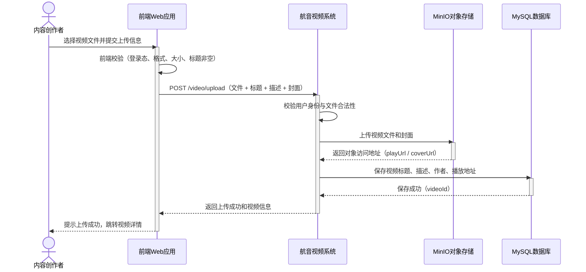
```mermaid
sequenceDiagram
    actor Creator as 内容创作者
    participant Web as 前端Web应用
    participant System as 航音视频系统
    participant Storage as MinIO对象存储
    participant DB as MySQL数据库

    Creator->>Web: 选择视频文件并提交上传信息
    activate Web
    Web->>Web: 前端校验（登录态、格式、大小、标题非空）
    Web->>System: POST /video/upload（文件 + 标题 + 描述 + 封面）
    activate System
    System->>System: 校验用户身份与文件合法性
    System->>Storage: 上传视频文件和封面
    activate Storage
    Storage-->>System: 返回对象访问地址（playUrl / coverUrl）
    deactivate Storage
    System->>DB: 保存视频标题、描述、作者、播放地址
    activate DB
    DB-->>System: 保存成功（videoId）
    deactivate DB
    System-->>Web: 返回上传成功和视频信息
    deactivate System
    Web-->>Creator: 提示上传成功，跳转视频详情
    deactivate Web
```

#### 3.3.2 UC-02 管理个人视频系统活动图

代码段

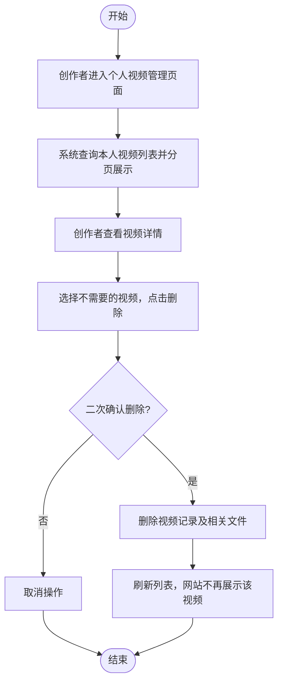
```mermaid
flowchart TD
    start([开始])
    enter[创作者进入个人视频管理页面]
    sys_query[系统查询本人视频列表并分页展示]
    view[创作者查看视频详情]
    choose[选择不需要的视频，点击删除]
    confirm{二次确认删除?}
    cancel[取消操作]
    delete[删除视频记录及相关文件]
    refresh[刷新列表，网站不再展示该视频]
    done([结束])

    start --> enter
    enter --> sys_query
    sys_query --> view
    view --> choose
    choose --> confirm
    confirm -->|否| cancel
    confirm -->|是| delete
    cancel --> done
    delete --> refresh
    refresh --> done
```

#### 3.3.3 UC-03 视频推荐系统顺序图

代码段

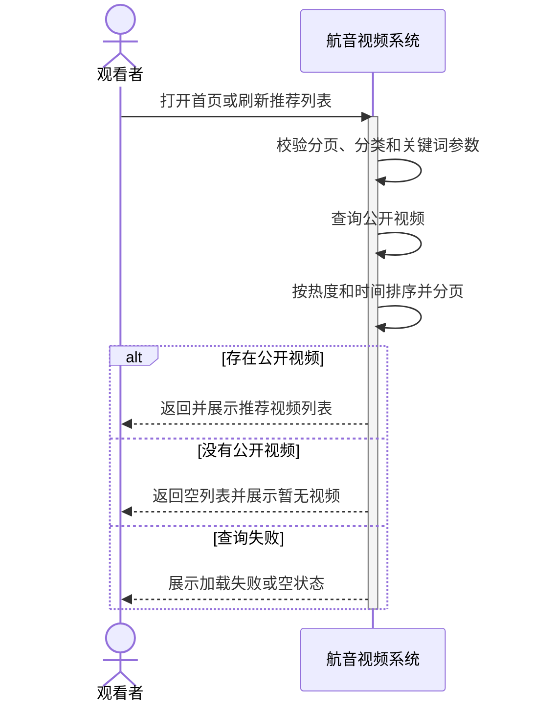
```mermaid
sequenceDiagram
    actor Viewer as 观看者
    participant System as 航音视频系统

    Viewer->>System: 打开首页或刷新推荐列表
    activate System
    System->>System: 校验分页、分类和关键词参数
    System->>System: 查询公开视频
    System->>System: 按热度和时间排序并分页
    alt 存在公开视频
        System-->>Viewer: 返回并展示推荐视频列表
    else 没有公开视频
        System-->>Viewer: 返回空列表并展示暂无视频
    else 查询失败
        System-->>Viewer: 展示加载失败或空状态
    end
    deactivate System
```

#### 3.3.4 UC-04 播放视频系统顺序图

代码段

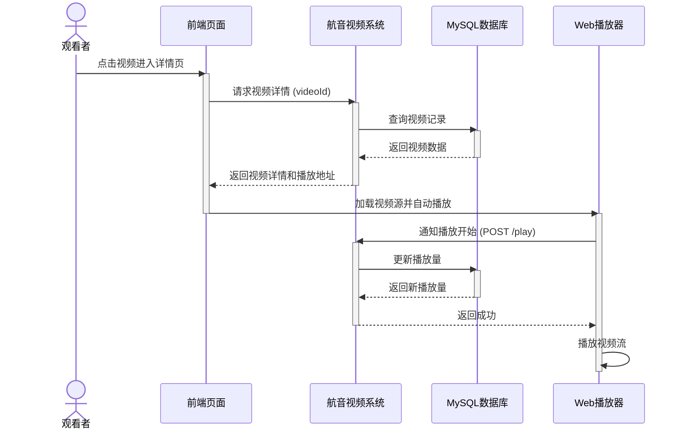
```mermaid
sequenceDiagram
    actor Viewer as 观看者
    participant Frontend as 前端页面
    participant CoreSystem as 航音视频系统
    participant DB as MySQL数据库
    participant Player as Web播放器

    Viewer->>Frontend: 点击视频进入详情页
    activate Frontend
    Frontend->>CoreSystem: 请求视频详情 (videoId)
    activate CoreSystem
    CoreSystem->>DB: 查询视频记录
    activate DB
    DB-->>CoreSystem: 返回视频数据
    deactivate DB
    CoreSystem-->>Frontend: 返回视频详情和播放地址
    deactivate CoreSystem
    Frontend->>Player: 加载视频源并自动播放
    deactivate Frontend
    activate Player
    Player->>CoreSystem: 通知播放开始 (POST /play)
    activate CoreSystem
    CoreSystem->>DB: 更新播放量
    activate DB
    DB-->>CoreSystem: 返回新播放量
    deactivate DB
    CoreSystem-->>Player: 返回成功
    deactivate CoreSystem
    Player->>Player: 播放视频流
    deactivate Player
```

#### 3.3.5 UC-05 视频评论系统顺序图

代码段

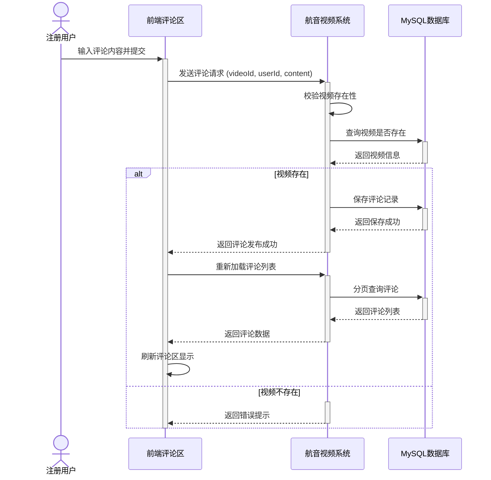
```mermaid
sequenceDiagram
    actor User as 注册用户
    participant Frontend as 前端评论区
    participant System as 航音视频系统
    participant DB as MySQL数据库

    User->>+Frontend: 输入评论内容并提交
    Frontend->>+System: 发送评论请求 (videoId, userId, content)
    System->>System: 校验视频存在性
    System->>+DB: 查询视频是否存在
    DB-->>-System: 返回视频信息

    alt 视频存在
        System->>+DB: 保存评论记录
        DB-->>-System: 返回保存成功
        System-->>-Frontend: 返回评论发布成功
        Frontend->>+System: 重新加载评论列表
        System->>+DB: 分页查询评论
        DB-->>-System: 返回评论列表
        System-->>-Frontend: 返回评论数据
        Frontend->>Frontend: 刷新评论区显示
    else 视频不存在
        activate System
        System-->>-Frontend: 返回错误提示
    end
    deactivate Frontend
```

#### 3.3.6 UC-06 视频弹幕系统顺序图

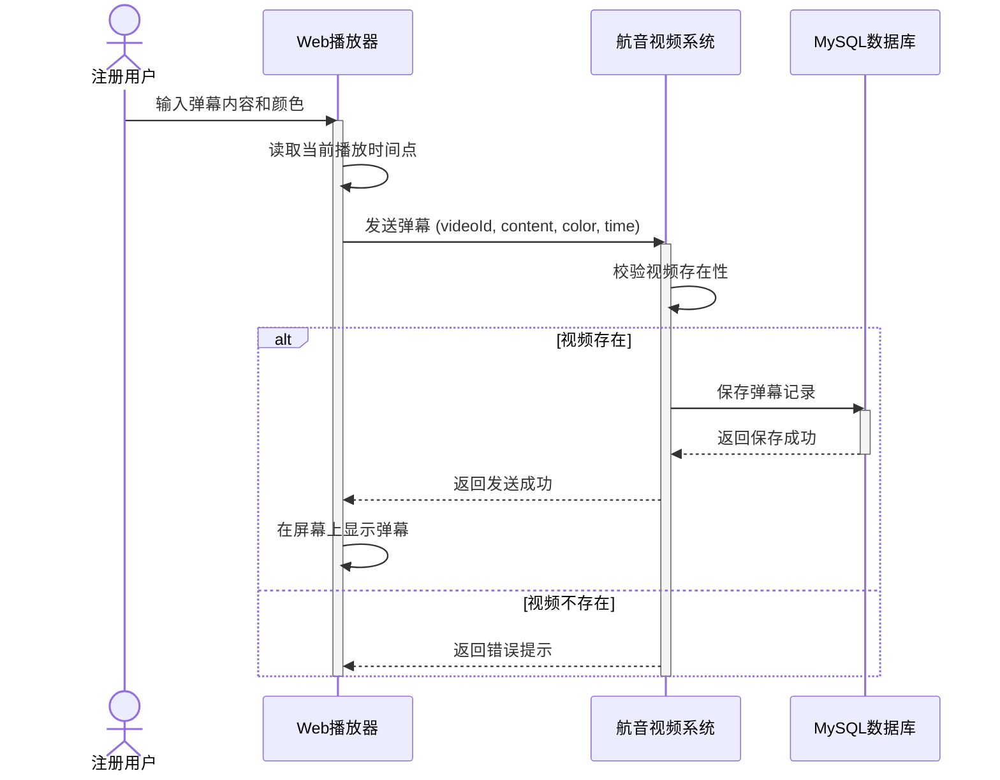
```mermaid
sequenceDiagram
    actor User as 注册用户
    participant Player as Web播放器
    participant System as 航音视频系统
    participant DB as MySQL数据库

    User->>Player: 输入弹幕内容和颜色
    activate Player
    Player->>Player: 读取当前播放时间点
    Player->>System: 发送弹幕 (videoId, content, color, time)
    activate System
    System->>System: 校验视频存在性

    alt 视频存在
        System->>DB: 保存弹幕记录
        activate DB
        DB-->>System: 返回保存成功
        deactivate DB
        System-->>Player: 返回发送成功
        Player->>Player: 在屏幕上显示弹幕
    else 视频不存在
        System-->>Player: 返回错误提示
    end
    deactivate System
    deactivate Player
```

#### 3.3.7 UC-07 创建直播间系统顺序图

代码段

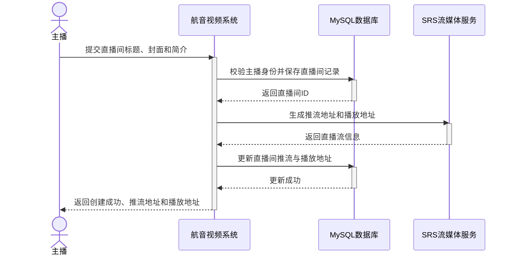
```mermaid
sequenceDiagram
    actor Anchor as 主播
    participant System as 航音视频系统
    participant DB as MySQL数据库
    participant SRS as SRS流媒体服务

    Anchor->>System: 提交直播间标题、封面和简介
    activate System
    System->>DB: 校验主播身份并保存直播间记录
    activate DB
    DB-->>System: 返回直播间ID
    deactivate DB
    System->>SRS: 生成推流地址和播放地址
    activate SRS
    SRS-->>System: 返回直播流信息
    deactivate SRS
    System->>DB: 更新直播间推流与播放地址
    activate DB
    DB-->>System: 更新成功
    deactivate DB
    System-->>Anchor: 返回创建成功、推流地址和播放地址
    deactivate System
```

#### 3.3.8 UC-08 观看直播系统活动图

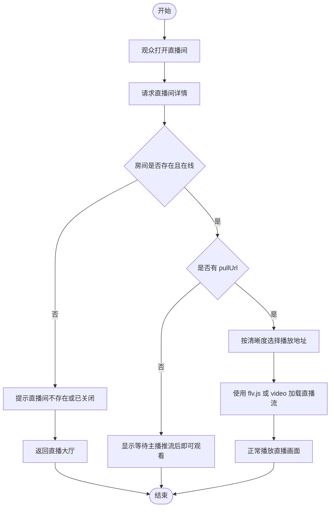
```mermaid
flowchart TD
    Start([开始]) --> Open[观众打开直播间]
    Open --> Load[请求直播间详情]
    Load --> Exists{房间是否存在且在线}
    Exists -- 否 --> Alert[提示直播间不存在或已关闭]
    Alert --> Back[返回直播大厅]
    Back --> End([结束])
    Exists -- 是 --> HasUrl{是否有 pullUrl}
    HasUrl -- 否 --> Wait[显示等待主播推流后即可观看]
    Wait --> End
    HasUrl -- 是 --> Choose[按清晰度选择播放地址]
    Choose --> LoadPlayer[使用 flv.js 或 video 加载直播流]
    LoadPlayer --> Play[正常播放直播画面]
    Play --> End
```

#### 3.3.9 UC-09 直播弹幕互动活动图

代码段

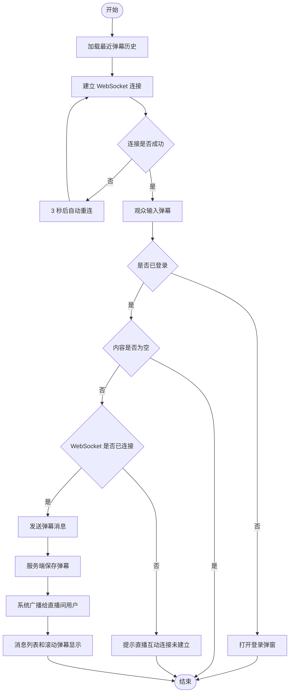
```mermaid
flowchart TD
    Start([开始]) --> History[加载最近弹幕历史]
    History --> Connect[建立 WebSocket 连接]
    Connect --> Connected{连接是否成功}
    Connected -- 否 --> Reconnect[3 秒后自动重连]
    Reconnect --> Connect
    Connected -- 是 --> Input[观众输入弹幕]
    Input --> Login{是否已登录}
    Login -- 否 --> LoginModal[打开登录弹窗]
    LoginModal --> End([结束])
    Login -- 是 --> Blank{内容是否为空}
    Blank -- 是 --> End
    Blank -- 否 --> WsOpen{WebSocket 是否已连接}
    WsOpen -- 否 --> Alert[提示直播互动连接未建立]
    Alert --> End
    WsOpen -- 是 --> Send[发送弹幕消息]
    Send --> Save[服务端保存弹幕]
    Save --> Broadcast[系统广播给直播间用户]
    Broadcast --> Display[消息列表和滚动弹幕显示]
    Display --> End
```

#### 3.3.10 UC-10 直播点赞系统活动图

代码段

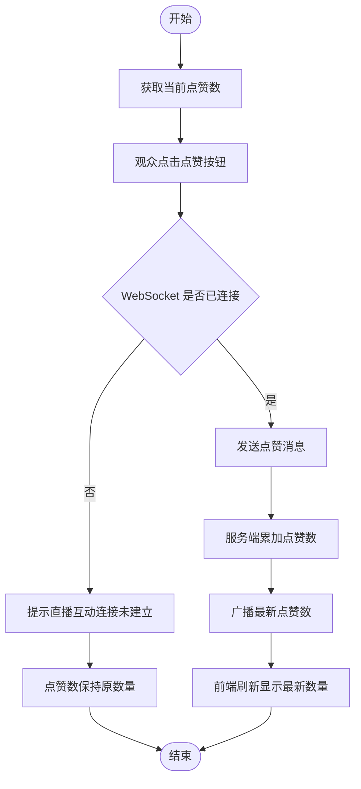
```mermaid
flowchart TD
    Start([开始]) --> Init[获取当前点赞数]
    Init --> Click[观众点击点赞按钮]
    Click --> WsOpen{WebSocket 是否已连接}
    WsOpen -- 否 --> Alert[提示直播互动连接未建立]
    Alert --> Keep[点赞数保持原数量]
    Keep --> End([结束])
    WsOpen -- 是 --> Send[发送点赞消息]
    Send --> Add[服务端累加点赞数]
    Add --> Broadcast[广播最新点赞数]
    Broadcast --> Refresh[前端刷新显示最新数量]
    Refresh --> End
```

### 概要设计 组件级

组件图

#### 4.2.1 UC-01 视频上传组件顺序图

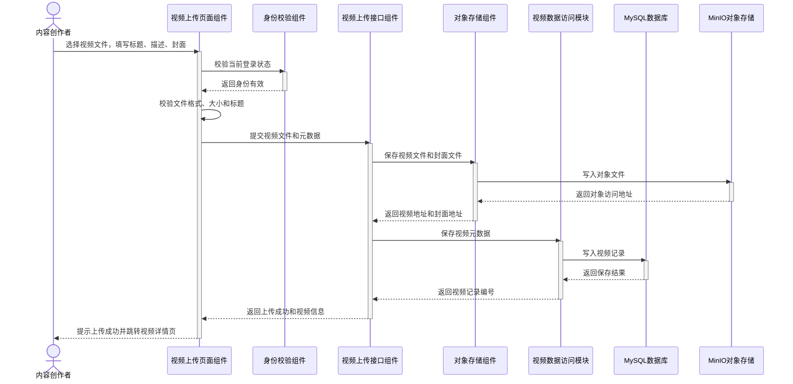
```mermaid
sequenceDiagram
    actor Creator as 内容创作者
    participant Page as 视频上传页面组件
    participant Auth as 身份校验组件
    participant Upload as 视频上传接口组件
    participant Storage as 对象存储组件
    participant Data as 视频数据访问模块
    participant DB as MySQL数据库
    participant MinIO as MinIO对象存储

    Creator->>Page: 选择视频文件，填写标题、描述、封面
    activate Page
    Page->>Auth: 校验当前登录状态
    activate Auth
    Auth-->>Page: 返回身份有效
    deactivate Auth
    Page->>Page: 校验文件格式、大小和标题
    Page->>Upload: 提交视频文件和元数据
    activate Upload
    Upload->>Storage: 保存视频文件和封面文件
    activate Storage
    Storage->>MinIO: 写入对象文件
    activate MinIO
    MinIO-->>Storage: 返回对象访问地址
    deactivate MinIO
    Storage-->>Upload: 返回视频地址和封面地址
    deactivate Storage
    Upload->>Data: 保存视频元数据
    activate Data
    Data->>DB: 写入视频记录
    activate DB
    DB-->>Data: 返回保存结果
    deactivate DB
    Data-->>Upload: 返回视频记录编号
    deactivate Data
    Upload-->>Page: 返回上传成功和视频信息
    deactivate Upload
    Page-->>Creator: 提示上传成功并跳转视频详情页
    deactivate Page
```

#### 4.2.2 UC-02 管理个人视频组件活动图

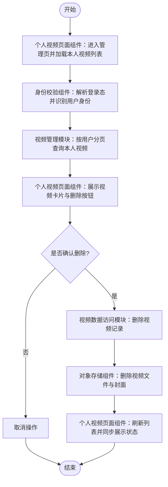
```mermaid
flowchart TD
    start([开始])
    vue_list["个人视频页面组件：进入管理页并加载本人视频列表"]
    auth_check["身份校验组件：解析登录态并识别用户身份"]
    manage_query["视频管理模块：按用户分页查询本人视频"]
    vue_show["个人视频页面组件：展示视频卡片与删除按钮"]
    vue_confirm{"是否确认删除?"}
    no1["取消操作"]
    data_delete["视频数据访问模块：删除视频记录"]
    storage_delete["对象存储组件：删除视频文件与封面"]
    list_refresh["个人视频页面组件：刷新列表并同步展示状态"]
    done([结束])

    start --> vue_list
    vue_list --> auth_check
    auth_check --> manage_query
    manage_query --> vue_show
    vue_show --> vue_confirm
    vue_confirm -->|否| no1
    no1 --> done
    vue_confirm -->|是| data_delete
    data_delete --> storage_delete
    storage_delete --> list_refresh
    list_refresh --> done
```

#### 4.2.3 UC-03 视频推荐组件顺序图

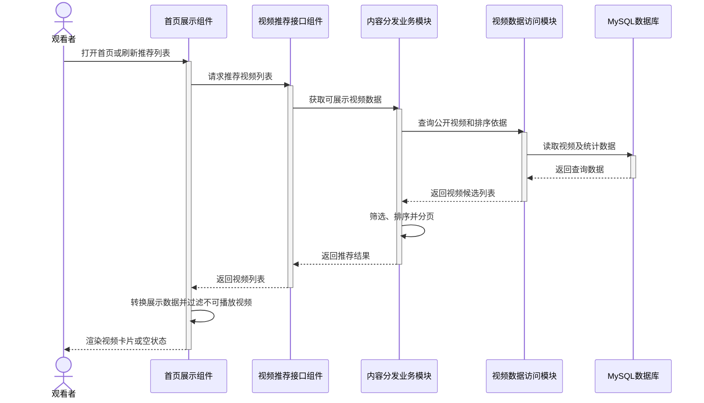
```mermaid
sequenceDiagram
    actor Viewer as 观看者
    participant Home as 首页展示组件
    participant Recommend as 视频推荐接口组件
    participant Content as 内容分发业务模块
    participant Data as 视频数据访问模块
    participant DB as MySQL数据库

    Viewer->>Home: 打开首页或刷新推荐列表
    activate Home
    Home->>Recommend: 请求推荐视频列表
    activate Recommend
    Recommend->>Content: 获取可展示视频数据
    activate Content
    Content->>Data: 查询公开视频和排序依据
    activate Data
    Data->>DB: 读取视频及统计数据
    activate DB
    DB-->>Data: 返回查询数据
    deactivate DB
    Data-->>Content: 返回视频候选列表
    deactivate Data
    Content->>Content: 筛选、排序并分页
    Content-->>Recommend: 返回推荐结果
    deactivate Content
    Recommend-->>Home: 返回视频列表
    deactivate Recommend
    Home->>Home: 转换展示数据并过滤不可播放视频
    Home-->>Viewer: 渲染视频卡片或空状态
    deactivate Home
```

#### 4.2.4 UC-04 视频播放组件顺序图

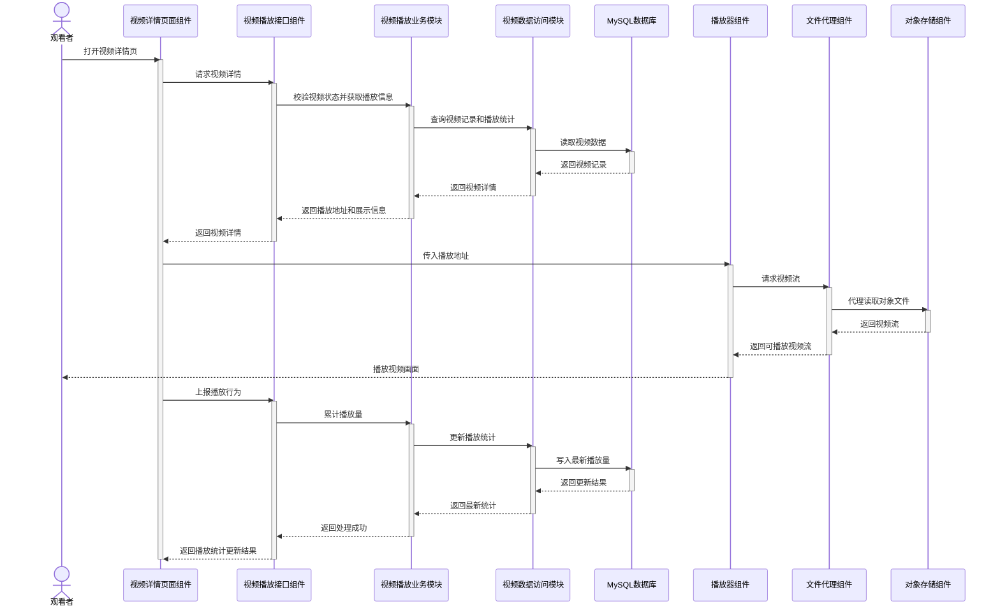
```mermaid
sequenceDiagram
    actor Viewer as 观看者
    participant Page as 视频详情页面组件
    participant VideoApi as 视频播放接口组件
    participant VideoBiz as 视频播放业务模块
    participant Data as 视频数据访问模块
    participant DB as MySQL数据库
    participant Player as 播放器组件
    participant Proxy as 文件代理组件
    participant Storage as 对象存储组件

    Viewer->>Page: 打开视频详情页
    activate Page
    Page->>VideoApi: 请求视频详情
    activate VideoApi
    VideoApi->>VideoBiz: 校验视频状态并获取播放信息
    activate VideoBiz
    VideoBiz->>Data: 查询视频记录和播放统计
    activate Data
    Data->>DB: 读取视频数据
    activate DB
    DB-->>Data: 返回视频记录
    deactivate DB
    Data-->>VideoBiz: 返回视频详情
    deactivate Data
    VideoBiz-->>VideoApi: 返回播放地址和展示信息
    deactivate VideoBiz
    VideoApi-->>Page: 返回视频详情
    deactivate VideoApi
    Page->>Player: 传入播放地址
    activate Player
    Player->>Proxy: 请求视频流
    activate Proxy
    Proxy->>Storage: 代理读取对象文件
    activate Storage
    Storage-->>Proxy: 返回视频流
    deactivate Storage
    Proxy-->>Player: 返回可播放视频流
    deactivate Proxy
    Player-->>Viewer: 播放视频画面
    deactivate Player
    Page->>VideoApi: 上报播放行为
    activate VideoApi
    VideoApi->>VideoBiz: 累计播放量
    activate VideoBiz
    VideoBiz->>Data: 更新播放统计
    activate Data
    Data->>DB: 写入最新播放量
    activate DB
    DB-->>Data: 返回更新结果
    deactivate DB
    Data-->>VideoBiz: 返回最新统计
    deactivate Data
    VideoBiz-->>VideoApi: 返回处理成功
    deactivate VideoBiz
    VideoApi-->>Page: 返回播放统计更新结果
    deactivate VideoApi
    deactivate Page
```

#### 4.2.5 UC-05 视频评论组件顺序图

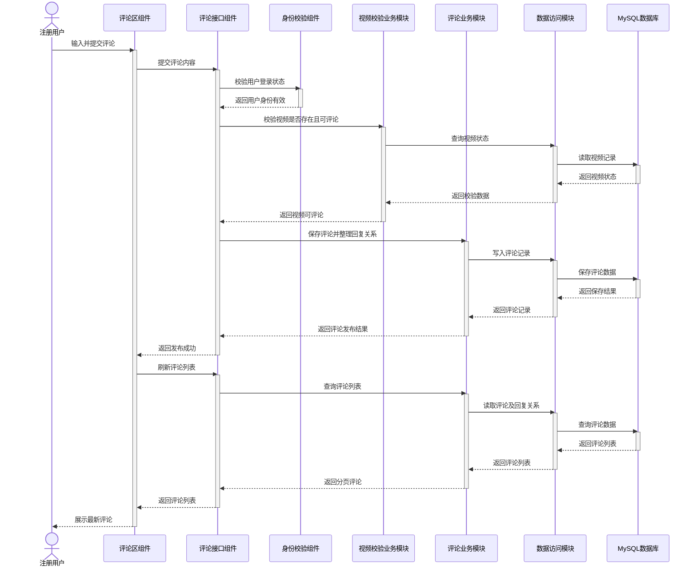
```mermaid
sequenceDiagram
    actor User as 注册用户
    participant CommentUI as 评论区组件
    participant CommentApi as 评论接口组件
    participant Auth as 身份校验组件
    participant VideoBiz as 视频校验业务模块
    participant CommentBiz as 评论业务模块
    participant Data as 数据访问模块
    participant DB as MySQL数据库

    User->>CommentUI: 输入并提交评论
    activate CommentUI
    CommentUI->>CommentApi: 提交评论内容
    activate CommentApi
    CommentApi->>Auth: 校验用户登录状态
    activate Auth
    Auth-->>CommentApi: 返回用户身份有效
    deactivate Auth
    CommentApi->>VideoBiz: 校验视频是否存在且可评论
    activate VideoBiz
    VideoBiz->>Data: 查询视频状态
    activate Data
    Data->>DB: 读取视频记录
    activate DB
    DB-->>Data: 返回视频状态
    deactivate DB
    Data-->>VideoBiz: 返回校验数据
    deactivate Data
    VideoBiz-->>CommentApi: 返回视频可评论
    deactivate VideoBiz
    CommentApi->>CommentBiz: 保存评论并整理回复关系
    activate CommentBiz
    CommentBiz->>Data: 写入评论记录
    activate Data
    Data->>DB: 保存评论数据
    activate DB
    DB-->>Data: 返回保存结果
    deactivate DB
    Data-->>CommentBiz: 返回评论记录
    deactivate Data
    CommentBiz-->>CommentApi: 返回评论发布结果
    deactivate CommentBiz
    CommentApi-->>CommentUI: 返回发布成功
    deactivate CommentApi
    CommentUI->>CommentApi: 刷新评论列表
    activate CommentApi
    CommentApi->>CommentBiz: 查询评论列表
    activate CommentBiz
    CommentBiz->>Data: 读取评论及回复关系
    activate Data
    Data->>DB: 查询评论数据
    activate DB
    DB-->>Data: 返回评论列表
    deactivate DB
    Data-->>CommentBiz: 返回评论列表
    deactivate Data
    CommentBiz-->>CommentApi: 返回分页评论
    deactivate CommentBiz
    CommentApi-->>CommentUI: 返回评论列表
    deactivate CommentApi
    CommentUI-->>User: 展示最新评论
    deactivate CommentUI
```

#### 4.2.6 UC-06 视频弹幕组件顺序图

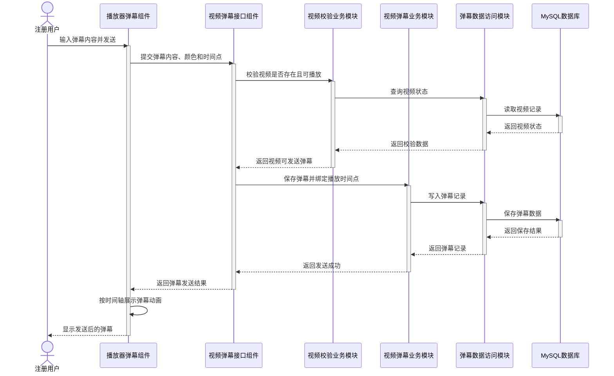
```mermaid
sequenceDiagram
    actor User as 注册用户
    participant Player as 播放器弹幕组件
    participant DanmakuApi as 视频弹幕接口组件
    participant VideoBiz as 视频校验业务模块
    participant DanmakuBiz as 视频弹幕业务模块
    participant Data as 弹幕数据访问模块
    participant DB as MySQL数据库

    User->>Player: 输入弹幕内容并发送
    activate Player
    Player->>DanmakuApi: 提交弹幕内容、颜色和时间点
    activate DanmakuApi
    DanmakuApi->>VideoBiz: 校验视频是否存在且可播放
    activate VideoBiz
    VideoBiz->>Data: 查询视频状态
    activate Data
    Data->>DB: 读取视频记录
    activate DB
    DB-->>Data: 返回视频状态
    deactivate DB
    Data-->>VideoBiz: 返回校验数据
    deactivate Data
    VideoBiz-->>DanmakuApi: 返回视频可发送弹幕
    deactivate VideoBiz
    DanmakuApi->>DanmakuBiz: 保存弹幕并绑定播放时间点
    activate DanmakuBiz
    DanmakuBiz->>Data: 写入弹幕记录
    activate Data
    Data->>DB: 保存弹幕数据
    activate DB
    DB-->>Data: 返回保存结果
    deactivate DB
    Data-->>DanmakuBiz: 返回弹幕记录
    deactivate Data
    DanmakuBiz-->>DanmakuApi: 返回发送成功
    deactivate DanmakuBiz
    DanmakuApi-->>Player: 返回弹幕发送结果
    deactivate DanmakuApi
    Player->>Player: 按时间轴展示弹幕动画
    Player-->>User: 显示发送后的弹幕
    deactivate Player
```

#### 4.2.7 UC-07 创建直播间组件级顺序图

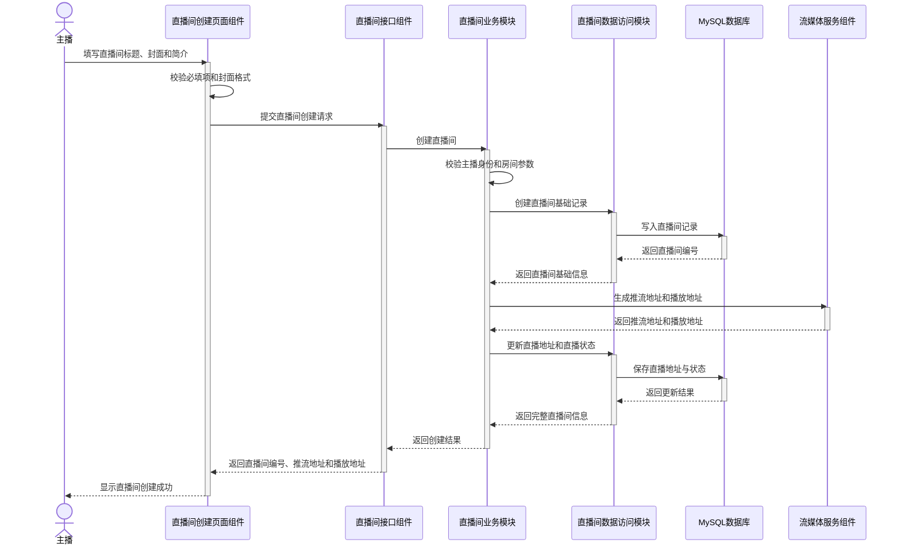
```mermaid
sequenceDiagram
    actor Anchor as 主播
    participant LivePage as 直播间创建页面组件
    participant LiveApi as 直播间接口组件
    participant LiveBiz as 直播间业务模块
    participant Data as 直播间数据访问模块
    participant DB as MySQL数据库
    participant Stream as 流媒体服务组件

    Anchor->>LivePage: 填写直播间标题、封面和简介
    activate LivePage
    LivePage->>LivePage: 校验必填项和封面格式
    LivePage->>LiveApi: 提交直播间创建请求
    activate LiveApi
    LiveApi->>LiveBiz: 创建直播间
    activate LiveBiz
    LiveBiz->>LiveBiz: 校验主播身份和房间参数
    LiveBiz->>Data: 创建直播间基础记录
    activate Data
    Data->>DB: 写入直播间记录
    activate DB
    DB-->>Data: 返回直播间编号
    deactivate DB
    Data-->>LiveBiz: 返回直播间基础信息
    deactivate Data
    LiveBiz->>Stream: 生成推流地址和播放地址
    activate Stream
    Stream-->>LiveBiz: 返回推流地址和播放地址
    deactivate Stream
    LiveBiz->>Data: 更新直播地址和直播状态
    activate Data
    Data->>DB: 保存直播地址与状态
    activate DB
    DB-->>Data: 返回更新结果
    deactivate DB
    Data-->>LiveBiz: 返回完整直播间信息
    deactivate Data
    LiveBiz-->>LiveApi: 返回创建结果
    deactivate LiveBiz
    LiveApi-->>LivePage: 返回直播间编号、推流地址和播放地址
    deactivate LiveApi
    LivePage-->>Anchor: 显示直播间创建成功
    deactivate LivePage
```

#### 4.2.8 UC-08 观看直播组件顺序图

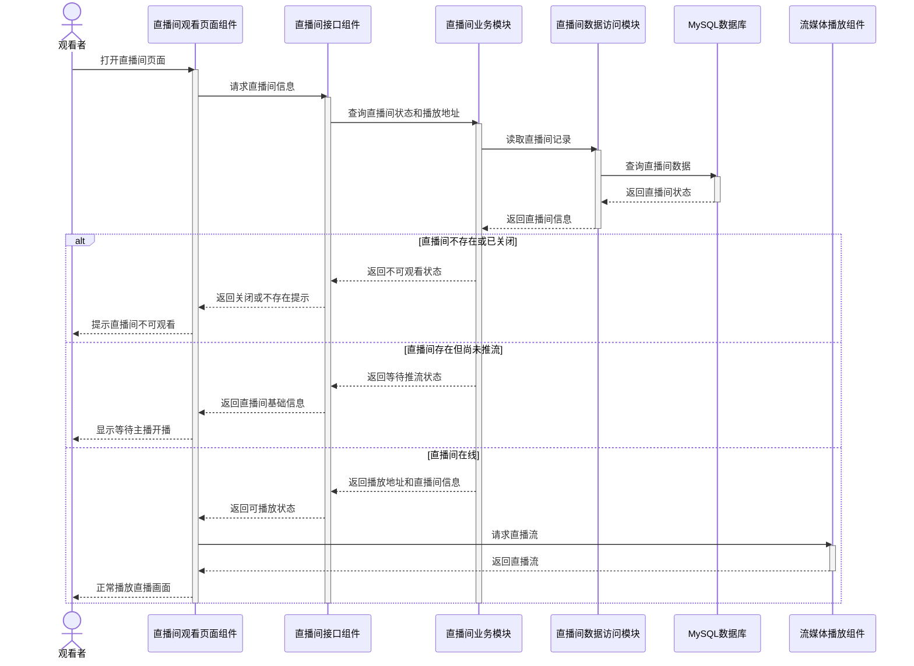
```mermaid
sequenceDiagram
    actor Audience as 观看者
    participant LivePage as 直播间观看页面组件
    participant LiveApi as 直播间接口组件
    participant LiveBiz as 直播间业务模块
    participant Data as 直播间数据访问模块
    participant DB as MySQL数据库
    participant Stream as 流媒体播放组件

    Audience->>LivePage: 打开直播间页面
    activate LivePage
    LivePage->>LiveApi: 请求直播间信息
    activate LiveApi
    LiveApi->>LiveBiz: 查询直播间状态和播放地址
    activate LiveBiz
    LiveBiz->>Data: 读取直播间记录
    activate Data
    Data->>DB: 查询直播间数据
    activate DB
    DB-->>Data: 返回直播间状态
    deactivate DB
    Data-->>LiveBiz: 返回直播间信息
    deactivate Data
    alt 直播间不存在或已关闭
        LiveBiz-->>LiveApi: 返回不可观看状态
        LiveApi-->>LivePage: 返回关闭或不存在提示
        LivePage-->>Audience: 提示直播间不可观看
    else 直播间存在但尚未推流
        LiveBiz-->>LiveApi: 返回等待推流状态
        LiveApi-->>LivePage: 返回直播间基础信息
        LivePage-->>Audience: 显示等待主播开播
    else 直播间在线
        LiveBiz-->>LiveApi: 返回播放地址和直播间信息
        LiveApi-->>LivePage: 返回可播放状态
        LivePage->>Stream: 请求直播流
        activate Stream
        Stream-->>LivePage: 返回直播流
        deactivate Stream
        LivePage-->>Audience: 正常播放直播画面
    end
    deactivate LiveBiz
    deactivate LiveApi
    deactivate LivePage
```

#### 4.2.9 UC-09 直播弹幕互动组件顺序图

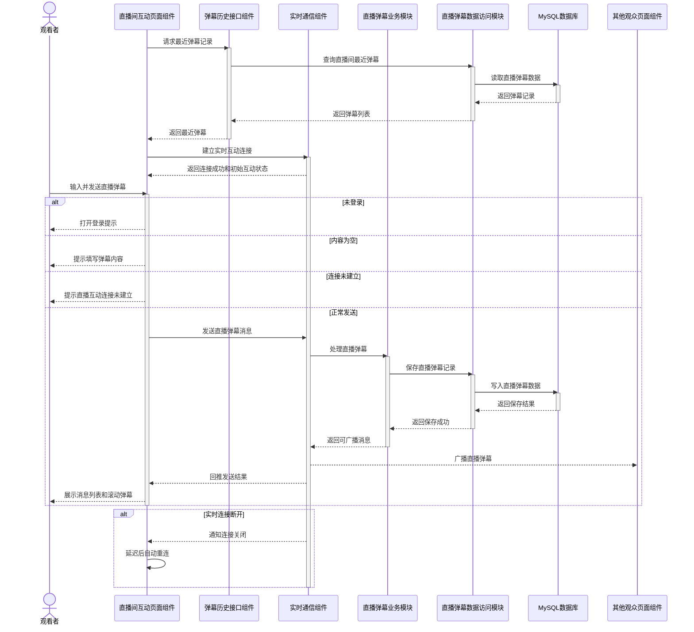
```mermaid
sequenceDiagram
    actor Audience as 观看者
    participant LivePage as 直播间互动页面组件
    participant History as 弹幕历史接口组件
    participant Realtime as 实时通信组件
    participant DanmakuBiz as 直播弹幕业务模块
    participant Data as 直播弹幕数据访问模块
    participant DB as MySQL数据库
    participant Others as 其他观众页面组件

    LivePage->>History: 请求最近弹幕记录
    activate History
    History->>Data: 查询直播间最近弹幕
    activate Data
    Data->>DB: 读取直播弹幕数据
    activate DB
    DB-->>Data: 返回弹幕记录
    deactivate DB
    Data-->>History: 返回弹幕列表
    deactivate Data
    History-->>LivePage: 返回最近弹幕
    deactivate History
    LivePage->>Realtime: 建立实时互动连接
    activate Realtime
    Realtime-->>LivePage: 返回连接成功和初始互动状态

    Audience->>LivePage: 输入并发送直播弹幕
    activate LivePage
    alt 未登录
        LivePage-->>Audience: 打开登录提示
    else 内容为空
        LivePage-->>Audience: 提示填写弹幕内容
    else 连接未建立
        LivePage-->>Audience: 提示直播互动连接未建立
    else 正常发送
        LivePage->>Realtime: 发送直播弹幕消息
        Realtime->>DanmakuBiz: 处理直播弹幕
        activate DanmakuBiz
        DanmakuBiz->>Data: 保存直播弹幕记录
        activate Data
        Data->>DB: 写入直播弹幕数据
        activate DB
        DB-->>Data: 返回保存结果
        deactivate DB
        Data-->>DanmakuBiz: 返回保存成功
        deactivate Data
        DanmakuBiz-->>Realtime: 返回可广播消息
        deactivate DanmakuBiz
        Realtime-->>Others: 广播直播弹幕
        Realtime-->>LivePage: 回推发送结果
        LivePage-->>Audience: 展示消息列表和滚动弹幕
    end
    deactivate LivePage

    alt 实时连接断开
        Realtime-->>LivePage: 通知连接关闭
        LivePage->>LivePage: 延迟后自动重连
    end
    deactivate Realtime
```

#### 4.2.10 UC-10 直播点赞组件顺序图

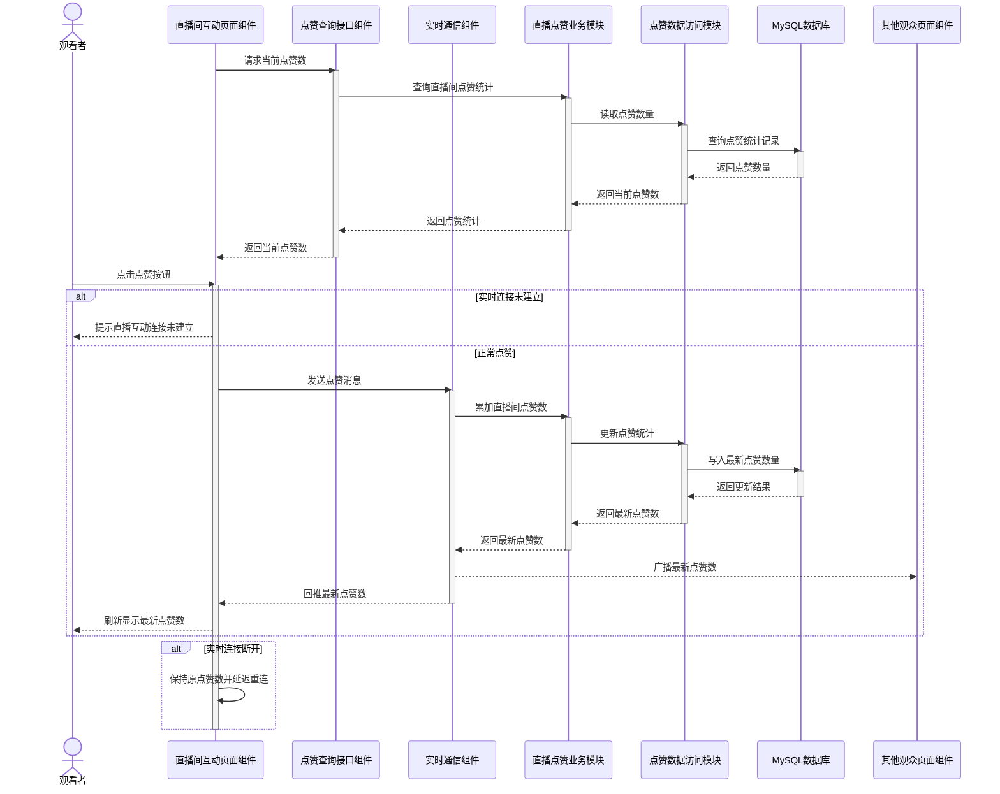
```mermaid
sequenceDiagram
    actor Audience as 观看者
    participant LivePage as 直播间互动页面组件
    participant LikeApi as 点赞查询接口组件
    participant Realtime as 实时通信组件
    participant LikeBiz as 直播点赞业务模块
    participant Data as 点赞数据访问模块
    participant DB as MySQL数据库
    participant Others as 其他观众页面组件

    LivePage->>LikeApi: 请求当前点赞数
    activate LikeApi
    LikeApi->>LikeBiz: 查询直播间点赞统计
    activate LikeBiz
    LikeBiz->>Data: 读取点赞数量
    activate Data
    Data->>DB: 查询点赞统计记录
    activate DB
    DB-->>Data: 返回点赞数量
    deactivate DB
    Data-->>LikeBiz: 返回当前点赞数
    deactivate Data
    LikeBiz-->>LikeApi: 返回点赞统计
    deactivate LikeBiz
    LikeApi-->>LivePage: 返回当前点赞数
    deactivate LikeApi

    Audience->>LivePage: 点击点赞按钮
    activate LivePage
    alt 实时连接未建立
        LivePage-->>Audience: 提示直播互动连接未建立
    else 正常点赞
        LivePage->>Realtime: 发送点赞消息
        activate Realtime
        Realtime->>LikeBiz: 累加直播间点赞数
        activate LikeBiz
        LikeBiz->>Data: 更新点赞统计
        activate Data
        Data->>DB: 写入最新点赞数量
        activate DB
        DB-->>Data: 返回更新结果
        deactivate DB
        Data-->>LikeBiz: 返回最新点赞数
        deactivate Data
        LikeBiz-->>Realtime: 返回最新点赞数
        deactivate LikeBiz
        Realtime-->>Others: 广播最新点赞数
        Realtime-->>LivePage: 回推最新点赞数
        deactivate Realtime
        LivePage-->>Audience: 刷新显示最新点赞数
    end

    alt 实时连接断开
        LivePage->>LivePage: 保持原点赞数并延迟重连
    end
    deactivate LivePage
```

### 详细设计 对象级

类图

```mermaid
classDiagram
    class VideoUploadPage {
        <<boundary>>
    }
    class HomePage {
        <<boundary>>
    }
    class VideoPlayerPage {
        <<boundary>>
    }
    class CommentArea {
        <<boundary>>
    }
    class LiveRoomPage {
        <<boundary>>
    }

    class UserController {
        <<control>>
    }
    class MinioController {
        <<control>>
    }
    class VideoController {
        <<control>>
    }
    class CommentController {
        <<control>>
    }
    class DanmakuController {
        <<control>>
    }
    class LiveRoomController {
        <<control>>
    }
    class LiveDanmuController {
        <<control>>
    }
    class LiveLikeController {
        <<control>>
    }

    class UserServiceImpl {
        <<control>>
    }
    class MinioService {
        <<control>>
    }
    class VideoServiceImpl {
        <<control>>
    }
    class CommentServiceImpl {
        <<control>>
    }
    class DanmakuServiceImpl {
        <<control>>
    }
    class LiveRoomServiceImpl {
        <<control>>
    }
    class LiveDanmuServiceImpl {
        <<control>>
    }
    class RoomLikesService {
        <<control>>
    }

    class UserMapper {
        <<repository>>
    }
    class VideoMapper {
        <<repository>>
    }
    class CommentMapper {
        <<repository>>
    }
    class DanmakuMapper {
        <<repository>>
    }
    class LiveRoomMapper {
        <<repository>>
    }
    class LiveDanmuMapper {
        <<repository>>
    }
    class RoomLikesMapper {
        <<repository>>
    }
    class ViewHistoryMapper {
        <<repository>>
    }
    class UserInterestMapper {
        <<repository>>
    }

    class User {
        <<entity>>
    }
    class Video {
        <<entity>>
    }
    class Comment {
        <<entity>>
    }
    class Danmaku {
        <<entity>>
    }
    class LiveRoom {
        <<entity>>
    }
    class LiveDanmu {
        <<entity>>
    }
    class RoomLikes {
        <<entity>>
    }
    class ViewHistory {
        <<entity>>
    }
    class UserInterest {
        <<entity>>
    }
    class LiveRoomCreateDTO {
        <<dto>>
    }
    class LoginUserVO {
        <<vo>>
    }
    class LiveRoomVO {
        <<vo>>
    }

    VideoUploadPage --> VideoController : upload
    HomePage --> VideoController : recommend
    VideoPlayerPage --> VideoController : detail/play
    CommentArea --> CommentController : comment
    VideoPlayerPage --> DanmakuController : danmaku
    LiveRoomPage --> LiveRoomController : create/view
    LiveRoomPage --> LiveDanmuController : live danmaku
    LiveRoomPage --> LiveLikeController : like

    VideoController --> VideoServiceImpl
    VideoController --> MinioController
    UserController --> UserServiceImpl
    CommentController --> CommentServiceImpl
    DanmakuController --> DanmakuServiceImpl
    LiveRoomController --> LiveRoomServiceImpl
    LiveDanmuController --> LiveDanmuServiceImpl
    LiveLikeController --> RoomLikesService
    MinioController --> MinioService

    UserServiceImpl --> UserMapper
    VideoServiceImpl --> VideoMapper
    VideoServiceImpl --> ViewHistoryMapper
    VideoServiceImpl --> UserInterestMapper
    CommentServiceImpl --> CommentMapper
    DanmakuServiceImpl --> DanmakuMapper
    LiveRoomServiceImpl --> LiveRoomMapper
    LiveRoomServiceImpl --> LiveRoomCreateDTO
    LiveDanmuServiceImpl --> LiveDanmuMapper
    RoomLikesService --> RoomLikesMapper

    VideoServiceImpl --> Video
    CommentServiceImpl --> Comment
    DanmakuServiceImpl --> Danmaku
    LiveRoomServiceImpl --> LiveRoom
    LiveDanmuServiceImpl --> LiveDanmu
    RoomLikesService --> RoomLikes
    UserServiceImpl --> LoginUserVO
    LiveRoomServiceImpl --> LiveRoomVO

    User "1" --> "0..*" Video : publishes
    Video "1" --> "0..*" Comment : has
    Video "1" --> "0..*" Danmaku : has
    LiveRoom "1" --> "0..*" LiveDanmu : receives
    LiveRoom "1" --> "1" RoomLikes : tracks
```

#### 3.1.1 UC-01 上传视频对象级顺序图

```mermaid
sequenceDiagram
    actor Creator as 内容创作者
    participant Ctrl as VideoController
    participant Svc as :VideoServiceImpl
    participant Minio as :MinioService
    participant Mapper as :VideoMapper
    participant Video as video:Video
    activate Creator
    activate Ctrl
    activate Svc
    activate Minio

    Creator->>Ctrl: POST /video/upload（file, title, description, cover）
    Ctrl->>Svc: uploadVideo(userId, file, form)
    Svc->>Svc: 校验登录态与参数
    Svc->>Video: new Video()
    activate Video
    Svc->>Video: setTitle(form.title)
    Svc->>Video: setDescription(form.description)
    Svc->>Video: setUserId(userId)
    Svc->>Minio: uploadFile(video-bucket, 视频文件)
    Minio-->>Svc: 返回视频对象名
    Svc->>Video: setPlayUrl(视频访问地址)
    Svc->>Minio: uploadFile(cover-bucket, 封面文件)
    Minio-->>Svc: 返回封面对象名
    Svc->>Video: setCoverUrl(封面地址)
    Svc->>Mapper: insert(video)
    activate Mapper
    Mapper-->>Svc: 影响行数=1
    deactivate Mapper
    Svc->>Video: 读取 id / playUrl / coverUrl
    Video-->>Svc: 视频记录信息
    Svc-->>Ctrl: 返回 Video 对象
    Ctrl-->>Creator: Result(200, "上传成功", VideoVO)
    deactivate Video

    deactivate Creator
    deactivate Ctrl
    deactivate Svc
    deactivate Minio
```

#### 3.1.2 UC-02 管理个人视频活动图

```mermaid
flowchart TD
    start([开始])
    ctrl["VideoController 接收<br/>GET /video/my（列表）<br/>或 DELETE /video/{id}（删除）"]
    check{"请求类型"}
    query["VideoServiceImpl.pageMyVideos(userId)<br/>→ videoMapper 分页查询本人视频"]
    show["返回 PageResult~VideoVO~<br/>前端展示本人视频列表"]
    del1["VideoServiceImpl.deleteVideo(userId, videoId)"]
    del2["videoMapper 校验 video.userId == userId"]
    pass{"归属校验"}
    deny["抛出异常，返回 403<br/>拒绝删除非本人视频"]
    del3["videoMapper.deleteById(videoId)"]
    del4["minioService.removeFile(视频对象)"]
    del5["minioService.removeFile(封面对象)"]
    del6["redisUtil.delete(视频缓存)"]
    resp["返回 Result~Void~ 删除成功"]
    done([结束])

    start --> ctrl
    ctrl --> check
    check -->|查询列表| query
    query --> show
    show --> done
    check -->|删除| del1
    del1 --> del2
    del2 --> pass
    pass -->|不通过| deny
    deny --> done
    pass -->|通过| del3
    del3 --> del4
    del4 --> del5
    del5 --> del6
    del6 --> resp
    resp --> done
```

### 3.2 内容分发子系统

内容分发子系统负责首页推荐、视频详情和个人视频列表查询；视频播放子系统负责根据播放地址加载视频文件，提供播放、暂停、进度控制和倍速等基础能力。两者对应需求 REQ-02、REQ-03，并落实概要设计项 DES-02、DES-03。

#### 3.2.1 UC-03 浏览推荐视频顺序图

```mermaid
sequenceDiagram
    actor Viewer as 观看者
    participant App as App.vue
    participant Controller as VideoController
    participant Service as VideoServiceImpl
    participant VideoMapper as VideoMapper
    participant UserMapper as UserMapper
    participant FollowMapper as UserFollowMapper
    participant HistoryMapper as ViewHistoryMapper
    participant InterestMapper as UserInterestMapper
    participant DB as MySQL
    activate Viewer
    activate App
    activate Controller
    activate Service
    activate VideoMapper
    activate UserMapper
    activate FollowMapper
    activate HistoryMapper
    activate InterestMapper
    activate DB

    Viewer->>App: 打开首页或刷新推荐列表
    App->>Controller: GET /api/videos/recommend
    Controller->>Service: getRecommendedFeed(userId,page,pageSize,categoryId,keyword)
    Service->>VideoMapper: selectList(status=public, categoryId)
    VideoMapper->>DB: 查询video表
    DB-->>VideoMapper: 返回视频记录
    VideoMapper-->>Service: List<Video>
    Service->>UserMapper: 查询作者资料
    UserMapper->>DB: 查询sys_user表
    opt 用户已登录
        Service->>FollowMapper: 查询关注作者
        FollowMapper->>DB: 查询user_follow表
        Service->>HistoryMapper: 查询观看历史
        HistoryMapper->>DB: 查询view_history表
        Service->>InterestMapper: 查询兴趣标签
        InterestMapper->>DB: 查询user_interest表
    end
    Service->>Service: 补充展示数据、计算推荐顺序并分页
    Service-->>Controller: List<Video>
    Controller-->>App: ApiResponse.success(videoList)
    App->>App: convertVideoFromBackend并过滤不可播放项
    App-->>Viewer: 展示推荐列表或空状态

    deactivate Viewer
    deactivate App
    deactivate Controller
    deactivate Service
    deactivate VideoMapper
    deactivate UserMapper
    deactivate FollowMapper
    deactivate HistoryMapper
    deactivate InterestMapper
    deactivate DB
```

### 3.3 视频播放活动图

视频播放，弹幕互动，评论互动

#### 3.3.1 UC-04 播放视频活动图

```mermaid
sequenceDiagram
    actor 用户 as 用户
    participant VP as VideoPlayer.vue
    participant VC as VideoController
    participant VS as VideoServiceImpl
    participant VM as VideoMapper
    participant VHM as ViewHistoryMapper
    participant UIM as UserInterestMapper
    participant DB as MySQL
    activate 用户
    activate VP
    activate VC
    activate VS
    activate VM
    activate VHM
    activate UIM
    activate DB

    用户->>VP: 点击播放
    VP->>VC: GET /api/videos/{videoId}
    VC->>VC: getVideoById(videoId)
    VC->>VS: getVideoById(videoId)
    VS->>VM: selectById(videoId)
    VM->>DB: SELECT * FROM video WHERE id=?
    DB-->>VM: Video记录
    VM-->>VS: Video实体
    VS->>VS: decorateVideo(video)
    VS-->>VC: 视频详情
    VC-->>VP: 视频JSON（含sources、playUrl）
    VP->>VP: 加载视频源并播放

    VP->>VC: POST /api/videos/{videoId}/play
    VC->>VS: incrementPlayCount(videoId, userId)
    VS->>VM: incrementPlayCount(videoId)
    VM->>DB: UPDATE video SET play_count=play_count+1
    DB-->>VM: 1
    VS->>VHM: insert或update ViewHistory
    VHM->>DB: INSERT INTO view_history
    DB-->>VHM: 1
    VS->>VS: adjustUserInterestForVideo(userId, videoId, 1)
    VS->>UIM: insert/update UserInterest
    UIM->>DB: INSERT INTO user_interest
    DB-->>UIM: 1
    VS-->>VC: {videoId, playCount}
    VC-->>VP: 返回新播放量

    deactivate 用户
    deactivate VP
    deactivate VC
    deactivate VS
    deactivate VM
    deactivate VHM
    deactivate UIM
    deactivate DB
```

#### 3.3.2 UC-05 发送评论活动图

```mermaid
flowchart TD
    Start([开始]) --> A[用户点击发送评论]
    A --> Cond1{用户是否登录}
    
    Cond1 -- 否 --> End_Login[提示登录提示]
    Cond1 -- 是 --> B[前端发送POST请求]
    
    B --> C[CommentController接收请求]
    C --> D[VideoController校验视频是否存在]
    D --> Cond2{视频是否存在}
    
    Cond2 -- 否 --> End_404[返回404代码]
    Cond2 -- 是 --> E[构建Comment实体]
    
    E --> F[UserService查询用户是否存在]
    F --> Cond3{用户是否存在}
    
    Cond3 -- 否 --> End_401[返回401代码]
    Cond3 -- 是 --> G[CommentServiceImpl执行保存]
    
    G --> H[CommentMapper.insert]
    H --> I[MySQL INSERT INTO comment]
    I --> Cond4{保存是否成功}
    
    Cond4 -- 否 --> End_500[返回500代码]
    Cond4 -- 是 --> J[评论列表实时更新]
    
    J --> K[页面追加显示新评论]
    K --> End_200[返回200代码]
    
    End_Login --> End([结束])
    End_404 --> End
    End_401 --> End
    End_500 --> End
    End_200 --> End
```

#### 3.3.3 UC-06 发送视频弹幕活动图

```mermaid
sequenceDiagram
    actor 用户 as 用户
    participant VP as VideoPlayer.vue
    participant DC as DanmakuController
    participant VC as VideoController
    participant DS as DanmakuServiceImpl
    participant DM as DanmakuMapper
    participant VM as VideoMapper
    participant DB as MySQL
    activate 用户
    activate VP
    activate DC
    activate VC
    activate DS
    activate DM
    activate VM
    activate DB

    用户->>VP: 输入弹幕内容和颜色，按回车发送
    VP->>VP: 读取当前video.currentTime
    VP->>DC: POST /api/videos/{videoId}/danmakus
    DC->>VC: getVideoById(videoId)
    VC->>VM: selectById(videoId)
    VM->>DB: SELECT * FROM video WHERE id=?
    DB-->>VM: Video记录
    VM-->>VC: Video实体
    VC-->>DC: 视频存在
    DC->>DC: 构建Danmaku对象(videoUrl, content, color, time, userId)
    DC->>DS: saveDanmaku(danmaku)
    DS->>DS: setCreatedAt(LocalDateTime.now())
    DS->>DM: insert(danmaku)
    DM->>DB: INSERT INTO danmaku
    DB-->>DM: 1
    DM-->>DS: true
    DS-->>DC: true
    DC-->>VP: 返回"弹幕发送成功"
    VP->>VP: 本地立即显示弹幕动画
    VP->>VP: 按时间点排序弹幕列表

    deactivate 用户
    deactivate VP
    deactivate DC
    deactivate VC
    deactivate DS
    deactivate DM
    deactivate VM
    deactivate DB
```

## 4 直播互动子系统详细设计

### 4.1 模块职责

直播互动子系统负责直播间创建、直播状态管理、播放地址生成、直播弹幕广播和直播点赞统计。直播间管理对应需求 REQ-05，实时互动对应需求 REQ-06，并落实概要设计项 DES-05、DES-06。

#### 4.1.1 UC-07 创建直播间对象级顺序图

```mermaid
sequenceDiagram
    actor Anchor as 主播
    participant Page as createPage:LiveRoomCreatePage
    participant Ctrl as roomCtrl:LiveRoomController
    participant Svc as roomSvc:LiveRoomServiceImpl
    participant DTO as createDTO:LiveRoomCreateDTO
    participant Room as room:LiveRoom
    participant Mapper as roomMapper:LiveRoomMapper
    participant SRS as streamConfig:SrsStreamConfig
    participant VO as roomVO:LiveRoomVO
    participant DB as db:MySQL
    activate Anchor

    Anchor->>Page: 填写直播间标题、封面和简介
    activate Page
    Page->>DTO: new LiveRoomCreateDTO(title, coverUrl, description)
    activate DTO
    DTO-->>Page: 创建请求对象
    deactivate DTO
    Page->>Ctrl: POST /api/live/rooms(createDTO)
    activate Ctrl
    Ctrl->>Svc: createRoom(anchorId, createDTO)
    activate Svc
    Svc->>DTO: validate()
    activate DTO
    DTO-->>Svc: 参数合法
    deactivate DTO
    Svc->>Room: new LiveRoom()
    activate Room
    Svc->>Room: 设置主播、标题、封面、streamName
    Svc->>Mapper: insert(room)
    activate Mapper
    Mapper->>DB: INSERT INTO live_room
    activate DB
    DB-->>Mapper: 返回 roomId
    deactivate DB
    Mapper-->>Svc: 保存成功
    deactivate Mapper
    Svc->>SRS: buildPushUrl(streamName)
    activate SRS
    SRS-->>Svc: pushUrl、playUrl
    deactivate SRS
    Svc->>Room: setPushUrl(pushUrl)
    Svc->>Room: setPlayUrl(playUrl)
    Svc->>Room: setStatus(waiting)
    Svc->>Mapper: updateById(room)
    activate Mapper
    Mapper->>DB: UPDATE live_room
    activate DB
    DB-->>Mapper: 更新成功
    deactivate DB
    Mapper-->>Svc: 返回更新结果
    deactivate Mapper
    Svc->>VO: LiveRoomVO.fromEntity(room)
    activate VO
    VO-->>Svc: roomVO
    deactivate VO
    Room-->>Svc: 完整直播间对象
    deactivate Room
    Svc-->>Ctrl: roomVO
    deactivate Svc
    Ctrl-->>Page: Result(200, roomVO)
    deactivate Ctrl
    Page-->>Anchor: 显示推流地址、播放地址和直播间编号
    deactivate Page

    deactivate Anchor
```

#### 4.1.2 UC-08 观看直播活动图

```mermaid
sequenceDiagram
    actor Viewer as 观众
    participant Vue as 直播间前端
    participant Ctrl as LiveRoomController
    participant Svc as :LiveRoomServiceImpl
    participant RoomMapper as :LiveRoomMapper
    participant UserMapper as :UserMapper
    participant Room as room:LiveRoom
    participant VO as roomVO:LiveRoomVO
    participant Player as flv.js 播放器
    activate Viewer
    activate Vue
    activate Ctrl
    activate Svc
    activate RoomMapper
    activate UserMapper
    activate Room
    activate VO
    activate Player

    Viewer->>Vue: 打开直播间页面
    Vue->>Ctrl: GET /api/live/rooms/{roomId}
    Ctrl->>Svc: getRoom(roomId)
    Svc->>RoomMapper: selectById(roomId)
    RoomMapper-->>Svc: room:LiveRoom

    alt room == null
        Svc-->>Ctrl: throw 直播间不存在
        Ctrl-->>Vue: Result(404, "直播间不存在")
        Vue-->>Viewer: 提示并返回直播大厅
    else room != null
        Svc->>UserMapper: selectById(room.userId)
        UserMapper-->>Svc: user:User
        Svc->>Room: getStreamName()
        Room-->>Svc: streamName
        Svc->>VO: LiveRoomVO.fromEntity(room)
        Svc->>VO: setPullUrl(HTTP-FLV 播放地址)
        Svc->>VO: setQualityUrls(原画 / 720P / 480P)
        Svc->>VO: setAnchorNickname(user.nickname)
        Svc-->>Ctrl: roomVO
        Ctrl-->>Vue: Result(200, roomVO)
        Vue->>Player: createPlayer({type:"flv", url:pullUrl, isLive:true})
        Vue->>Player: attachMediaElement / load / play
        Player-->>Vue: 直播画面播放
        Vue-->>Viewer: 显示直播画面
    end

    deactivate Viewer
    deactivate Vue
    deactivate Ctrl
    deactivate Svc
    deactivate RoomMapper
    deactivate UserMapper
    deactivate Room
    deactivate VO
    deactivate Player
```

#### 4.1.3 UC-09 直播弹幕互动活动图

```mermaid
sequenceDiagram
    actor Viewer as 观众
    participant Vue as 直播间前端
    participant DanmuCtrl as LiveDanmuController
    participant DanmuSvc as :LiveDanmuService
    participant DanmuMapper as :LiveDanmuMapper
    participant Danmu as danmu:LiveDanmu
    participant WS as LiveInteractWebSocketHandler
    participant LikesSvc as :RoomLikesService
    participant Other as 其他在线客户端
    activate Viewer
    activate Vue
    activate DanmuCtrl
    activate DanmuSvc
    activate DanmuMapper
    activate Danmu
    activate WS
    activate LikesSvc
    activate Other

    Vue->>DanmuCtrl: GET /api/live/rooms/{roomId}/danmus?limit=50
    DanmuCtrl->>DanmuSvc: getRecentDanmu(roomId, 50)
    DanmuSvc->>DanmuMapper: selectList(room_id = roomId, LIMIT 50)
    DanmuMapper-->>DanmuSvc: List~LiveDanmu~
    DanmuSvc-->>DanmuCtrl: 最近弹幕列表
    DanmuCtrl-->>Vue: Result(200, 弹幕列表)

    Vue->>WS: 建立 WebSocket 连接 ws://.../ws/live/{roomId}
    WS->>LikesSvc: getLikeCount(roomId)
    LikesSvc-->>WS: likeCount
    WS->>Other: 广播 online_count 与当前点赞数

    Viewer->>Vue: 输入并发送弹幕
    Vue->>WS: {type:"danmu", userId, content, color}
    WS->>DanmuSvc: saveDanmu(roomId, userId, username, content, color)
    DanmuSvc->>Danmu: new LiveDanmu()
    DanmuSvc->>Danmu: setRoomId / setUserId / setContent / setColor
    DanmuSvc->>DanmuMapper: insert(danmu)
    DanmuMapper-->>DanmuSvc: 影响行数 = 1
    DanmuSvc-->>WS: danmu:LiveDanmu
    WS->>Other: 广播 {type:"danmu", id, content, color, sendTime}
    Other-->>Vue: 消息列表和滚动弹幕显示

    deactivate Viewer
    deactivate Vue
    deactivate DanmuCtrl
    deactivate DanmuSvc
    deactivate DanmuMapper
    deactivate Danmu
    deactivate WS
    deactivate LikesSvc
    deactivate Other
```

#### 4.1.4 UC-10 直播点赞顺序图

```mermaid
sequenceDiagram
    autonumber
    actor Viewer as 观众
    participant Vue as 直播间前端
    participant LikeCtrl as LiveLikeController
    participant LikesSvc as :RoomLikesService
    participant LikesMapper as :RoomLikesMapper
    participant Likes as likes:RoomLikes
    participant WS as LiveInteractWebSocketHandler
    participant Other as 其他在线客户端
    activate Viewer
    activate Vue
    activate LikeCtrl
    activate LikesSvc
    activate LikesMapper
    activate Likes
    activate WS
    activate Other

    Vue->>LikeCtrl: GET /api/live/rooms/{roomId}/like
    LikeCtrl->>LikesSvc: getLikeCount(roomId)
    LikesSvc->>LikesMapper: selectById(roomId)
    LikesMapper-->>LikesSvc: likes:RoomLikes
    LikesSvc-->>LikeCtrl: likeCount
    LikeCtrl-->>Vue: Result(200, Map.of("likeCount", likeCount))

    Viewer->>Vue: 点击点赞按钮
    Vue->>WS: {type:"like", userId}
    WS->>LikesSvc: addLike(roomId)
    LikesSvc->>LikesMapper: upsertIncrement(roomId)
    LikesMapper-->>LikesSvc: 更新成功
    LikesSvc->>LikesMapper: selectById(roomId)
    LikesMapper-->>LikesSvc: likes:RoomLikes
    LikesSvc-->>WS: 最新 likeCount
    WS->>Other: 广播 {type:"like", likeCount}
    Other-->>Vue: 刷新显示最新点赞数

    deactivate Viewer
    deactivate Vue
    deactivate LikeCtrl
    deactivate LikesSvc
    deactivate LikesMapper
    deactivate Likes
    deactivate WS
    deactivate Other
```

### 测试报告

测试环境

| 项目        | 实际环境                                  |
| ----------- | ----------------------------------------- |
| 操作系统    | Windows                                   |
| Git 分支    | `uc07cicd`                                |
| Java        | 21.0.11                                   |
| Maven       | 3.9.16（使用本机已缓存发行版）            |
| Node.js     | v24.15.0                                  |
| npm         | 11.12.1                                   |
| Spring Boot | 4.0.6                                     |
| MySQL       | 8.0.45，本地专用数据库 `hangyin_video_ci` |
| MinIO       | Docker `minio/minio:latest`               |
| SRS         | Docker `ossrs/srs:5`                      |
| 浏览器      | Playwright Chromium 151                   |
| 测试时间    | 2026-08-28                                |

统计

| 测试类别                    |              总数 |     通过 | 失败 | 错误 | 跳过/不执行 | 结论   |
| --------------------------- | ----------------: | -------: | ---: | ---: | ----------: | ------ |
| 后端单元测试                | 包含于 Maven 汇总 | 全部通过 |    0 |    0 |           0 | 通过   |
| 后端集成/API/WebSocket 测试 | 包含于 Maven 汇总 | 全部通过 |    0 |    0 |           0 | 通过   |
| HTTP 端到端测试             |      2 个场景脚本 | 全部通过 |    0 |    0 |           0 | 通过   |
| 浏览器端到端测试            |                16 |       11 |    3 |    0 |           1 | 未通过 |

后端 Maven 汇总为 `Tests run: 119, Failures: 0, Errors: 0, Skipped: 0`。单元测试与集成/API/WebSocket 测试在 UC04-UC06、UC08-UC10 等测试类中存在混合和嵌套关系，不能简单按类别相加；本报告以 Maven 的 119 项唯一执行结果作为后端总数。

### 8.1 UC01-02 视频上传、管理和可见性

| 编号                     | 测试内容                                                     | 类型 | 本次结果 |
| ------------------------ | ------------------------------------------------------------ | ---- | -------- |
| TC-01-1                  | 有效文件上传成功，标题、状态和清晰度字段正确                 | API  | 通过     |
| TC-01-2                  | 标题为空时拒绝上传                                           | API  | 通过     |
| TC-01-3                  | 文件为空时拒绝上传                                           | API  | 通过     |
| TC-01-4                  | MinIO 上传异常时返回失败且不保存视频                         | API  | 通过     |
| TC-01-5                  | 视频转码异常时返回失败且不保存视频                           | API  | 通过     |
| TC-01-6                  | 转码无结果时回退到原始视频地址                               | API  | 通过     |
| TC-02-1                  | 查询用户上传视频列表                                         | API  | 通过     |
| TC-02-2a                 | 视频所有者通过请求头删除视频                                 | API  | 通过     |
| TC-02-2b                 | 视频所有者通过请求体删除视频                                 | API  | 通过     |
| TC-02-2c                 | 缺少用户身份时拒绝删除                                       | API  | 通过     |
| TC-02-3                  | 非所有者删除视频时返回无权限                                 | API  | 通过     |
| TC-02-4                  | 查询不存在视频时返回 404                                     | API  | 通过     |
| TC-02-5                  | 所有者将视频设置为私密                                       | API  | 通过     |
| TC-02-6                  | 所有者将视频设置为公开                                       | API  | 通过     |
| TC-02-7                  | 非所有者修改可见性时返回无权限                               | API  | 通过     |
| UNIT-01-01 至 UNIT-01-10 | 删除权限、重复删除、空用户、视频不存在、可见性切换、列表装饰和播放量格式化 | 单元 | 通过     |
| INT-01-02-01             | Spring 应用上下文加载                                        | 集成 | 通过     |

### 8.2 UC03 浏览推荐视频

| 编号          | 测试内容                                       | 类型       | 本次结果                          |
| ------------- | ---------------------------------------------- | ---------- | --------------------------------- |
| UNIT-TC-03-01 | 公热视频按推荐分数排序                         | 单元       | 通过                              |
| UNIT-TC-03-02 | 关键词匹配标题、作者、描述和标签               | 单元       | 通过                              |
| UNIT-TC-03-03 | 非法分页值按安全范围修正                       | 单元       | 通过                              |
| UNIT-TC-03-04 | 已关注作者获得推荐加分                         | 单元       | 通过                              |
| UNIT-TC-03-05 | 页码超过结果范围返回空列表                     | 单元       | 通过                              |
| UNIT-TC-03-06 | 游客不读取个性化数据                           | 单元       | 通过                              |
| UNIT-TC-03-07 | 登录用户读取关注、兴趣和观看历史               | 单元       | 通过                              |
| UNIT-TC-03-08 | 兴趣标签匹配提高排序                           | 单元       | 通过                              |
| UNIT-TC-03-09 | 已观看视频降低排序权重                         | 单元       | 通过                              |
| UNIT-TC-03-10 | 只查询公开视频和指定分类                       | 单元       | 通过                              |
| UNIT-TC-03-11 | 分数相同时近期视频优先                         | 单元       | 通过                              |
| UNIT-TC-03-12 | 视频空字段和作者缺失时安全返回                 | 单元       | 通过                              |
| UNIT-TC-03-13 | 标签去空、去重并限制数量                       | 单元       | 通过                              |
| UNIT-TC-03-14 | 分页、分类和边界值限制                         | 单元       | 通过                              |
| UNIT-TC-03-15 | 最大页码不发生整数溢出                         | 单元       | 通过                              |
| UNIT-TC-03-16 | 创建时间为空时排序稳定                         | 单元       | 通过                              |
| UNIT-TC-03-17 | 空白关键词按无筛选处理                         | 单元       | 通过                              |
| UNIT-TC-03-18 | 最大计数值下推荐分数不溢出                     | 单元       | 通过                              |
| UNIT-TC-03-19 | Controller 使用接口默认参数                    | 单元       | 通过                              |
| UNIT-TC-03-20 | Controller 正确转发查询参数                    | 单元       | 通过                              |
| UNIT-TC-03-21 | Service 空结果序列化为空数组                   | 单元       | 通过                              |
| UNIT-TC-03-22 | 缺少用户请求头按游客处理                       | 单元       | 通过                              |
| UNIT-TC-03-23 | 非数字页码返回 HTTP 400                        | 单元       | 通过                              |
| UNIT-TC-03-24 | 非数字用户标识返回 HTTP 400                    | 单元       | 通过                              |
| API-TC-03-01  | 游客只获得公开视频并按热度排序                 | API        | 通过                              |
| API-TC-03-02  | 登录用户优先获得关注作者视频                   | API        | 通过                              |
| API-TC-03-03  | 兴趣标签匹配视频优先                           | API        | 通过                              |
| API-TC-03-04  | 已观看视频降低推荐顺序                         | API        | 通过                              |
| API-TC-03-05  | 分类和关键词组合筛选                           | API        | 通过                              |
| API-TC-03-06  | 推荐结果分页                                   | API        | 通过                              |
| API-TC-03-07  | 无匹配数据返回空数组                           | API        | 通过                              |
| API-TC-03-08  | 页码类型错误返回 HTTP 400                      | API        | 通过                              |
| API-TC-03-09  | 用户标识类型错误返回 HTTP 400                  | API        | 通过                              |
| E2E-TC-03-01  | 游客打开首页，公开视频按热度排列并显示卡片字段 | 浏览器 E2E | 首轮失败；重置 fixture 后复跑通过 |
| E2E-TC-03-02  | 用户通过搜索框筛选推荐视频                     | 浏览器 E2E | 通过                              |
| E2E-TC-03-03  | 登录后优先看到关注作者的视频                   | 浏览器 E2E | 通过                              |
| E2E-TC-03-04  | 搜索无匹配内容时显示空结果                     | 浏览器 E2E | 通过                              |
| E2E-TC-03-05  | 从推荐卡片进入视频页并返回首页                 | 浏览器 E2E | 通过                              |

### 8.3 UC04 播放视频

| 编号         | 测试内容                                        | 类型       | 本次结果                   |
| ------------ | ----------------------------------------------- | ---------- | -------------------------- |
| TC-UC04-01   | 视频存在时回填 videoId、sources、清晰度和播放量 | 单元       | 通过                       |
| TC-UC04-02   | 视频不存在时返回空结果                          | 单元       | 通过                       |
| TC-UC04-03   | 播放量达到万级时正确格式化                      | 单元       | 通过                       |
| TC-UC04-04   | 播放量为空时不抛异常                            | 单元       | 通过                       |
| TC-UC04-05   | 无播放地址时不设置播放源                        | 单元       | 通过                       |
| TC-UC04-06   | 通知播放开始并自增播放量                        | 单元       | 通过                       |
| TC-UC04-07   | 首次点赞后 liked 为 true 且数量加一             | 单元       | 通过                       |
| TC-UC04-08   | 无用户关系时 liked/favorited 均为 false         | 单元       | 通过                       |
| TC-UC04-09   | 获取存在视频的详情                              | API        | 通过                       |
| TC-UC04-10   | 获取不存在视频返回 404                          | API        | 通过                       |
| TC-UC04-11   | 通知播放成功并返回最新播放量                    | API        | 通过                       |
| TC-UC04-12   | 不存在视频的播放通知返回 404                    | API        | 通过                       |
| TC-UC04-13   | 连续播放两次后播放量累计                        | API        | 通过                       |
| TC-UC04-14   | 进入详情页、加载播放地址并通知播放              | 后端 E2E   | 通过                       |
| TC-UC04-15   | 不存在视频的详情和播放通知均失败                | 后端 E2E   | 通过                       |
| E2E-TC-04-01 | 浏览器加载视频并触发播放计数请求                | 浏览器 E2E | 失败，测试播放地址不可访问 |

### 8.4 UC05 发送评论

| 编号       | 测试内容                               | 类型            | 本次结果                      |
| ---------- | -------------------------------------- | --------------- | ----------------------------- |
| TC-UC05-01 | 新评论的 likeCount 初始化为 0          | 单元            | 通过                          |
| TC-UC05-02 | 已有 likeCount 保存时保持不变          | 单元            | 通过                          |
| TC-UC05-03 | 分页查询回填评论编号和用户信息         | 单元            | 通过                          |
| TC-UC05-04 | 用户不存在时安全返回 user=null         | 单元            | 通过                          |
| TC-UC05-05 | 评论点赞后 likeCount 加一              | 单元            | 通过                          |
| TC-UC05-06 | 评论不存在时不执行更新                 | 单元            | 通过                          |
| TC-UC05-07 | 删除评论调用删除操作                   | 单元            | 通过                          |
| TC-UC05-08 | 删除不存在评论返回 false               | 单元            | 通过                          |
| TC-UC05-09 | 向存在视频发送评论成功                 | API             | 通过                          |
| TC-UC05-10 | 向不存在视频发送评论返回 404           | API             | 通过                          |
| TC-UC05-11 | 评论内容缺失返回 400                   | API             | 通过                          |
| TC-UC05-12 | 评论内容为空白返回 400                 | API             | 通过                          |
| TC-UC05-13 | 发送评论后重新查询列表可见             | API             | 通过                          |
| TC-UC05-14 | 查询不存在视频的评论返回 404           | API             | 通过                          |
| TC-UC05-15 | 浏览器提交评论并重新加载列表显示新评论 | 后端/浏览器 E2E | 浏览器断言失败；HTTP 接口通过 |
| TC-UC05-16 | 向不存在视频发送评论返回错误           | 后端 E2E        | 通过                          |

### 8.5 UC06 发送视频弹幕

| 编号       | 测试内容                       | 类型            | 本次结果 |
| ---------- | ------------------------------ | --------------- | -------- |
| TC-UC06-01 | 发送弹幕时设置创建时间并插入   | 单元            | 通过     |
| TC-UC06-02 | 插入影响行数为 0 时返回 false  | 单元            | 通过     |
| TC-UC06-03 | 按视频地址查询全部弹幕         | 单元            | 通过     |
| TC-UC06-04 | 按用户编号查询弹幕             | 单元            | 通过     |
| TC-UC06-05 | 删除存在的弹幕                 | 单元            | 通过     |
| TC-UC06-06 | 删除不存在弹幕                 | 单元            | 通过     |
| TC-UC06-07 | 向存在视频发送弹幕成功         | API             | 通过     |
| TC-UC06-08 | 向不存在视频发送弹幕返回 404   | API             | 通过     |
| TC-UC06-09 | 弹幕内容为空返回 400           | API             | 通过     |
| TC-UC06-10 | 字符串形式时间值可解析         | API             | 通过     |
| TC-UC06-11 | 未提供 userId 时使用 anonymous | API             | 通过     |
| TC-UC06-12 | 按时间区间过滤弹幕             | API             | 通过     |
| TC-UC06-13 | 查询不存在视频的弹幕返回 404   | API             | 通过     |
| TC-UC06-14 | 浏览器发送弹幕后页面显示       | 后端/浏览器 E2E | 通过     |
| TC-UC06-15 | 向不存在视频发送弹幕返回错误   | 后端 E2E        | 通过     |

### 8.6 UC07 创建直播间

| 编号            | 测试内容                                     | 类型       | 本次结果                  |
| --------------- | -------------------------------------------- | ---------- | ------------------------- |
| TC-UC07-01      | 新建直播间并生成房间、推流、播放和清晰度信息 | 单元       | 通过                      |
| TC-UC07-02      | 新建直播间时服务与 Mapper 等对象调用顺序正确 | 单元       | 通过                      |
| TC-UC07-03      | 复用已有直播间并关闭其他在线直播间           | 单元       | 通过                      |
| TC-UC07-04      | 标题为空时拒绝创建                           | 单元       | 通过                      |
| TC-UC07-05      | 未登录时拒绝创建                             | 单元       | 通过                      |
| TC-UC07-06      | API 创建直播间成功                           | API        | 通过                      |
| TC-UC07-07      | API 非法参数返回业务 400                     | API        | 通过                      |
| E2E-UC07-01     | 真实 HTTP 创建直播间                         | HTTP E2E   | 通过                      |
| E2E-UC07-02     | 创建后按房间编号查询                         | HTTP E2E   | 通过                      |
| E2E-UC07-03     | 创建后出现在直播间列表                       | HTTP E2E   | 通过                      |
| E2E-UC07-04     | 主播关闭已创建直播间                         | HTTP E2E   | 通过                      |
| E2E-UC07-05     | 空标题返回业务失败                           | HTTP E2E   | 通过                      |
| E2E-UC07-06     | 未登录创建返回业务失败                       | HTTP E2E   | 通过                      |
| BROWSER-UC07-01 | 主播通过页面创建直播间并看到推流信息         | 浏览器 E2E | Flaky，首次失败、重试通过 |

### 8.7 UC08-10 直播观看、弹幕和点赞互动

| 编号               | 测试内容                                     | 类型          | 本次结果                        |
| ------------------ | -------------------------------------------- | ------------- | ------------------------------- |
| TC-UC08-10-01      | 弹幕内容为空或超长时拒绝并保持连接           | 单元/后端 E2E | 通过                            |
| TC-UC08-10-02      | 弹幕内容清洗、默认颜色和创建时间             | 单元          | 通过                            |
| TC-UC08-10-03      | 点赞后计数正确累加                           | 单元/后端 E2E | 通过                            |
| TC-UC08-10-04      | 缺少点赞记录时安全处理                       | 单元          | 通过                            |
| TC-UC08-10-05      | 直播间创建、查询和关闭 API                   | API           | 通过                            |
| TC-UC08-10-06      | 弹幕历史查询 API                             | API           | 通过                            |
| TC-UC08-10-07      | 点赞 API 和 WebSocket 广播                   | API/WebSocket | 通过                            |
| TC-UC08-10-08      | 两个观看者接收在线人数和弹幕广播             | 后端 E2E      | 通过                            |
| TC-UC08-10-09      | 连续点赞后数据库计数与广播一致               | 后端 E2E      | 通过                            |
| TC-UC08-10-10      | 直播间关闭后状态为 offline，缺失房间返回 404 | 后端 E2E      | 通过                            |
| BROWSER-UC08-10-01 | 详情接口异常时回退本地缓存                   | 浏览器 E2E    | 通过                            |
| BROWSER-UC08-10-02 | pullUrl 为空时显示等待推流                   | 浏览器 E2E    | 通过                            |
| BROWSER-UC08-10-03 | 切换清晰度重新加载播放器                     | 浏览器 E2E    | 通过                            |
| BROWSER-UC08-10-04 | WebSocket 未连接时发送弹幕提示连接未建立     | 浏览器 E2E    | 通过                            |
| BROWSER-UC08-10-05 | WebSocket 未连接时点赞保持原数量并提示       | 浏览器 E2E    | 通过                            |
| BROWSER-UC08-10-06 | 未登录发送弹幕时弹出登录窗口                 | 浏览器 E2E    | 通过                            |
| BROWSER-UC08-10-07 | SRS 推流后 HTTP-FLV 可用且浏览器播放         | 浏览器 E2E    | 本次跳过，需 `RUN_SRS_E2E=true` |

