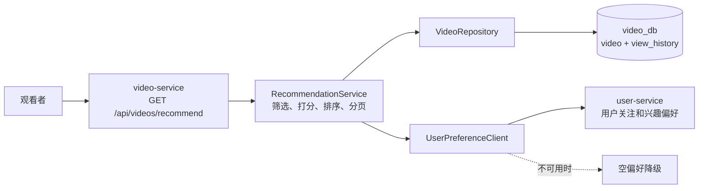
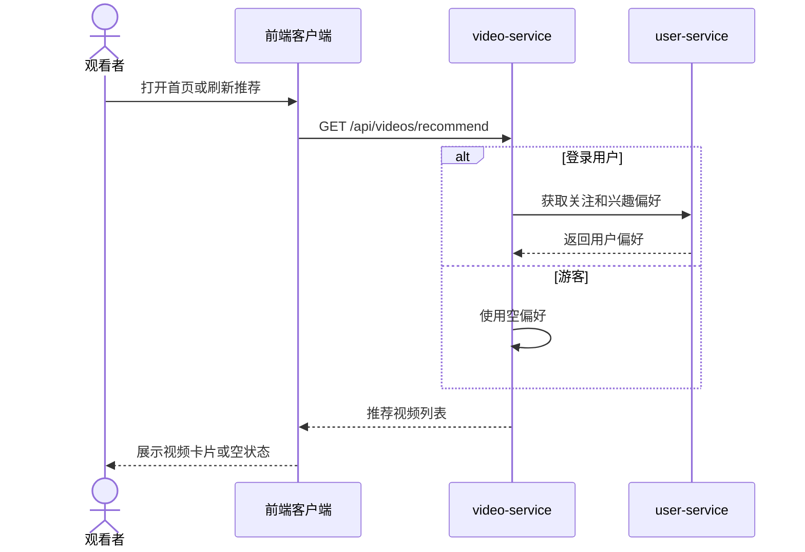
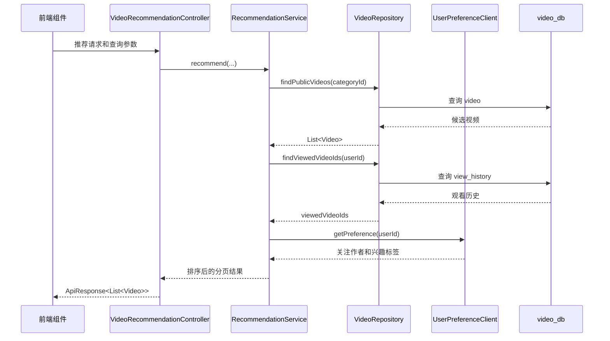
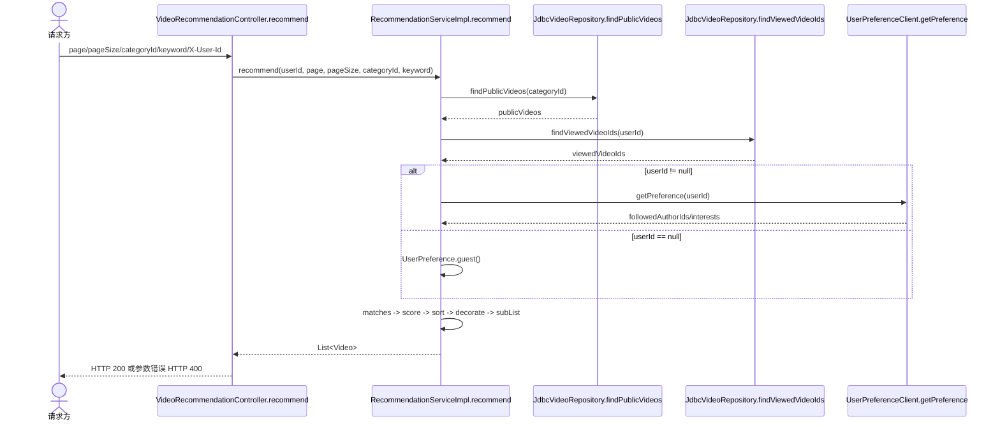

# UC-03 浏览推荐视频微服务迁移设计说明

## 1. 文档目的

本文档说明 UC-03“浏览推荐视频”从单体后端迁移到 `video-service` 的实现范围、服务边界、接口、数据访问方式和验证结果。文档对应需求规格说明书中的 `REQ-02`、`UC-03`，并以视频微服务设计文档中的数据归属和“不跨 Schema 联表”规则为准。

本文档只描述已实现的推荐接口，不把视频详情、上传、评论、弹幕、对象存储等未迁移接口列为本服务已完成内容。

## 2. UC-03 用例说明

| 项目 | 内容 |
| --- | --- |
| 用例编号 | `UC-03` |
| 用例名称 | 浏览推荐视频 |
| 关联需求 | `REQ-02 视频列表与推荐展示` |
| 参与者 | 观看者（游客或登录用户） |
| 触发条件 | 用户打开首页、刷新推荐列表或提交筛选条件 |
| 前置条件 | video-service 已启动，数据库中存在或允许不存在公开视频 |
| 主成功流程 | 1. 客户端请求推荐接口；2. 服务查询公开视频；3. 登录用户加载偏好和观看历史；4. 服务计算分数、排序并分页；5. 返回推荐视频列表；6. 客户端展示视频卡片。 |
| 备选流程 | 游客不加载个性化偏好；无分类时查询全部分类；关键词为空时不执行关键词筛选。 |
| 异常流程 | 页码或用户标识无法转换为数字时返回 HTTP 400；用户服务不可用时降级为空偏好；没有匹配视频时返回成功和空数组。 |
| 可验证结果 | 返回体包含 `code=200` 和数组数据；公开视频按推荐规则排序；私密视频不出现在结果中；分页和筛选条件生效。 |

## 3. 迁移范围

| 项目 | 迁移后的处理方式 |
| --- | --- |
| 推荐入口 | `GET /api/videos/recommend` |
| 视频候选数据 | 从 video-service 自有 `video` 表读取，限定 `status = 'public'` |
| 观看历史 | 从 video-service 自有 `view_history` 表读取 |
| 关注作者 | 通过 `UserPreferenceClient` 获取，不读取 user-service 数据表 |
| 兴趣标签 | 通过 `UserPreferenceClient` 获取，不读取 user-service 数据表 |
| 游客请求 | 不调用用户偏好服务，使用空偏好进行公共推荐 |
| 用户服务不可用 | `HttpUserPreferenceClient` 降级为空偏好，推荐接口仍可返回公开视频 |
| 分页位置 | 候选筛选和排序完成后在 video-service 内存分页 |
| 当前未迁移 | 其余 28 个视频、评论、弹幕和 MinIO 接口 |

## 4. 服务边界

video-service 独占视频推荐所需的 `video`、`view_history` 表。服务只通过 HTTP 客户端读取用户服务提供的偏好结果，不直接访问 `sys_user`、`user_follow` 或 `user_interest`，也不执行跨 Schema JOIN。



## 5. 接口设计

### 5.1 推荐接口

| 项目 | 内容 |
| --- | --- |
| 请求 | `GET /api/videos/recommend` |
| 查询参数 | `page`、`pageSize`、`categoryId`、`keyword` |
| 请求头 | 可选 `X-User-Id`，登录用户传递数字用户编号 |
| 默认值 | `page=1`、`pageSize=12`、`categoryId=0` |
| 参数范围 | 页码最小为 1；每页数量限制为 1 至 50；非正分类值按全部分类处理 |
| 成功状态 | HTTP 200，响应 `code=200` |
| 错误状态 | 参数类型无法转换时 HTTP 400；未预期服务错误时 HTTP 500 |

### 5.2 响应示例

```json
{
  "code": 200,
  "message": "success",
  "data": [
    {
      "id": 12,
      "videoId": 12,
      "title": "校园音乐",
      "author": "作者",
      "userId": 7,
      "categoryId": 3,
      "status": "public",
      "playCount": 120,
      "sources": {
        "720P": "https://example.test/12.mp4"
      },
      "defaultQuality": "720P",
      "tagList": ["校园", "音乐"],
      "authorInfo": {
        "userId": 7,
        "following": true
      }
    }
  ]
}
```

无匹配结果时仍返回 HTTP 200，`data` 为 `[]`。

### 5.3 推荐处理规则

1. 读取公开视频，并按 `categoryId` 过滤。
2. `keyword` 非空时，对标题、作者、描述和标签执行不区分大小写的包含匹配。
3. 计算推荐分数：播放量、点赞量、收藏量和评论量提供基础分；关注作者增加 1000 分；兴趣标签按兴趣分值乘以 10 加分；已观看视频扣除 200 分。
4. 分数相同时按创建时间倒序，再按视频编号倒序。
5. 补充播放地址、默认清晰度、标签列表和作者关注状态后分页返回。

## 6. 三层交互模型

### 6.1 系统级顺序图

系统级图只描述观看者、前端、video-service 和 user-service 之间的外部协作，不展开内部类和数据库实现。



### 6.2 组件级顺序图

组件级图描述 video-service 内部接口组件、业务组件、数据访问组件和外部用户组件之间的协作。



### 6.3 对象级顺序图

对象级图落到当前实现类和方法，作为测试覆盖对象级分支的依据。



## 7. 数据表设计

### 7.1 video-service 自有表

| 表 | 推荐查询字段 | 说明 |
| --- | --- | --- |
| `video` | `id`、`title`、`description`、`play_url`、`author`、`user_id`、`category_id`、`tags`、`status`、统计字段、时间字段 | 视频候选记录；只返回 `public` 状态 |
| `view_history` | `user_id`、`video_id` | 判断登录用户是否已观看；`(user_id, video_id)` 唯一 |

表结构文件：

- H2/本地测试初始化：`src/main/resources/schema.sql`
- MySQL 部署脚本：`sql/003_recommendation_schema.sql`

### 7.2 跨服务数据

关注作者和兴趣标签属于 user-service。video-service 只依赖以下逻辑数据，不保存用户表副本：

```text
UserPreference {
  followedAuthorIds: Set<Long>
  interests: Map<String, Integer>
  viewedVideoIds: Set<Long>
}
```

其中观看历史的最终来源是 video-service 自有 `view_history`；客户端返回的 `viewedVideoIds` 只作为兼容补充，不替代本地表。

## 8. 工程文件

| 路径 | 用途 |
| --- | --- |
| `src/main/java/com/example/video/controller/VideoRecommendationController.java` | HTTP 接口和参数绑定 |
| `src/main/java/com/example/video/service/RecommendationServiceImpl.java` | 推荐规则、排序和分页 |
| `src/main/java/com/example/video/repository/JdbcVideoRepository.java` | `video`、`view_history` 数据访问 |
| `src/main/java/com/example/video/client/HttpUserPreferenceClient.java` | 用户服务偏好 HTTP 客户端 |
| `src/main/java/com/example/video/client/NoopUserPreferenceClient.java` | 未配置用户服务时的游客降级实现 |
| `src/main/resources/application.yml` | 服务端口和数据库环境变量配置 |
| `src/test/resources/application.yml` | H2 测试数据库配置 |

## 9. 需求追溯

| 需求 | 用例 | 设计模型 | 实现代码 | 测试证据 |
| --- | --- | --- | --- | --- |
| `REQ-02` | `UC-03` | 系统级、组件级、对象级顺序图 | `VideoRecommendationController`、`RecommendationServiceImpl`、`JdbcVideoRepository` | `UNIT-TC-03-01`、`API-TC-03-01` |
| 推荐排序 | `UC-03` 主流程 | 对象级顺序图 `score` 分支 | `RecommendationServiceImpl.score` | `UNIT-TC-03-01`、`03-04`、`03-08`、`03-09` |
| 公开视频和筛选 | `UC-03` 备选流程 | 组件级 `VideoRepository` 查询 | `JdbcVideoRepository.findPublicVideos` | `UNIT-TC-03-02`、`03-10`、`API-TC-03-05` |
| 分页和空结果 | `UC-03` 备选流程 | 对象级 `subList` 分支 | `RecommendationServiceImpl.recommend` | `UNIT-TC-03-03`、`03-05`、`API-TC-03-06`、`03-07` |
| 非法参数 | `UC-03` 异常流程 | 对象级 Controller 参数绑定 | `GlobalExceptionHandler` | `UNIT-TC-03-23`、`03-24`、`API-TC-03-08`、`03-09` |

## 10. 当前边界和后续衔接

- 当前服务只实现 UC-03 推荐接口，不能直接替代完整视频服务。
- `HttpUserPreferenceClient` 当前请求 `/api/users/{userId}/preferences`，默认用户服务地址为 `http://user-service:8081`；主项目现有用户服务容器端口为 `8081`，但偏好接口路径和响应字段仍需要由组内正式统一。
- 微服务迁移后，原单体前端的浏览器端到端测试不能直接视为本服务 E2E 结果；需要网关或前端改为访问 video-service 后重新执行。
- Docker、Kubernetes、公共 CI/CD 和其他 UC 的迁移属于组级工作，不包含在本次 UC-03 代码范围内。

## 11. 与完整 video-service 的合并清单

当前 `videoplayer` 分支已经包含视频详情、上传、播放计数、点赞收藏、评论、弹幕和 MinIO 代码；UC-03 分支只包含推荐服务。因此合并时以 `videoplayer` 的 `video-service` 目录为基础，不直接用 UC-03 目录覆盖它。

| 顺序 | 合并项 | 处理要求 | 验收方式 |
| --- | --- | --- | --- |
| 1 | 工程骨架 | 保留组员版本的 `com.example.demo` 包、MyBatis-Plus、现有 Controller 和 MinIO 配置 | 详情、上传、评论、弹幕原有测试仍通过 |
| 2 | 推荐逻辑 | 将 UC-03 的筛选、关键词匹配、关注/兴趣加分、观看历史降权、分页和字段补充合入现有 `VideoServiceImpl#getRecommendedFeed` | 推荐单元和 API 测试通过，排序规则与 UC-03 报告一致 |
| 3 | 推荐入口 | 保留 `GET /api/videos/recommend`、`page/pageSize/categoryId/keyword` 和 `X-User-Id` 约定，只保留一个 Controller 映射 | 同一路径不能出现两个 Controller 方法 |
| 4 | 数据库 | 以组员完整 `video` 表为基础补齐 UC-03 需要的 `tags`、统计字段和 `view_history` 索引；不要删除清晰度、评论、弹幕和用户视频关系字段 | 新数据库初始化成功，旧接口能够读写 |
| 5 | 服务端口 | 组员版本默认端口为 `8082`，UC-03 独立测试端口为 `8083`；集成时由网关和 Compose/K8s 统一选择一个端口，并同步健康检查 | 网关路由、容器端口、探针端口一致 |
| 6 | 用户偏好 | 先确定 user-service 的正式路径和 JSON 字段，再实现 `UserPreferenceClient`；当前 `/api/users/{userId}/preferences` 尚未在 user-service 分支提供，不能直接开启开关 | user-service 可用时验证关注作者和兴趣加分；不可用时仍能游客降级 |
| 7 | 配置安全 | 不保留组员配置中的默认数据库密码；数据库密码通过 Secret/环境变量注入；Actuator 只暴露健康和信息端点，禁止生产环境暴露 `env` | 代码扫描无明文密码，健康检查仍可用 |
| 8 | CI 文件 | `main` 使用 `build-and-test.yml`，UC-03 分支使用 `ci.yml`；合并时解决重命名冲突，保留组长主流程并移植 UC-03 两个测试作业，不保留重复工作流 | PR 合并后只运行预期工作流，单元/API/E2E 报告可下载 |
| 9 | 回归验证 | 三位组员代码合并后重新执行完整 video-service 测试、UC-03 三层测试、网关 API 和浏览器 E2E | 所有公开接口和受影响业务用例均有通过记录 |
