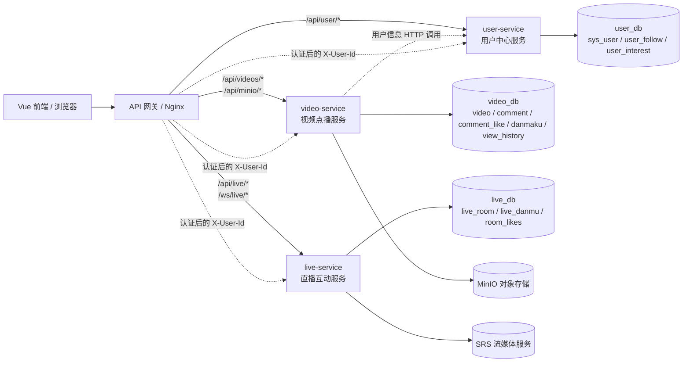

# 视频直播系统微服务划分设计文档

## 1. 设计目标

本系统按业务领域进行服务拆分，在保持现有功能不变的前提下，使每个微服务拥有清晰的职责边界、独立的数据所有权和稳定的对外接口。

基本原则：

1. 一个业务领域由一个微服务负责。
2. 每张业务表只有一个微服务可以写入。
3. 服务之间通过 HTTP API、WebSocket 或领域事件通信，不直接访问对方数据库。
4. 三个服务可以共用 MySQL 实例，但使用隔离的逻辑 Schema，禁止跨 Schema JOIN。

## 2. 微服务划分总览



| 微服务 | 建议端口 | 领域职责 | 外部依赖 |
| --- | ---: | --- | --- |
| `user-service` 用户中心服务 | 8081 | 注册登录、用户资料、头像、关注关系、粉丝列表、用户兴趣 | `user_db` |
| `video-service` 视频点播服务 | 8082 | 视频上传、转码、推荐、播放、收藏、点赞、评论、点播弹幕、观看历史、对象存储 | `video_db`、MinIO |
| `live-service` 直播互动服务 | 8083 | 直播间创建/关闭、在线列表、推拉流地址、直播弹幕、直播点赞、在线人数、SRS 探活 | `live_db`、SRS、WebSocket |

> 端口为逻辑拆分建议。当前单体工程可以先按模块实现，部署时再分别打包成三个服务。

## 3. user-service

### 3.1 职责边界

- 维护账号、密码、昵称、头像和个人简介。
- 完成注册、登录和身份信息返回；生产环境由网关统一校验 JWT。
- 维护关注/取消关注、关注列表和粉丝列表。
- 维护用户兴趣标签，为视频推荐提供用户画像数据。
- 对外提供用户基本信息查询，供视频服务补充评论作者等展示信息。

用户服务不维护视频、评论、点播弹幕和直播数据，不直接修改其他服务的数据表。

### 3.2 服务接口清单

服务前缀：`/api/user`

| 编号 | 方法 | 接口 | 用途 | 关键参数 |
| --- | --- | --- | --- | --- |
| USER-01 | POST | `/api/user/register` | 用户注册 | JSON：`username`、`password` |
| USER-02 | POST | `/api/user/login` | 用户登录 | JSON：`username`、`password` |
| USER-03 | GET | `/api/user/{userId}/profile` | 查询用户资料及公开作品 | Path：`userId`；Query：`viewerId` |
| USER-04 | PUT | `/api/user/{userId}/avatar` | 修改头像 | JSON：`avatarUrl` |
| USER-05 | POST | `/api/user/{userId}/follow` | 关注用户 | Header：`X-User-Id` |
| USER-06 | DELETE | `/api/user/{userId}/follow` | 取消关注 | Header：`X-User-Id` |
| USER-07 | GET | `/api/user/{userId}/following` | 查询关注列表 | Path：`userId` |
| USER-08 | GET | `/api/user/{userId}/followers` | 查询粉丝列表 | Path：`userId` |
| USER-09 | GET | `/api/user/{userId}/history` | 查询观看历史 | Path：`userId` |

### 3.3 数据表归属

| 表名 | 所属服务 | 用途 | 唯一写入方 |
| --- | --- | --- | --- |
| `sys_user` | `user-service` | 账号、密码、昵称、头像、简介 | `user-service` |
| `user_follow` | `user-service` | 用户关注和粉丝关系 | `user-service` |
| `user_interest` | `user-service` | 用户兴趣标签及权重 | `user-service` |

## 4. video-service

### 4.1 职责边界

- 管理视频元数据、公开状态、推荐排序和播放记录。
- 通过 MinIO 保存视频、封面和转码文件，负责生成多清晰度地址。
- 管理视频点赞、收藏、评论及评论点赞。
- 管理点播视频弹幕和观看历史。
- 需要用户昵称或头像时调用 user-service，不读取用户数据库。

### 4.2 服务接口清单

服务前缀：`/api/videos`、`/api/minio`

| 编号 | 方法 | 接口 | 用途 |
| --- | --- | --- | --- |
| VIDEO-01 | GET | `/api/videos/recommend` | 分页获取推荐视频，支持分类和关键词 |
| VIDEO-02 | GET | `/api/videos/{videoId}` | 查询视频详情 |
| VIDEO-03 | GET | `/api/videos/url?videoUrl=` | 按播放地址查询视频 |
| VIDEO-04 | GET | `/api/videos/user/{userId}/uploads` | 查询用户上传视频 |
| VIDEO-05 | GET | `/api/videos/user/{userId}/favorites` | 查询用户收藏视频 |
| VIDEO-06 | POST | `/api/videos/upload` | 上传视频并执行转码 |
| VIDEO-07 | POST | `/api/videos/{videoId}/visibility` | 设置公开或仅自己可见 |
| VIDEO-08 | DELETE | `/api/videos/{videoId}` | 作者删除视频 |
| VIDEO-09 | POST | `/api/videos/{videoId}/likes` | 点赞或取消点赞 |
| VIDEO-10 | DELETE | `/api/videos/{videoId}/likes` | 取消视频点赞 |
| VIDEO-11 | POST | `/api/videos/{videoId}/favorites` | 收藏或取消收藏 |
| VIDEO-12 | DELETE | `/api/videos/{videoId}/favorites` | 取消视频收藏 |
| VIDEO-13 | POST | `/api/videos/{videoId}/play` | 播放计数加一并记录历史 |
| VIDEO-14 | GET | `/api/videos/{videoId}/status` | 查询当前用户点赞/收藏状态 |
| VIDEO-15 | GET | `/api/videos/{videoId}/comments` | 分页查询评论及回复 |
| VIDEO-16 | POST | `/api/videos/{videoId}/comments` | 发布评论或回复 |
| VIDEO-17 | POST | `/api/videos/{videoId}/comments/{commentId}/like` | 评论点赞 |
| VIDEO-18 | DELETE | `/api/videos/{videoId}/comments/{commentId}/like` | 取消评论点赞 |
| VIDEO-19 | DELETE | `/api/videos/{videoId}/comments/{commentId}` | 删除评论 |
| VIDEO-20 | GET | `/api/videos/{videoId}/danmakus` | 按时间段查询点播弹幕 |
| VIDEO-21 | POST | `/api/videos/{videoId}/danmakus` | 发送点播弹幕 |
| VIDEO-22 | GET | `/api/videos/danmaku/video?videoUrl=` | 兼容接口：按视频地址查询弹幕 |
| VIDEO-23 | POST | `/api/videos/danmaku` | 兼容接口：直接保存弹幕 |
| VIDEO-24 | GET | `/api/videos/danmaku/user?userId=` | 兼容接口：按用户查询弹幕 |
| VIDEO-25 | DELETE | `/api/videos/danmaku/{id}` | 删除点播弹幕 |
| VIDEO-26 | POST | `/api/minio/upload` | 通用文件上传 |
| VIDEO-27 | DELETE | `/api/minio/delete?objectName=` | 删除对象 |
| VIDEO-28 | GET | `/api/minio/url?objectName=` | 获取对象访问地址 |
| VIDEO-29 | GET | `/api/minio/test` | MinIO 连通性检查 |

### 4.3 数据表归属

| 表名 | 所属服务 | 用途 | 唯一写入方 |
| --- | --- | --- | --- |
| `video` | `video-service` | 视频元数据、播放地址、状态、计数 | `video-service` |
| `comment` | `video-service` | 视频评论和楼中楼回复 | `video-service` |
| `comment_like` | `video-service` | 评论点赞去重关系 | `video-service` |
| `danmaku` | `video-service` | 点播视频弹幕 | `video-service` |
| `view_history` | `video-service` | 用户观看次数、进度和最近观看时间 | `video-service` |

## 5. live-service

### 5.1 职责边界

- 创建、查询和关闭直播间，生成 SRS 推流和播放地址。
- 维护在线直播间列表、分类筛选和直播间详情。
- 通过 WebSocket 接收并广播直播弹幕、点赞和在线人数。
- 维护直播互动历史和累计点赞数。
- 通过 SRS API 探活，但不把 SRS 内部状态当作业务数据表。

直播服务只保存 `userId` 和 `categoryId` 等逻辑关联，不直接查询用户服务或分类服务的数据库。

### 5.2 服务接口清单

服务前缀：`/api/live`；WebSocket 前缀：`/ws/live`

| 编号 | 方法 | 接口 | 用途 |
| --- | --- | --- | --- |
| LIVE-01 | POST | `/api/live/rooms` | 创建并开始直播间 |
| LIVE-02 | GET | `/api/live/rooms` | 分页查询在线直播间 |
| LIVE-03 | GET | `/api/live/rooms/{roomId}` | 查询直播间详情和播放地址 |
| LIVE-04 | POST | `/api/live/rooms/{roomId}/close` | 主播关闭自己的直播间 |
| LIVE-05 | GET | `/api/live/rooms/{roomId}/danmus` | 查询直播间历史弹幕 |
| LIVE-06 | GET | `/api/live/rooms/{roomId}/like` | 查询累计点赞数 |
| LIVE-07 | GET | `/api/live/srs/health` | SRS 探活检查 |
| LIVE-08 | WebSocket | `/ws/live/{roomId}` | 建立直播互动连接 |
| LIVE-09 | WebSocket | `/ws/live/{roomId}` | 发送 `danmu`、`like` 消息并接收广播 |

运维接口：`GET /actuator/health`、`GET /actuator/info`。

### 5.3 数据表归属

| 表名 | 所属服务 | 用途 | 唯一写入方 |
| --- | --- | --- | --- |
| `live_room` | `live-service` | 直播间、主播、推拉流地址和状态 | `live-service` |
| `live_danmu` | `live-service` | 直播弹幕历史 | `live-service` |
| `room_likes` | `live-service` | 直播间累计点赞数 | `live-service` |

直播间关闭后保留历史弹幕和点赞记录；关闭状态下禁止新的弹幕和点赞。创建新的直播间时清理同一房间的旧互动记录。

## 6. 跨服务通信与数据一致性

| 调用场景 | 调用方式 | 数据规则 | 失败处理 |
| --- | --- | --- | --- |
| 网关向业务服务传递身份 | Header `X-User-Id` | 服务端校验正整数和权限，不能把任意客户端值当作认证凭据 | 未认证返回 401/400 |
| video-service 查询用户信息 | HTTP 调用 user-service | 不跨库读取 `sys_user`；可缓存昵称头像 | 用户服务不可用时评论列表降级为匿名；发布评论可返回 503 |
| 前端获取直播信息 | HTTP 调用 live-service | 不读取 `live_db` | 按统一 `ApiResponse` 处理错误并重试 |
| 直播互动 | WebSocket 调用 live-service | 弹幕和点赞只能由 live-service 写入 | 连接关闭并向客户端发送 `error` |
| 视频文件存储 | video-service 调用 MinIO | 数据库只保存对象名和访问地址 | 上传失败回滚视频记录或标记失败 |
| 流媒体状态 | live-service 调用 SRS | SRS 是基础设施，不属于业务库 | 探活失败只影响状态提示，不阻塞详情查询 |

### 6.1 禁止事项

1. `user-service` 不得写入 `video`、`comment`、`danmaku` 或直播表。
2. `video-service` 不得写入 `sys_user`、`user_follow`、`user_interest` 或直播表。
3. `live-service` 不得写入用户表和视频点播表。
4. 不使用跨 Schema JOIN；需要组合数据时由服务调用或网关聚合。

### 6.2 事务边界

- 单服务内的主表和从表更新使用本地事务，例如视频与评论计数、直播间与互动初始化。
- 跨服务操作不使用分布式数据库事务，采用幂等接口、重试和必要的补偿任务。
- 对外返回统一响应结构，并以 HTTP 状态码和业务 `code` 双重表达成功或失败。

## 7. 部署与演进建议

开发阶段可以保留一个代码仓库，通过模块边界和接口模拟微服务；部署阶段分别构建三个镜像：

```text
user-service  -> user_db
video-service -> video_db + MinIO
live-service  -> live_db + SRS
```

三个服务分别配置数据库连接、日志和健康检查。后续如果用户认证、分类或通知服务独立出来，只需将当前逻辑关联改为接口调用，不改变视频和直播服务的数据所有权方案。
