## 1 引言

### 1.1 编写目的

本文档旨在提供《航音视频》系统的概要设计，明确系统分层、组件边界、接口协作、数据组织、运行方式和部署关系，为详细设计、编码实现、测试和部署提供统一的结构依据。预期读者包括项目开发人员、测试人员、项目管理人员和验收人员。

### 1.2 背景

开发软件系统名称：航音视频。

任务提出者：软件工程课设。

开发者：由作业小组开发（马凯俊，冯景康，李雨豪，龚锦勋，孙一弘）。

运行该软件的计算站（中心）：网页端及配套服务端。

### 1.3 定义

本文中使用的专门术语定义如下：

- 航音视频：集短视频、中长视频、直播互动于一体的综合视频平台。
- 内容创作者：需要发布工具与数据反馈的视频发布者与直播主播。
- 普通观看者：希望获得流畅播放与高频互动体验的观众。
- 弹幕：视频播放时在屏幕上滚动显示并与视频时间轴绑定的互动文本。
- MinIO：对象存储服务，用于保存视频和封面文件。
- SRS：流媒体服务，用于直播推流和 HTTP-FLV 播放。
- Nginx：文件代理服务，用于代理视频文件并支持 Range 请求。

### 1.4 参考设计

- 《航音视频》软件开发计划书
- 《航音视频》软件需求规格说明书
- 《软件工程基础2026春大作业要求》
- 目标平台对标系统（抖音、哔哩哔哩等）的需求调研资料

## 2 系统需求概述

### 2.1 需求规定

- 输入项目：创作者上传的视频文件、直播推流信号、观看者发送的弹幕、直播间高频点赞指令、普通搜索关键词。
- 输出项目：流畅的视频/直播画面、与时间轴同步的弹幕、前端连击点赞特效、创作者上传后形成的视频列表及互动数据。
- 功能性能要求：系统应快速响应直播推流，快速实现视频加载，保持较低弹幕延迟。

### 2.2 业务目标

实现一个集短视频、中长视频、直播互动于一体的综合视频平台，致力于连接内容创作者与观看者，打造一个多元、开放、有温度的视频社区。

### 2.3 运行环境

#### 2.3.1 设备

- 计算机：用户可以通过支持 Web 端的现代主流浏览器（台式机、笔记本电脑或移动设备）访问系统。

#### 2.3.2 支持软件

- 前端框架：使用 Vue3 搭配组件库实现响应式 Web 端交互。
- 后端框架：基于 Java、Spring Boot 构建服务端核心业务逻辑。
- 数据库与存储：采用 MySQL 存储结构化业务数据，采用 MinIO 保存视频文件和封面文件。
- 直播与代理：采用 SRS 提供 RTMP 推流和 HTTP-FLV 播放能力，采用 Nginx 代理视频文件。

### 2.4 设计约束

系统设计考虑稳定性、安全性、合法性和可部署性。核心演示流程必须能够在本地或测试环境中按部署文档启动。

### 2.5 功能需求

- 流媒体与直播功能：实现推拉流处理；支持主播创建直播间；观众端流畅播放并支持直播中断提示。
- 互动与社交服务功能：提供视频弹幕、评论、直播弹幕和直播点赞。
- 内容分发与管理功能：支持视频上传、视频列表展示、个人视频管理。
- 展示与终端播放功能：提供涵盖播放、暂停、快进、倍速等基础播放器控制。

### 2.6 系统总体架构

系统采用前后端分离架构，划分为五大子系统。用户与账户子系统作为所有需要身份校验的业务模块的公共支撑，其余子系统分别承载需求规格说明书中的核心业务需求：

1. 用户与账户子系统：负责注册、登录和用户信息。
2. 内容分发与创作者子系统：负责视频上传、视频记录、推荐列表和个人视频管理。
3. 播放与社区互动子系统：负责播放器渲染、视频弹幕和评论。
4. 直播互动子系统：负责直播间创建、直播播放、直播弹幕和点赞。
5. 存储与基础设施子系统：负责 MySQL、MinIO、SRS、Nginx 和 Docker Compose 支撑。

## 3 系统组件设计

### 3.1 组件图

组件图展示客户端层、应用服务层和基础设施层之间的依赖关系。图中业务访问接口、数据持久化接口、媒体播放接口和直播流服务接口分别对应本章接口设计及各业务用例的组件协作过程。

### 3.2 子系统与模块划分

| 子系统 | 模块 | 主要组件 | 对应需求 |
| --- | --- | --- | --- |
| 用户与账户子系统 | 登录注册、用户资料、身份校验 | 用户账户模块、身份校验组件、用户数据访问模块 | 公共支撑 |
| 内容分发与创作者子系统 | 视频上传、视频管理、推荐列表 | 内容管理模块、对象存储模块、内容业务处理模块 | REQ-01、REQ-02 |
| 播放与社区互动子系统 | 视频播放、评论、视频弹幕 | 视频播放组件、评论互动模块、视频弹幕模块 | REQ-03、REQ-04 |
| 直播互动子系统 | 直播间、直播弹幕、直播点赞 | 直播间管理模块、直播互动模块、实时通信组件 | REQ-05、REQ-06 |
| 存储与基础设施子系统 | 对象存储、流媒体、代理、数据库 | MySQL、MinIO、SRS、Nginx、Docker Compose | REQ-07 |

## 4 系统接口设计

### 4.1 接口设计

#### 4.1.1 视频分发与推荐接口

**功能描述**：根据用户兴趣或热度排行，获取首页/详情页的推荐视频列表。

**输入项目**：`page`、`pageSize`、`category` 等分页或分类参数。

**处理需求**：整合视频元数据（标题、封面 URL、作者名、播放量、点赞数），返回可展示的视频列表。

**输出项目**：`videoList`，包含视频基本信息的 JSON 数组；`total`，结果总数。

#### 4.1.2 视频展示与播放接口

**功能描述**：用户点击视频后，获取播放地址、视频详情及初始化弹幕列表。

**输入项目**：`videoID`、`userID`、`quality` 等。

**处理需求**：校验视频发布状态；获取播放地址；更新播放量；预读弹幕数据。

**输出项目**：流媒体地址，视频描述、时长、弹幕信息。

#### 4.1.3 内容创作中心接口（上传功能）

**功能描述**：创作者上传本地视频文件，系统保存文件并生成视频记录。

**输入项目**：视频文件、标题、描述、封面等。

**处理需求**：上传文件至 MinIO，返回对象地址；将视频元数据写入数据库。

**输出项目**：视频上传状态和视频信息。

#### 4.1.4 直播互动接口（拉流与点赞）

**功能描述**：用户进入直播间，获取拉流信号并订阅实时互动通道。

**输入项目**：`roomID`、`userID`。

**处理需求**：查询直播间状态；获取 HTTP-FLV 播放地址；获取当前直播间累计点赞数。

**输出项目**：`playUrl`、`audienceCount`、`currentLikes`。

### 4.2 分析模型

本节顺序图采用组件级表达，参与者以页面组件、接口组件、业务模块、数据访问模块和基础设施组件命名，强调模块协作关系而非具体类或函数实现。

#### 4.2.1 UC-01 视频上传组件顺序图

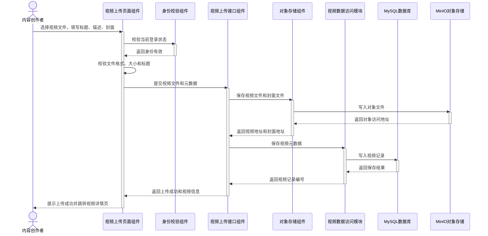

#### 4.2.2 UC-02 管理个人视频组件活动图

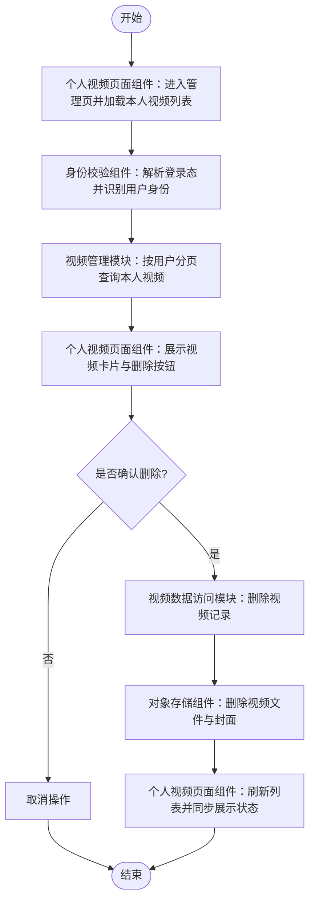

#### 4.2.3 UC-03 视频推荐组件顺序图

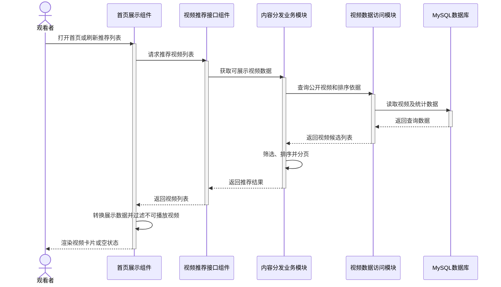

#### 4.2.4 UC-04 视频播放组件顺序图

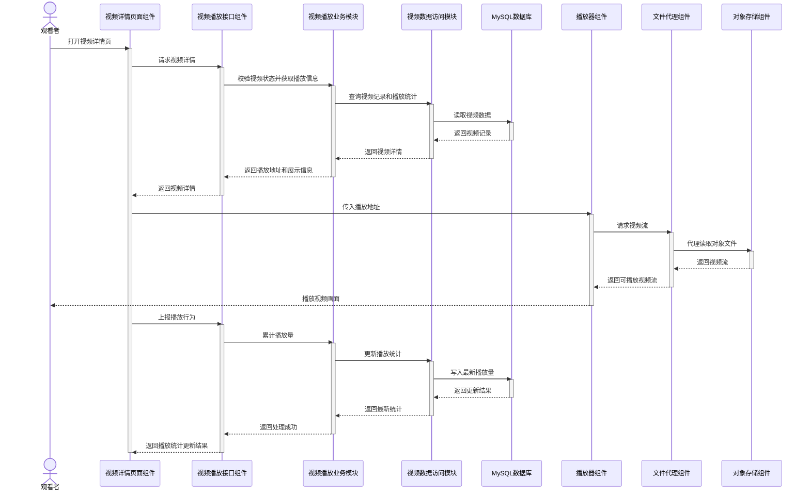

#### 4.2.5 UC-05 视频评论组件顺序图

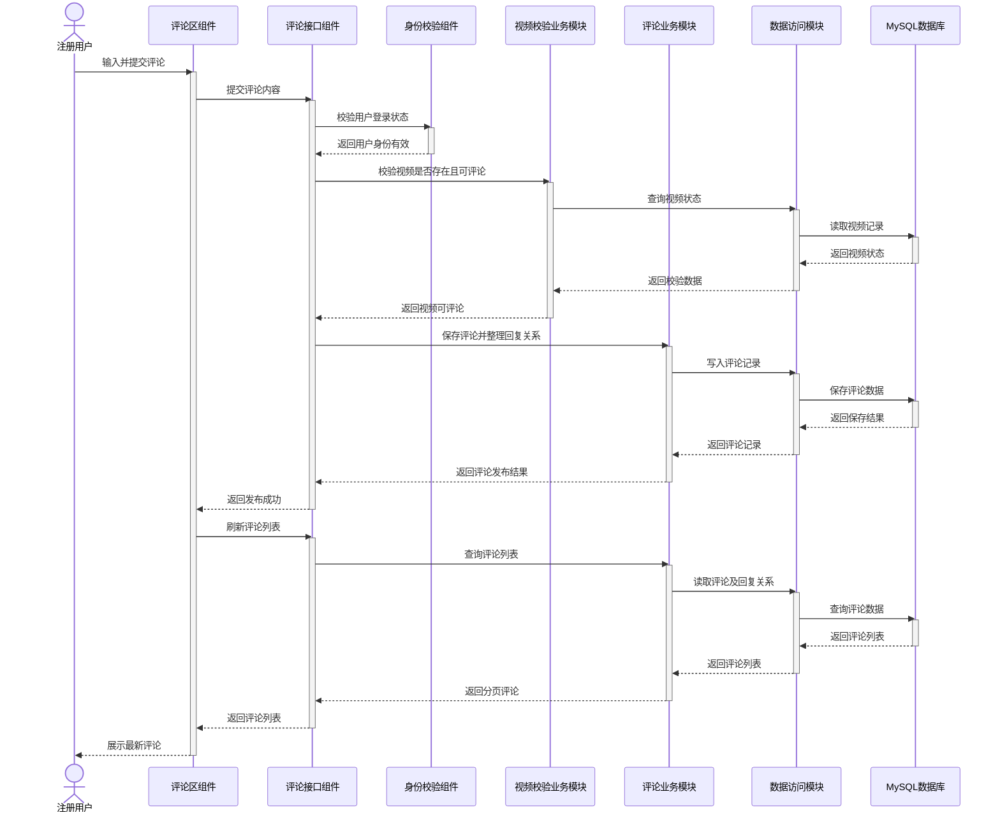

#### 4.2.6 UC-06 视频弹幕组件顺序图

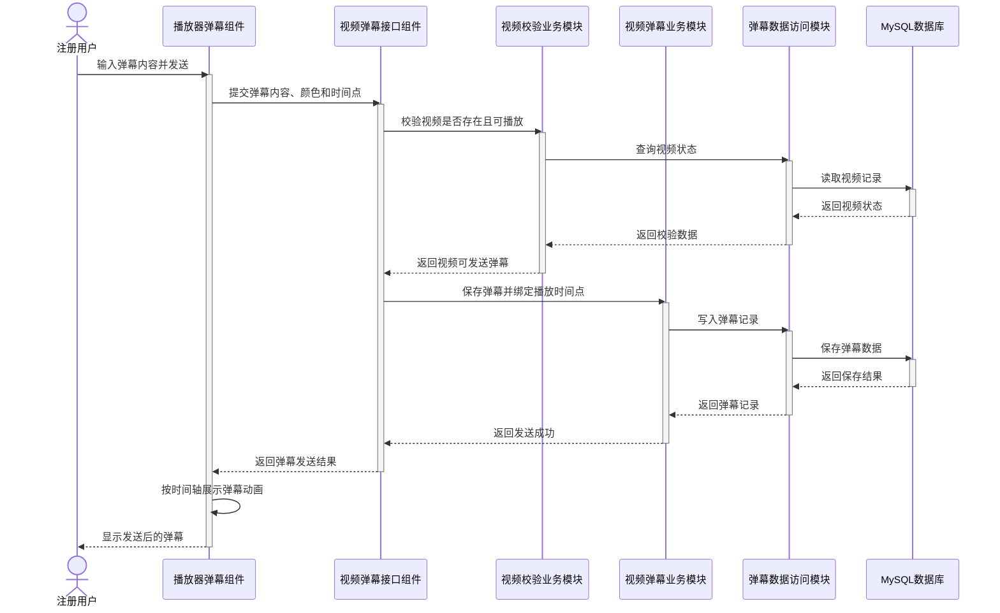

#### 4.2.7 UC-07 创建直播间组件级顺序图

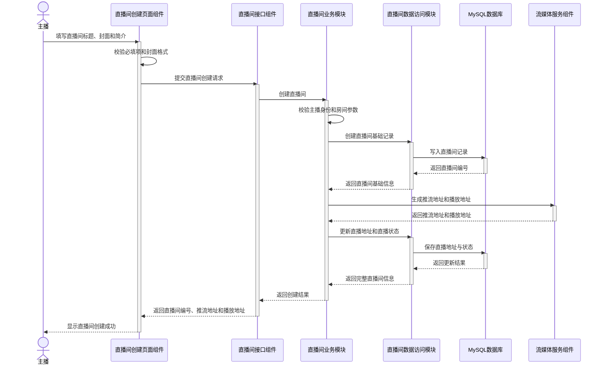

#### 4.2.8 UC-08 观看直播组件顺序图

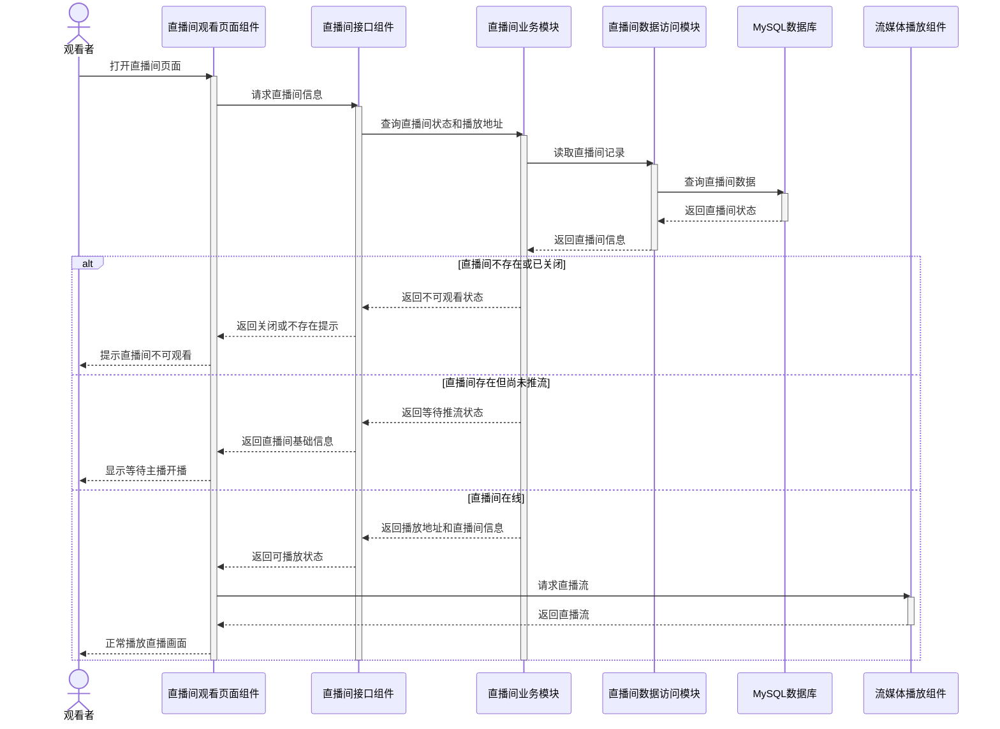

#### 4.2.9 UC-09 直播弹幕互动组件顺序图

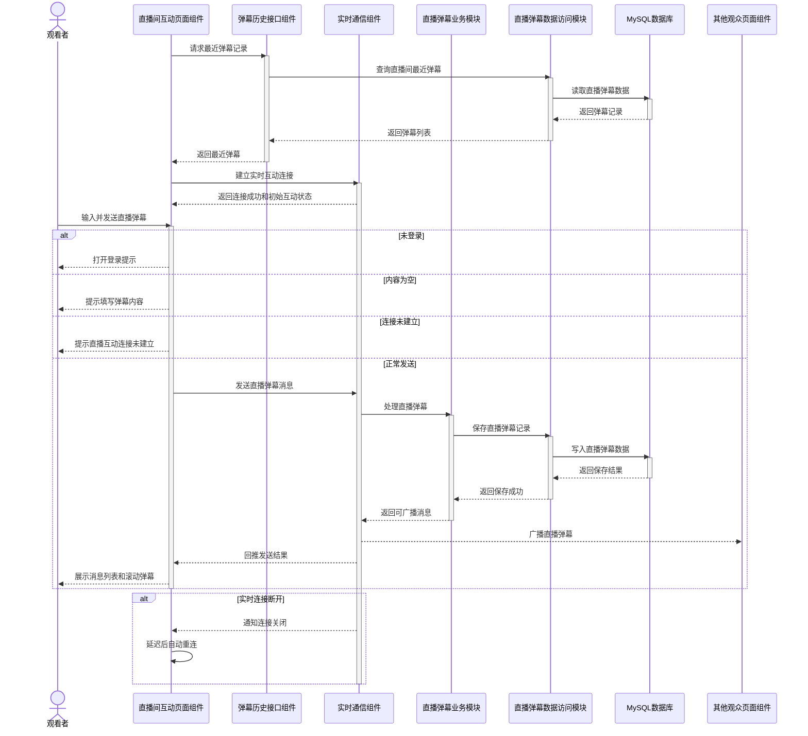

#### 4.2.10 UC-10 直播点赞组件顺序图

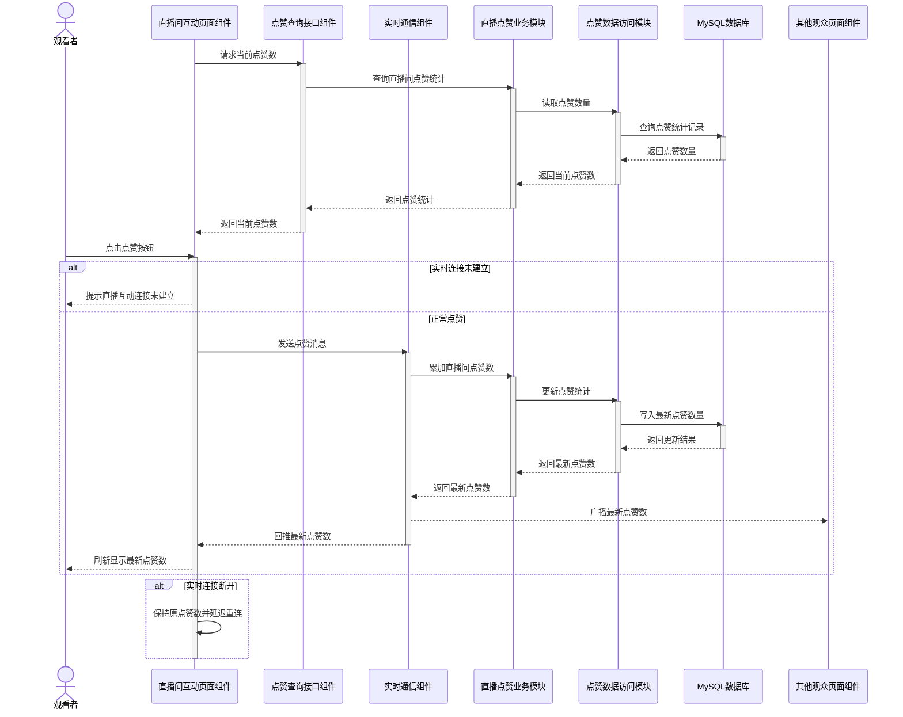

## 5 系统数据库设计

### 5.1 数据库选择

系统采用关系型数据库 MySQL 处理核心稳定业务数据，同时使用 MinIO 处理视频和封面等对象文件。

### 5.2 数据库表设计

- `sys_user` 表：存储用户身份信息。
- `video` 表：记录视频状态、标题、分类、播放地址和统计信息。
- `live_room` 表：记录实时直播推流状态及推流/播放地址。
- `danmaku` 表：存储与视频时间轴绑定的视频弹幕。
- `comment` 表：存储视频评论和回复关系。
- `user_video` 表：存储用户对视频的点赞和收藏关系。
- `live_danmu` 表：存储直播弹幕历史。
- `room_likes` 表：存储直播间点赞数。

### 5.3 数据库关系设计

- 用户与视频关系：一对多关系，一个用户可以发布多个视频。
- 视频与弹幕/评论关系：一对多关系，一个视频可以包含多条弹幕和评论。
- 直播间与直播弹幕关系：一对多关系，一个直播间可以包含多条直播弹幕。
- 直播间与点赞统计关系：一对一关系，一个直播间对应一条点赞统计记录。

## 6 运行设计

### 6.1 运行模块组合

前端子系统通过用户界面捕获操作指令，发送至后端进行统一处理后，调用对应的服务模块，如内容分发、对象存储、播放器、直播间、弹幕和点赞模块，协作完成数据请求与展示。

### 6.2 运行控制

- 上传控制：若发生网络波动而中断，客户端提示用户重试上传。
- 并发与降级控制：系统在面临弹幕发送及直播峰值状态时，应避免数据库阻塞，并优先保证核心播放能力。
- 容错控制：若检测到视频源文件故障或推流中断，播放器模块主动捕获异常并弹出明确错误提示或重试按钮。

### 6.3 运行时间

- 加载与交互响应：视频首屏加载时间应控制在合理范围内，首页和详情接口常规情况下不超过 3 秒。
- 流媒体响应：系统应快速完成直播间创建和播放地址生成。

## 7 部署图

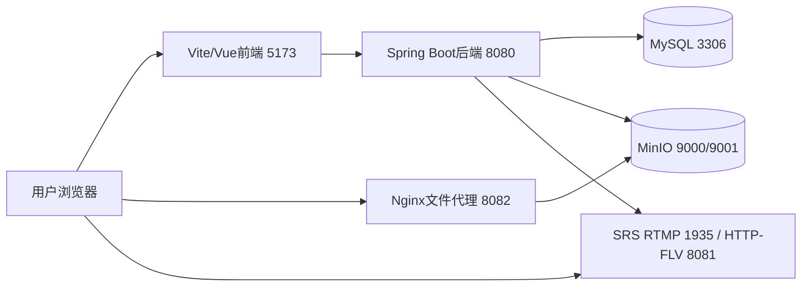

## 8 设计追溯与一致性检查

概要设计编号采用 `DES` 前缀，需求编号与需求规格说明书保持一致。用户与账户子系统属于公共支撑能力；其余设计项按业务需求建立一对一或一对多映射。

| 概要设计项 | 覆盖需求 | 对应组件/模块 | 后续详细设计 |
| --- | --- | --- | --- |
| DES-01 内容上传与对象存储组件 | REQ-01 | 内容管理模块、对象存储模块、视频数据访问模块 | DD-02 |
| DES-02 内容分发与个人视频管理组件 | REQ-02 | 推荐接口、内容分发模块、视频管理模块 | DD-03 |
| DES-03 视频播放组件 | REQ-03 | 视频播放接口、播放器组件、媒体服务组件 | DD-04 |
| DES-04 评论与视频弹幕组件 | REQ-04 | 评论互动模块、视频弹幕模块 | DD-05 |
| DES-05 直播间管理与流媒体组件 | REQ-05 | 直播间管理模块、SRS 接口 | DD-06 |
| DES-06 直播实时互动组件 | REQ-06 | WebSocket 实时通信组件、点赞模块 | DD-07 |
| DES-07 基础设施与部署组件 | REQ-07 | MySQL、MinIO、SRS、Nginx、Docker Compose | DD-08 |
| DES-08 用户与认证公共组件 | 公共支撑 | 用户账户模块、身份校验组件、用户数据访问模块 | DD-01 |

### 8.1 用例图与组件分析图对应关系

UC-01 至 UC-10 在第 4.2 节分别设置一张组件级顺序图或活动图，图题与需求规格说明书第 3.3 节保持一致。组件图负责说明系统边界和层次依赖；用例分析图负责说明单个业务场景中的组件协作过程，两者共同构成概要设计的分析模型。

### 8.2 追溯检查结论

REQ-01 至 REQ-07 均已落实到概要设计组件，并分别链接到详细设计项 DD-02 至 DD-08；公共用户认证能力通过 DES-08 链接到 DD-01。数据库设计、运行设计和部署图共同支撑 REQ-07，接口设计和 4.2 节分析模型覆盖核心业务流程，未发现需求编号缺失或跨文档编号不一致。

