# 《航音视频》软件详细设计说明书

## 1 引言

### 1.1 编写目的

本文档在《航音视频》软件概要设计说明书的基础上，进一步细化系统的各功能模块、接口、异常处理和关键业务流程，旨在为开发团队（前端、后端、测试）提供明确、可执行的底层设计与实现依据，确保系统能够支撑视频分发、视频播放、评论弹幕、直播推流和直播互动等核心业务。

### 1.2 背景

开发软件系统名称：航音视频。

任务提出者：软件工程基础 2026 春季学期大作业。

开发者：5 人开发团队。

运行环境：现代浏览器 Web 端，后端基于 Spring Boot，基础设施包括 MySQL、MinIO、SRS 和 Nginx。

### 1.3 参考文档

- 《航音视频》软件开发计划书
- 《航音视频》软件需求规格说明书
- 《航音视频》软件概要设计说明书
- 《软件工程基础2026春大作业要求》

## 2 系统结构设计及子系统细化

系统采用前后端分离架构，后端按 Controller、Service、Mapper 分层组织，前端按页面组件、播放器组件和实时互动组件组织。结合概要设计的组件边界，本系统细化为以下子系统：

1. 视频上传子系统
2. 内容分发子系统
3. 视频播放子系统
4. 评论弹幕子系统
5. 直播互动子系统
6. 存储与基础设施支撑模块

### 2.1 UML2.0 类图

```mermaid
classDiagram
    class VideoUploadPage {
        <<boundary>>
    }
    class HomePage {
        <<boundary>>
    }
    class VideoPlayerPage {
        <<boundary>>
    }
    class CommentArea {
        <<boundary>>
    }
    class LiveRoomPage {
        <<boundary>>
    }

    class UserController {
        <<control>>
    }
    class MinioController {
        <<control>>
    }
    class VideoController {
        <<control>>
    }
    class CommentController {
        <<control>>
    }
    class DanmakuController {
        <<control>>
    }
    class LiveRoomController {
        <<control>>
    }
    class LiveDanmuController {
        <<control>>
    }
    class LiveLikeController {
        <<control>>
    }

    class UserServiceImpl {
        <<control>>
    }
    class MinioService {
        <<control>>
    }
    class VideoServiceImpl {
        <<control>>
    }
    class CommentServiceImpl {
        <<control>>
    }
    class DanmakuServiceImpl {
        <<control>>
    }
    class LiveRoomServiceImpl {
        <<control>>
    }
    class LiveDanmuServiceImpl {
        <<control>>
    }
    class RoomLikesService {
        <<control>>
    }

    class UserMapper {
        <<repository>>
    }
    class VideoMapper {
        <<repository>>
    }
    class CommentMapper {
        <<repository>>
    }
    class DanmakuMapper {
        <<repository>>
    }
    class LiveRoomMapper {
        <<repository>>
    }
    class LiveDanmuMapper {
        <<repository>>
    }
    class RoomLikesMapper {
        <<repository>>
    }
    class ViewHistoryMapper {
        <<repository>>
    }
    class UserInterestMapper {
        <<repository>>
    }

    class User {
        <<entity>>
    }
    class Video {
        <<entity>>
    }
    class Comment {
        <<entity>>
    }
    class Danmaku {
        <<entity>>
    }
    class LiveRoom {
        <<entity>>
    }
    class LiveDanmu {
        <<entity>>
    }
    class RoomLikes {
        <<entity>>
    }
    class ViewHistory {
        <<entity>>
    }
    class UserInterest {
        <<entity>>
    }
    class LiveRoomCreateDTO {
        <<dto>>
    }
    class LoginUserVO {
        <<vo>>
    }
    class LiveRoomVO {
        <<vo>>
    }

    VideoUploadPage --> VideoController : upload
    HomePage --> VideoController : recommend
    VideoPlayerPage --> VideoController : detail/play
    CommentArea --> CommentController : comment
    VideoPlayerPage --> DanmakuController : danmaku
    LiveRoomPage --> LiveRoomController : create/view
    LiveRoomPage --> LiveDanmuController : live danmaku
    LiveRoomPage --> LiveLikeController : like

    VideoController --> VideoServiceImpl
    VideoController --> MinioController
    UserController --> UserServiceImpl
    CommentController --> CommentServiceImpl
    DanmakuController --> DanmakuServiceImpl
    LiveRoomController --> LiveRoomServiceImpl
    LiveDanmuController --> LiveDanmuServiceImpl
    LiveLikeController --> RoomLikesService
    MinioController --> MinioService

    UserServiceImpl --> UserMapper
    VideoServiceImpl --> VideoMapper
    VideoServiceImpl --> ViewHistoryMapper
    VideoServiceImpl --> UserInterestMapper
    CommentServiceImpl --> CommentMapper
    DanmakuServiceImpl --> DanmakuMapper
    LiveRoomServiceImpl --> LiveRoomMapper
    LiveRoomServiceImpl --> LiveRoomCreateDTO
    LiveDanmuServiceImpl --> LiveDanmuMapper
    RoomLikesService --> RoomLikesMapper

    VideoServiceImpl --> Video
    CommentServiceImpl --> Comment
    DanmakuServiceImpl --> Danmaku
    LiveRoomServiceImpl --> LiveRoom
    LiveDanmuServiceImpl --> LiveDanmu
    RoomLikesService --> RoomLikes
    UserServiceImpl --> LoginUserVO
    LiveRoomServiceImpl --> LiveRoomVO

    User "1" --> "0..*" Video : publishes
    Video "1" --> "0..*" Comment : has
    Video "1" --> "0..*" Danmaku : has
    LiveRoom "1" --> "0..*" LiveDanmu : receives
    LiveRoom "1" --> "1" RoomLikes : tracks
```

### 2.2 关键实体职责

| 实体 | 对应数据表 | 职责 |
| --- | --- | --- |
| User | sys_user | 表示系统用户，保存账号、昵称、头像等基础信息。 |
| Video | video | 表示视频内容，保存标题、描述、播放地址、封面、统计数据。 |
| Comment | comment | 表示视频评论，支持父评论形成回复关系。 |
| Danmaku | danmaku | 表示视频弹幕，保存内容、颜色、发送时间点。 |
| LiveRoom | live_room | 表示直播间，保存标题、推流地址、播放地址、状态。 |
| LiveDanmu | live_danmu | 表示直播弹幕历史记录。 |
| RoomLikes | room_likes | 表示直播间累计点赞数。 |
| UserVideo | user_video | 表示用户和视频之间的点赞、收藏关系。 |

## 3 子系统详细设计

### 3.1 视频管理子系统

视频管理子系统负责接收前端上传的视频文件、保存对象文件、写入视频元数据，并提供创作者本人视频的查询与删除能力。该模块对应需求 REQ-01 和 REQ-02，并落实概要设计项 DES-01、DES-02。

#### 3.1.1 UC-01 上传视频对象级顺序图

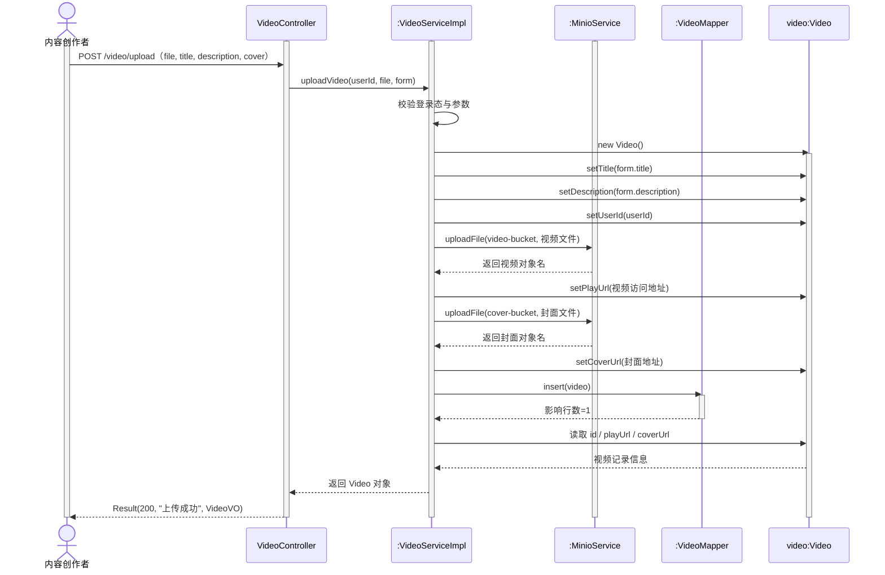

#### 3.1.2 UC-02 管理个人视频活动图

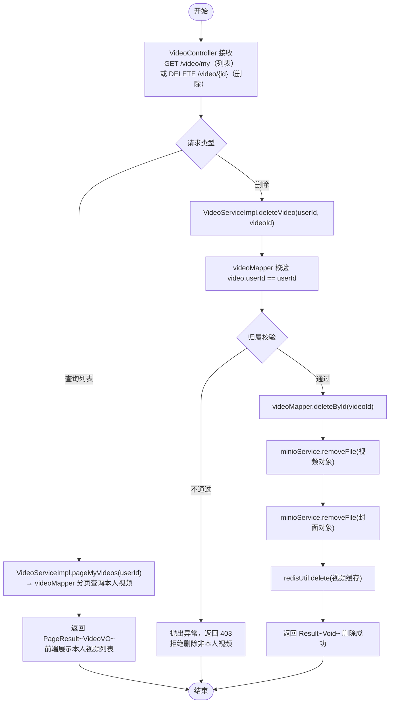

### 3.2 内容分发子系统

内容分发子系统负责首页推荐、视频详情和个人视频列表查询；视频播放子系统负责根据播放地址加载视频文件，提供播放、暂停、进度控制和倍速等基础能力。两者对应需求 REQ-02、REQ-03，并落实概要设计项 DES-02、DES-03。

#### 3.2.1 UC-03 浏览推荐视频顺序图

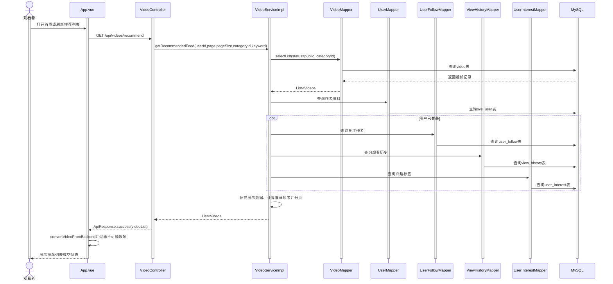

### 3.3 视频播放活动图

视频播放，弹幕互动，评论互动

#### 3.3.1 UC-04 播放视频活动图

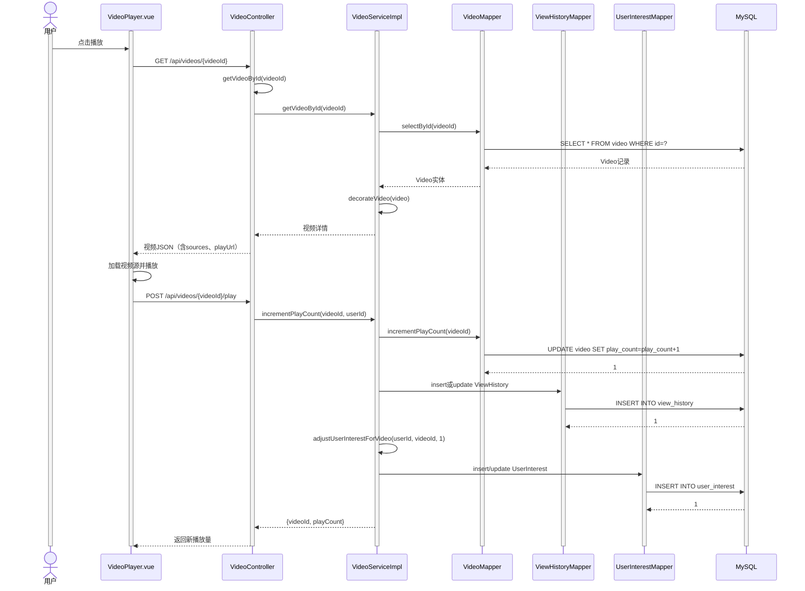

#### 3.3.2 UC-05 发送评论活动图

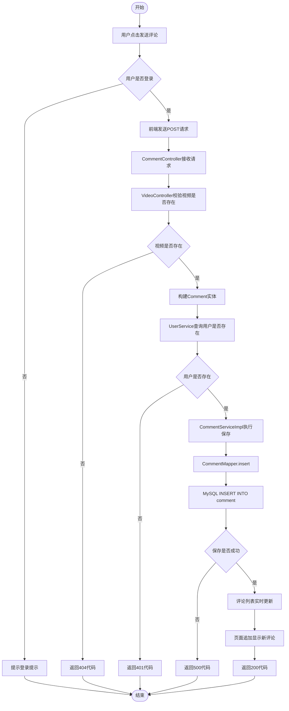

#### 3.3.3 UC-06 发送视频弹幕活动图

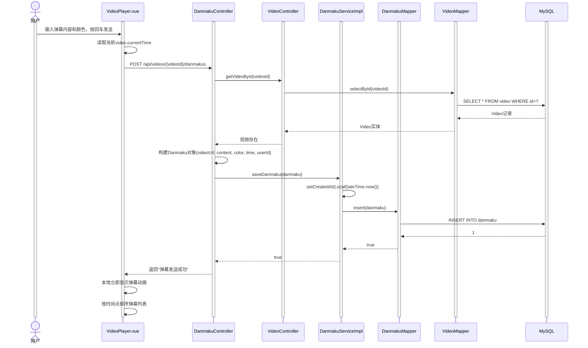

## 4 直播互动子系统详细设计

### 4.1 模块职责

直播互动子系统负责直播间创建、直播状态管理、播放地址生成、直播弹幕广播和直播点赞统计。直播间管理对应需求 REQ-05，实时互动对应需求 REQ-06，并落实概要设计项 DES-05、DES-06。

#### 4.1.1 UC-07 创建直播间对象级顺序图

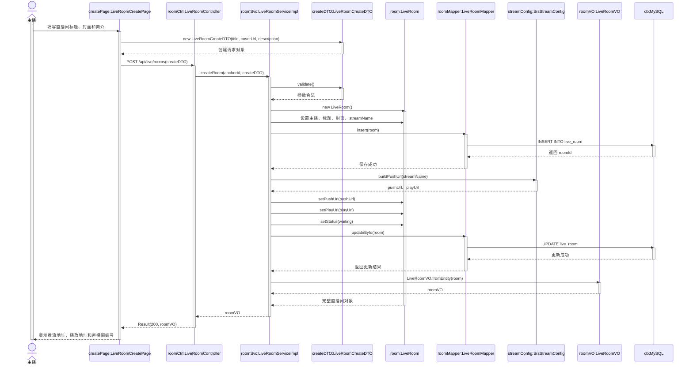

#### 4.1.2 UC-08 观看直播活动图

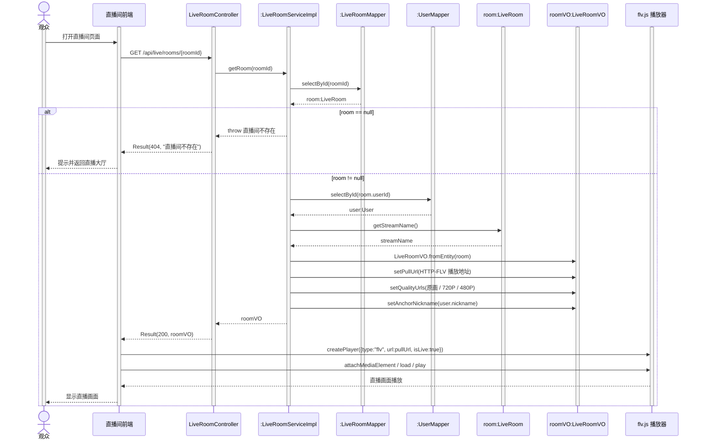

#### 4.1.3 UC-09 直播弹幕互动活动图

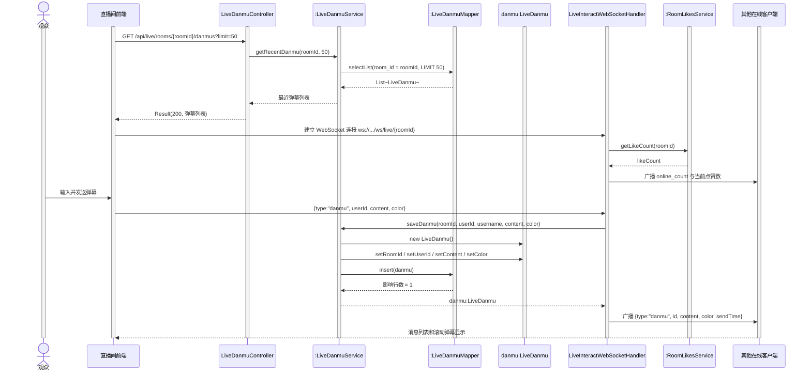

#### 4.1.4 UC-10 直播点赞顺序图

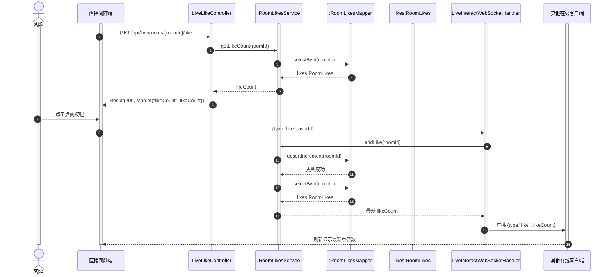

## 5 用户与账户子系统详细设计

### 5.1 模块职责

用户与账户子系统负责注册、登录、用户资料展示、头像地址维护、关注关系和观看历史查询。当前源码通过 `UserController` 对外提供接口，`UserServiceImpl` 负责注册与登录业务，`UserMapper`、`UserFollowMapper` 和 `ViewHistoryMapper` 负责数据访问。

### 5.2 注册与登录处理规则

1. 注册时以 `username` 作为唯一业务键；用户名已存在时由数据库唯一索引和业务层共同阻止重复注册。
2. 登录时按用户名查询用户，并比较密码；成功后返回 `LoginUserVO`，包含用户编号、用户名、昵称和头像等展示信息。
3. 个人主页查询时，根据 `viewerId` 判断是否为本人：本人可查看自己的非删除视频，其他用户只能查看公开视频。
4. 关注操作禁止关注自己；目标用户不存在时返回资源不存在；重复关注通过唯一约束处理并返回“已经关注过该用户”。
5. 观看历史按 `last_viewed_at` 倒序返回。首次观看插入记录，再次观看递增 `view_count` 并更新时间。

当前源码中的登录密码直接参与比较并写入用户实体，尚未接入密码哈希和令牌签发机制。因此本详细设计将登录流程按现有实现记录，并将密码加密、令牌认证列为正式部署前的安全改进项。

### 5.3 用户接口

| 接口 | 方法 | 输入 | 输出与处理 |
| --- | --- | --- | --- |
| `/api/user/register` | POST | `username`、`password`、`nickname` | 注册结果；用户名重复或参数错误时返回失败文本。 |
| `/api/user/login` | POST | `username`、`password` | `LoginUserVO`；认证失败返回失败信息。 |
| `/api/user/{userId}/profile` | GET | 路径 `userId`，可选 `viewerId` | 用户资料、关注/粉丝数、投稿和收藏视频。 |
| `/api/user/{userId}/avatar` | PUT | `avatarUrl` | 更新头像地址。 |
| `/api/user/{userId}/follow` | POST/DELETE | 请求头 `X-User-Id` | 新增或删除关注关系。 |
| `/api/user/{userId}/following` | GET | 路径 `userId` | 关注用户摘要列表。 |
| `/api/user/{userId}/followers` | GET | 路径 `userId` | 粉丝用户摘要列表。 |
| `/api/user/{userId}/history` | GET | 路径 `userId` | 观看历史及关联视频详情。 |

## 6 接口与数据处理详细设计

### 6.1 通用响应和身份传递

后端业务接口统一使用 `ApiResponse<T>` 包装结果，主要字段为 `code`、`message` 和 `data`。视频、评论和弹幕接口通过 `ResponseEntity` 返回 HTTP 响应；直播接口直接返回 `ApiResponse`。当前演示版本使用 `X-User-Id` 请求头或请求体中的 `userId` 传递用户编号，详细设计中将其视为登录态适配字段，正式部署时应由统一认证组件替换为令牌解析结果。

错误码约定如下：

| 错误码 | 触发条件 | 处理方式 |
| --- | --- | --- |
| 400 | 参数为空、ID 不合法、未登录创建直播 | 返回提示信息，前端保留当前页面。 |
| 401 | 用户不存在或未登录执行互动 | 要求登录后重试。 |
| 403 | 删除或修改非本人资源 | 拒绝操作，不修改数据库。 |
| 404 | 视频、用户、评论或直播间不存在 | 返回资源不存在提示。 |
| 409 | 重复评论点赞、重复关注等数据冲突 | 保持原状态并提示当前状态。 |
| 500 | MinIO、FFmpeg、数据库等未预期异常 | 记录服务端日志，前端显示失败和重试入口。 |

### 6.2 视频接口详细定义

| 接口 | 方法 | 核心输入 | 核心输出 |
| --- | --- | --- | --- |
| `/api/videos/recommend` | GET | `page`、`pageSize`、`categoryId`、`keyword`、可选 `X-User-Id` | 推荐视频列表。页码最小为 1，每页数量限制为 1 至 50，默认 12。 |
| `/api/videos/{videoId}` | GET | `videoId` | 视频详情、作者信息、清晰度地址和展示字段。 |
| `/api/videos/upload` | POST | `title`、`description`、`coverUrl`、`tags`、`author`、`userId`、`duration`、`file` | 保存成功后返回完整视频对象。文件为空或标题为空时返回 400。 |
| `/api/videos/user/{userId}/uploads` | GET | `userId` | 用户投稿列表，不返回 `deleted` 状态视频。 |
| `/api/videos/user/{userId}/favorites` | GET | `userId` | 用户收藏且处于公开状态的视频。 |
| `/api/videos/{videoId}/visibility` | POST | `userId`、`visible` | 仅视频作者可切换 `public` / `private`。 |
| `/api/videos/{videoId}` | DELETE | `X-User-Id` 或 `userId` | 逻辑删除，状态变为 `deleted`。 |
| `/api/videos/{videoId}/play` | POST | 可选 `X-User-Id` | 播放量加一；登录用户同步观看历史和兴趣分数。 |
| `/api/videos/{videoId}/likes` | POST/DELETE | `userId` | 切换视频点赞状态并更新累计数量。 |
| `/api/videos/{videoId}/favorites` | POST/DELETE | `userId` | 切换视频收藏状态并更新累计数量。 |
| `/api/videos/{videoId}/status` | GET | `userId` | 返回 `liked`、`favorited` 和 `videoId`。 |

### 6.3 上传、转码和对象存储流程

1. `VideoController` 校验标题和文件非空，并取得原始扩展名。
2. 文件先复制到临时文件，使用 `MinioService.uploadLocalFile` 写入 `hangyin-video` 桶的 `videos/` 对象路径。
3. `VideoTranscodeService` 根据 FFmpeg 配置生成 480P、720P、1080P 等质量文件；转码成功的对象名转换为 Nginx 公共访问地址。
4. 创建 `Video` 实体，写入标题、描述、标签、作者、原文件对象名、播放地址、质量地址、状态和统计初值。
5. 调用 `videoService.save` 写入 MySQL，再按视频编号重新查询并装饰作者、来源和标签列表后返回。
6. 无论成功或失败，最后删除本地临时文件；对象存储或转码失败时返回 500。数据库记录写入之前失败，不产生完整视频记录。

### 6.4 推荐算法处理

推荐查询只读取 `status = public` 的视频，可按分类过滤并对标题、作者、昵称、描述和标签进行不区分大小写的关键词匹配。服务层为每个候选视频补充作者资料、粉丝数、关注状态、清晰度地址和标签列表，再计算排序分数：播放量、点赞量、收藏量、评论量、用户兴趣标签、关注作者、新近发布视频增加分值，已观看视频降低分值，最后按创建时间倒序作为平序规则。推荐结果在内存中分页，页码越界返回空列表。

### 6.5 评论与视频弹幕接口

评论接口为 `/api/videos/{videoId}/comments`，支持 `page`、`pageSize` 和可选用户编号；发布评论时检查视频存在、用户存在，支持 `parentId` 构造回复关系。评论删除权限为评论作者或视频作者。评论点赞通过 `comment_like` 关系表避免同一用户重复点赞。

视频弹幕接口为 `/api/videos/{videoId}/danmakus`。查询时先根据视频编号取得 `videoUrl`，再按 `startTime` 和 `endTime` 在服务层过滤时间范围；发布时保存 `videoUrl`、内容、颜色、播放时间、用户编号和创建时间。弹幕内容必须非空，播放器收到成功响应后立即在本地按时间轴显示。

## 7 数据库、异常和运行设计

### 7.1 主要数据表字段设计

| 表 | 关键字段 | 约束与用途 |
| --- | --- | --- |
| `sys_user` | `id`、`username`、`password`、`nickname`、`avatar_url`、`bio` | `username` 唯一；保存账户和用户资料。 |
| `video` | `id`、`title`、`user_id`、`status`、`play_url`、`video_url`、`url_480p`、`url_720p`、`url_1080p`、统计字段 | `created_at` 和 `video_url` 建索引；`status` 支持公开、私有和逻辑删除。 |
| `user_video` | `user_id`、`video_id`、`liked`、`favorited` | `(user_id, video_id)` 唯一；保存点赞和收藏状态。 |
| `view_history` | `user_id`、`video_id`、`view_count`、`last_viewed_at`、`progress_seconds` | 用户观看同一视频时更新原记录。 |
| `user_interest` | `user_id`、`tag`、`score` | 根据播放、点赞、收藏调整兴趣分值，最低为 0。 |
| `comment` | `video_id`、`user_id`、`content`、`parent_id`、`like_count` | `parent_id` 支持评论回复，按视频和父评论建立索引。 |
| `danmaku` | `video_url`、`content`、`color`、`time`、`user_id` | 按视频对象地址和时间建立索引。 |
| `live_room` | `user_id`、`title`、`stream_name`、`push_url`、`play_url`、`status` | `stream_name` 唯一；记录直播生命周期和流地址。 |
| `live_danmu` | `room_id`、`user_id`、`username`、`content`、`color`、`send_time` | 按 `(room_id, send_time)` 查询最近弹幕。 |
| `room_likes` | `room_id`、`like_count` | `room_id` 为主键，一间直播间对应一条累计统计记录。 |

### 7.2 直播间生命周期

主播创建直播间时，服务层要求登录并校验标题非空；同一主播优先复用已有房间，关闭该用户其他在线房间，然后生成或复用 `streamName`。系统据此拼接 RTMP 推流地址和 HTTP-FLV 拉流地址，设置状态为 `online`，保存房间并重置直播弹幕与点赞统计，随后启动 FFmpeg 直播转码任务。

进入直播间时，系统查询房间并转换为 `LiveRoomVO`，补充主播昵称、原画拉流地址及 720P、480P 地址。关闭直播间时只允许主播本人操作，将状态置为 `offline` 并停止对应转码任务。

### 7.3 WebSocket 互动设计

WebSocket 端点为 `/ws/live/{roomId}`，`LiveInteractWebSocketHandler` 使用并发映射维护“房间编号 -> 会话集合”。连接建立后加入房间，广播在线人数并单独发送当前点赞数；连接关闭后移除会话并再次广播在线人数。

消息类型包括：

| 类型 | 输入 | 服务端处理 | 广播结果 |
| --- | --- | --- | --- |
| `danmu` | `userId`、`username`、`content`、`color` | 非空校验，写入 `live_danmu` | 向房间全部会话广播弹幕编号、用户、内容、颜色和发送时间。 |
| `like` | 无需额外业务字段 | 原子累加 `room_likes.like_count` | 向房间全部会话广播最新 `likeCount`。 |
| 非法 JSON | 任意 | 记录警告并丢弃 | 不影响其他会话。 |

直播页面加载历史弹幕后建立 WebSocket；连接失败由前端延迟重连。服务端发送时检查会话是否仍打开，发送异常只记录日志，不阻塞同一房间其他用户。

### 7.4 异常处理与事务边界

- 视频点赞、收藏、播放量与观看历史更新使用事务，确保关系状态和统计字段在同一业务调用中完成。
- 视频可见性切换和逻辑删除使用事务，并在更新前校验资源归属。
- 直播房间创建包含房间记录保存、地址更新、互动统计重置和转码任务启动；数据库更新失败时接口返回错误，转码任务不应继续使用无效房间信息。
- MinIO、FFmpeg 和数据库异常由控制器转换为统一失败响应，并保留异常消息用于服务端排查。
- `GlobalExceptionHandler` 处理超过 `2GB` 的上传请求，返回明确的文件大小错误，不泄露堆栈信息给前端。

### 7.5 部署与配置

| 组件 | 默认端口/配置 | 作用 |
| --- | --- | --- |
| Vue3 + Vite 前端 | `5173` | 页面、播放器、直播互动和重连逻辑。 |
| Spring Boot 后端 | `8080` | REST 接口和 WebSocket 服务。 |
| MySQL | `3306` | 业务表和统计数据。 |
| MinIO | `9000` API，`9001` 控制台 | 视频、封面和转码对象存储。 |
| Nginx | `8082` | 代理 `/video/` 对象访问并透传 Range 请求。 |
| SRS | `1935` RTMP，`8081` HTTP-FLV | 接收推流并提供直播拉流。 |

关键配置来自 `application.yml` 和 `application.properties`：数据库连接、MinIO 地址与桶名、SRS 的 RTMP/HTTP 基地址、上传大小、FFmpeg 路径、转码开关、转码超时和重试间隔。前端根据当前页面主机生成 API 与 WebSocket 地址，并将 `localhost` 等地址转换为当前访问主机，保证局域网演示时播放器和互动连接指向同一服务端。

## 8 详细设计追溯与实现闭环

本节将需求规格说明书中的核心需求、概要设计组件和本详细设计中的实现单元建立双向追溯。`DD` 编号代表本文件中的详细设计项；用户认证虽然是公共支撑能力，但仍通过独立的详细设计项记录，避免在业务需求映射中遗漏。

| 详细设计项 | 覆盖需求 | 覆盖概要设计 | 本文对应章节/实现单元 | 验证结果 |
| --- | --- | --- | --- | --- |
| DD-01 用户登录、注册与用户关系设计 | 公共支撑 | DES-08 | 第 5 章；UserController、UserServiceImpl、UserMapper | 注册、登录、资料、关注和观看历史规则已定义。 |
| DD-02 视频上传与对象存储设计 | REQ-01 | DES-01 | 3.1、6.3；VideoController、VideoServiceImpl、MinioService | 文件、封面、转码对象和视频元数据的处理链路已定义。 |
| DD-03 视频列表、推荐与个人视频管理设计 | REQ-02 | DES-02 | 3.1、3.2、6.4；VideoServiceImpl、VideoMapper | 推荐排序、分页、权限校验和逻辑删除规则已定义。 |
| DD-04 播放器、播放量与观看历史设计 | REQ-03 | DES-03 | 3.2、3.3、6.2；VideoController、ViewHistoryMapper | 播放地址、播放控制、播放量和观看历史处理已定义。 |
| DD-05 评论与视频弹幕设计 | REQ-04 | DES-04 | 3.3、6.5；CommentServiceImpl、DanmakuServiceImpl | 评论回复、评论权限、弹幕时间范围和内容校验已定义。 |
| DD-06 直播间创建、查询与关闭设计 | REQ-05 | DES-05 | 第 4 章、7.2；LiveRoomServiceImpl、LiveRoomMapper | 直播生命周期、推流地址和拉流地址处理已定义。 |
| DD-07 直播弹幕、点赞与 WebSocket 广播设计 | REQ-06 | DES-06 | 第 4 章、7.3；LiveInteractWebSocketHandler、RoomLikesService | 弹幕广播、点赞累加、连接管理和异常处理已定义。 |
| DD-08 MySQL、MinIO、SRS、Nginx 部署与异常设计 | REQ-07 | DES-07 | 第 7 章；部署配置、事务边界和统一异常处理 | 基础服务端口、依赖关系、事务和错误码已定义。 |

### 8.1 用例、图和实现单元对应关系

| 用例 | 详细设计图 | 主要实现单元 | 关联详细设计 |
| --- | --- | --- | --- |
| UC-01 上传视频 | 3.1.1 对象级顺序图 | VideoController、VideoServiceImpl、MinioService | DD-02 |
| UC-02 管理个人视频 | 3.1.2 活动图 | VideoServiceImpl、VideoMapper | DD-02、DD-03 |
| UC-03 浏览推荐视频 | 3.2.1 顺序图 | VideoController、VideoServiceImpl、VideoMapper | DD-03 |
| UC-04 播放视频 | 3.3.1 UC-04 活动图 | VideoController、ViewHistoryMapper | DD-04 |
| UC-05 发送评论 | 3.3.2 UC-05 活动图 | CommentController、CommentServiceImpl、CommentMapper | DD-05 |
| UC-06 发送视频弹幕 | 3.3.3 UC-06 活动图 | DanmakuController、DanmakuServiceImpl、DanmakuMapper | DD-05 |
| UC-07 创建直播间 | 4.1.1 UC-07 对象级顺序图 | LiveRoomController、LiveRoomServiceImpl、LiveRoomMapper | DD-06 |
| UC-08 观看直播 | 4.1.2 UC-08 活动图 | LiveRoomController、SRS 播放地址适配 | DD-06、DD-08 |
| UC-09 直播弹幕互动 | 4.1.3 UC-09 活动图 | LiveInteractWebSocketHandler、LiveDanmuServiceImpl | DD-07 |
| UC-10 直播点赞 | 4.1.4 UC-10 顺序图 | LiveLikeController、RoomLikesService、RoomLikesMapper | DD-07 |

### 8.2 追溯检查结论

REQ-01 至 REQ-07 均至少对应一个概要设计项和一个详细设计项；UC-01 至 UC-10 均有唯一的主要详细设计图，并可定位到具体控制器、服务、数据访问对象或基础设施适配单元。第 7 章补充了数据库、异常、事务和部署约束，因此功能流程、数据落库、运行支撑和异常处理均形成闭环。后续若修改接口、数据表或业务流程，应同步更新本节、概要设计第 8 节、需求规格说明书第 9 节及测试用例编号。

