# 《航音视频》软件详细设计说明书

## 1 引言

### 1.1 编写目的

本文档在《航音视频》软件概要设计说明书的基础上，进一步细化系统的各功能模块、接口、异常处理和关键业务流程，旨在为开发团队（前端、后端、测试）提供明确、可执行的底层设计与实现依据，确保系统能够支撑视频分发、视频播放、评论弹幕、直播推流和直播互动等核心业务。

### 1.2 背景

开发软件系统名称：航音视频。

任务提出者：软件工程基础 2026 春季学期大作业。

开发者：5 人开发团队。

运行环境：现代浏览器 Web 端，后端基于 Spring Boot，基础设施包括 MySQL、MinIO、SRS 和 Nginx。

### 1.3 参考文档

- 《航音视频》软件开发计划书
- 《航音视频》软件需求规格说明书
- 《航音视频》软件概要设计说明书
- 《软件工程基础2026春大作业要求》

## 2 系统结构设计及子系统细化

系统采用前后端分离架构，后端按 Controller、Service、Mapper 分层组织。结合原详细设计的业务划分，本系统细化为以下子系统：

1. 视频上传子系统
2. 内容分发子系统
3. 视频播放子系统
4. 评论弹幕子系统
5. 直播互动子系统
6. 存储与基础设施支撑模块

### 2.1 后端分层类图

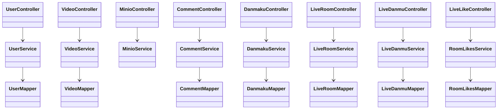

### 2.2 关键实体职责

| 实体 | 对应数据表 | 职责 |
| --- | --- | --- |
| User | sys_user | 表示系统用户，保存账号、昵称、头像等基础信息。 |
| Video | video | 表示视频内容，保存标题、描述、播放地址、封面、统计数据。 |
| Comment | comment | 表示视频评论，支持父评论形成回复关系。 |
| Danmaku | danmaku | 表示视频弹幕，保存内容、颜色、发送时间点。 |
| LiveRoom | live_room | 表示直播间，保存标题、推流地址、播放地址、状态。 |
| LiveDanmu | live_danmu | 表示直播弹幕历史记录。 |
| RoomLikes | room_likes | 表示直播间累计点赞数。 |
| UserVideo | user_video | 表示用户和视频之间的点赞、收藏关系。 |

## 3 视频上传子系统详细设计

### 3.1 模块职责

视频上传子系统负责接收前端上传的视频文件，将文件保存到 MinIO，并将视频标题、描述、封面、播放地址等元数据写入 MySQL。该模块对应需求 REQ-02。

### 3.2 活动图

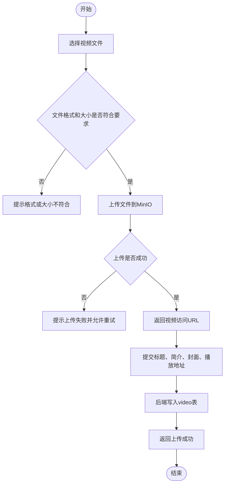

### 3.3 详细顺序图

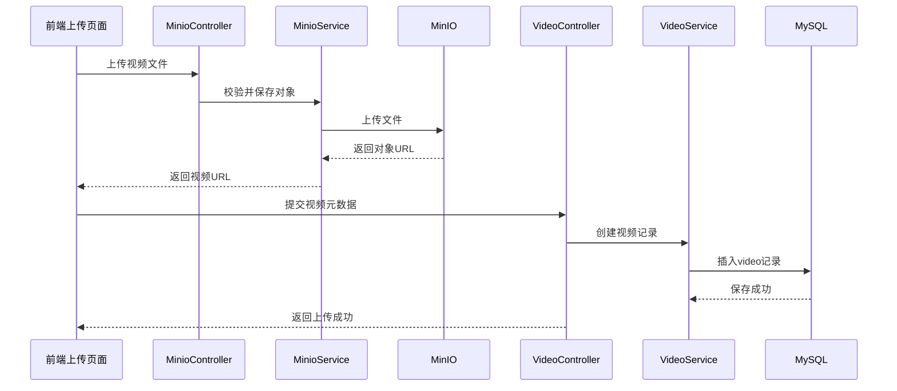

## 4 内容分发与播放子系统详细设计

### 4.1 模块职责

内容分发子系统负责首页视频列表、视频详情、个人视频列表等数据查询；播放子系统负责根据播放地址加载视频文件，提供播放、暂停、快进、倍速等基础控制。该模块对应 REQ-03 和 REQ-04。

### 4.2 视频对象状态图

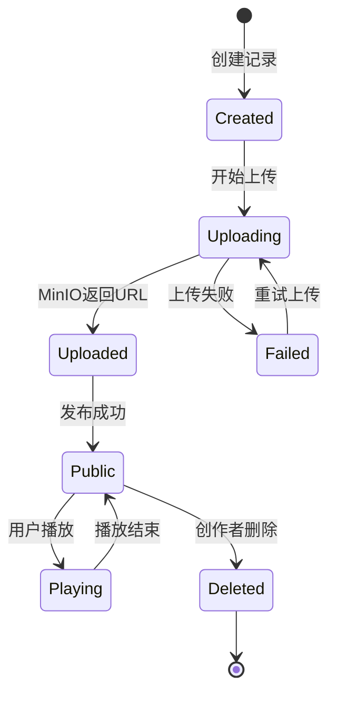

### 4.3 视频播放活动图

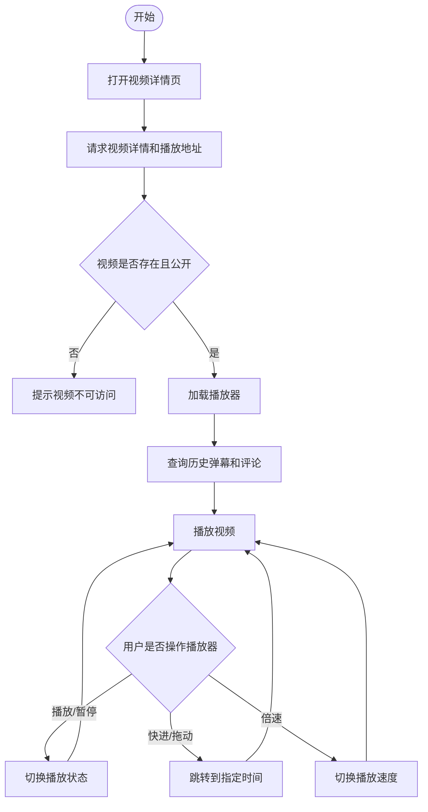

### 4.4 UC-04 播放视频对象级顺序图

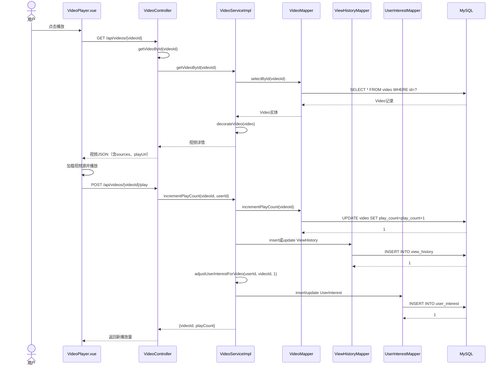

## 5 评论弹幕子系统详细设计

### 5.1 模块职责

评论弹幕子系统负责视频评论、视频弹幕的新增、查询和展示。评论以视频为中心进行列表展示，弹幕以视频 URL 和播放时间点为核心进行展示。该模块对应 REQ-05。

### 5.2 视频弹幕活动图

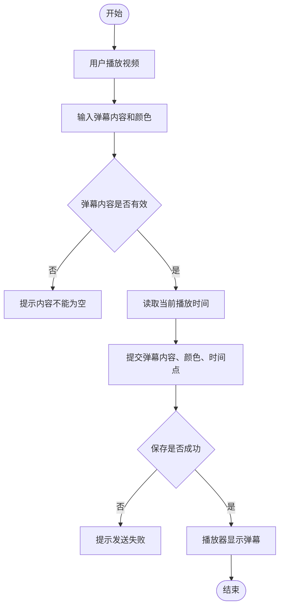

### 5.3 评论发布详细顺序图

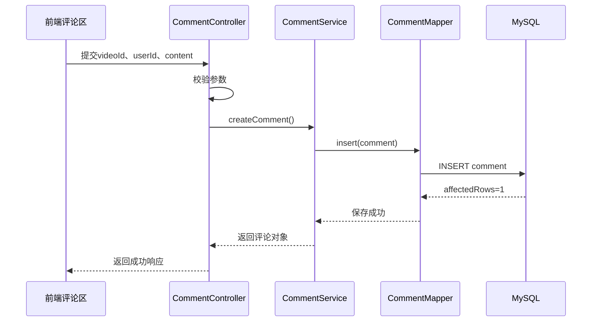

### 5.4 UC-07 发送评论对象级活动图

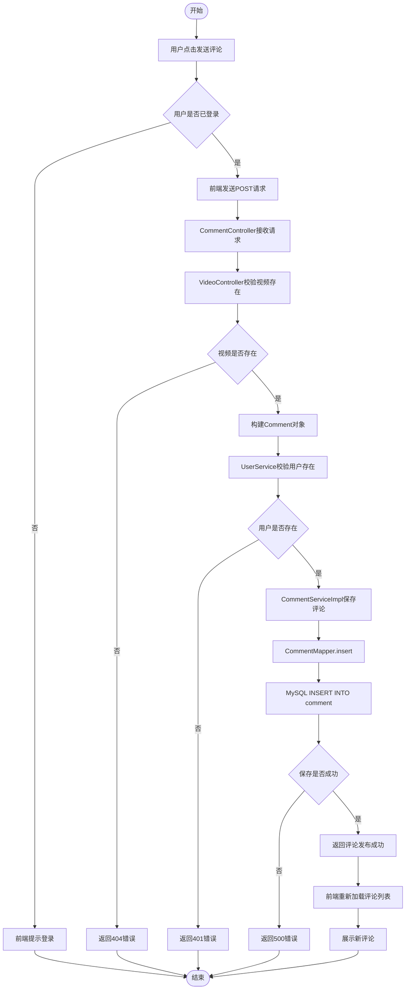

### 5.5 UC-06 发送视频弹幕对象级顺序图

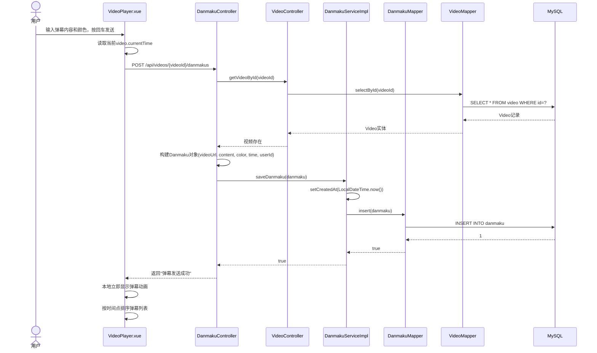

## 6 直播互动子系统详细设计

### 6.1 模块职责

直播互动子系统负责直播间创建、直播状态管理、直播播放地址生成、直播弹幕广播和直播点赞统计。该模块对应 REQ-06 和 REQ-07。

### 6.2 直播互动活动图

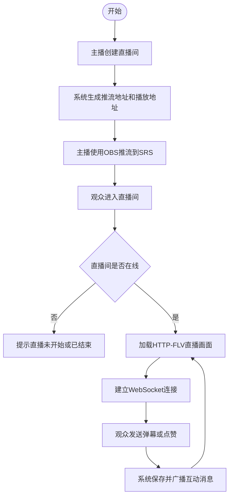

### 6.3 直播间状态图

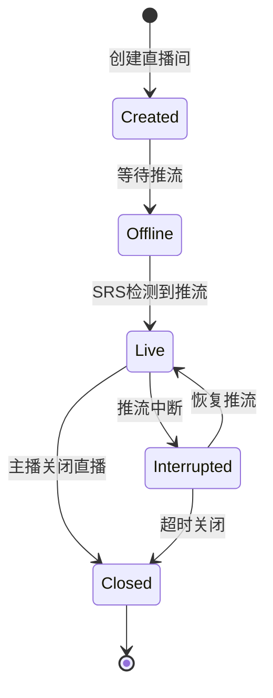

### 6.4 直播点赞详细顺序图

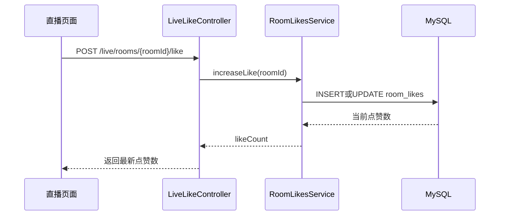

## 7 异常处理设计

| 场景 | 异常原因 | 处理方式 | 对应测试 |
| --- | --- | --- | --- |
| 登录失败 | 用户不存在或密码错误 | 返回失败响应，前端提示重新输入。 | TC-01-03 |
| 上传失败 | 文件过大、MinIO 不可用、网络中断 | 前端提示失败，允许重新上传。 | TC-02-02 |
| 视频无法播放 | 播放地址失效或文件不存在 | 播放器显示资源不可用。 | TC-04-03 |
| 弹幕发送失败 | 参数缺失或数据库写入失败 | 提示发送失败，可重试。 | TC-05-03 |
| 直播未开始 | 直播间 offline | 显示直播未开始或已结束。 | TC-06-02 |
| WebSocket 断开 | 网络异常或服务断开 | 尝试重连，失败后提示用户。 | TC-07-03 |

## 8 详细设计追溯

| 详细设计项 | 覆盖需求 | 覆盖概要设计 |
| --- | --- | --- |
| DD-01 用户登录注册流程 | REQ-01 | DES-01 |
| DD-02 视频上传活动设计 | REQ-02 | DES-02 |
| DD-03 推荐列表处理设计 | REQ-03 | DES-03 |
| DD-04 播放器状态设计 | REQ-04 | DES-04 | 4.4 UC-04播放视频对象级顺序图, VideoPlayer.vue组件 |
| DD-05 弹幕活动设计 | REQ-05 | DES-05 | 5.4 UC-05发送评论对象级活动图, 5.5 UC-06发送视频弹幕对象级顺序图 |
| DD-06 直播间状态设计 | REQ-06 | DES-06 |
| DD-07 WebSocket 广播设计 | REQ-07 | DES-07 |
| DD-08 服务启动与异常处理 | REQ-08 | DES-08 |
