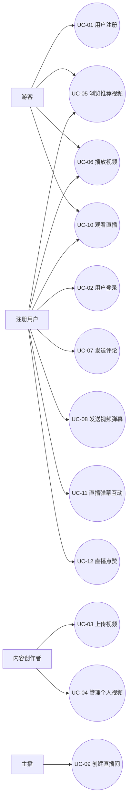
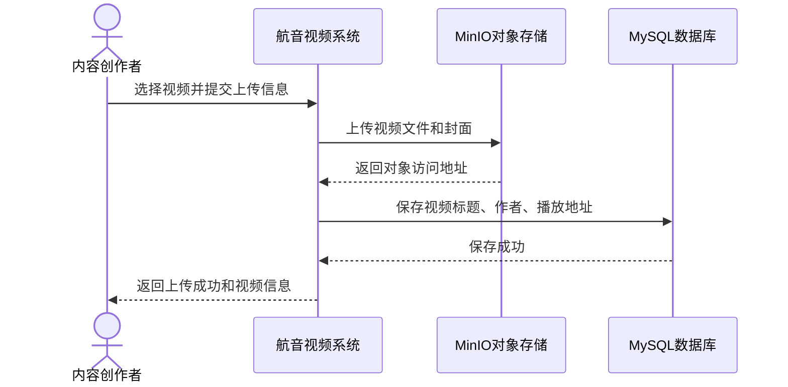
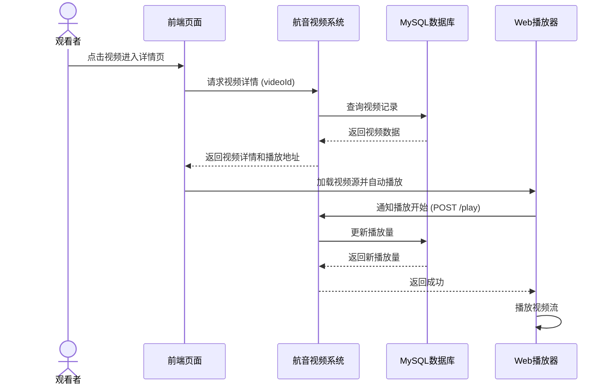
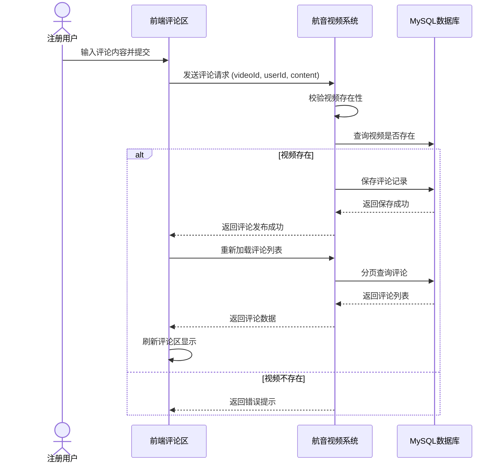
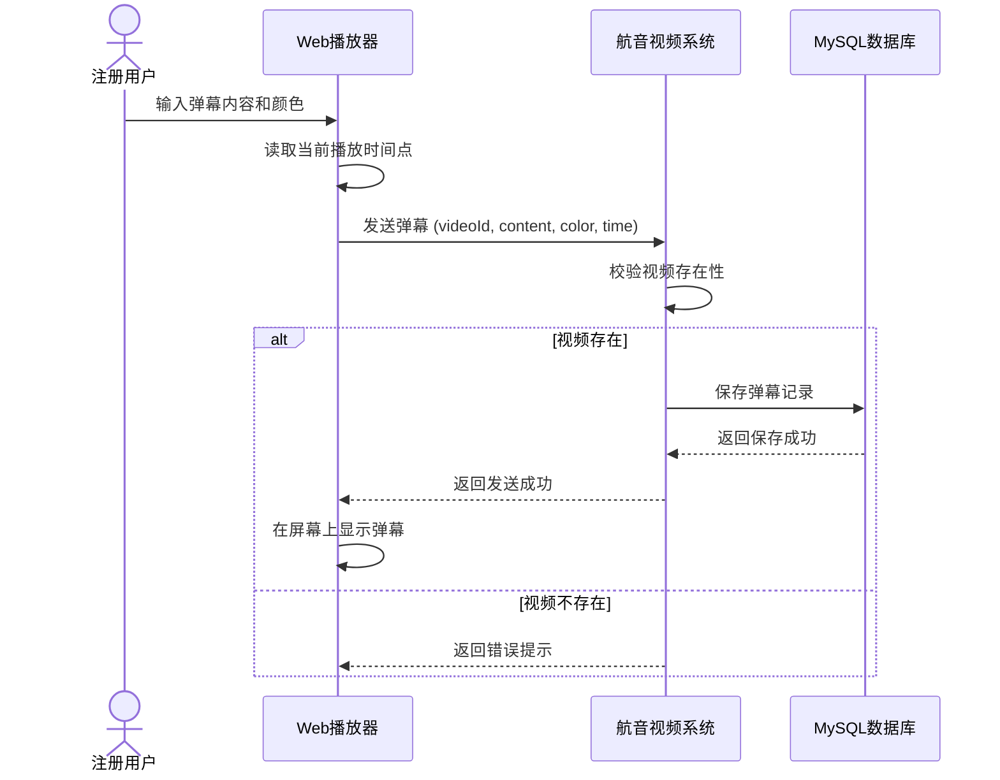
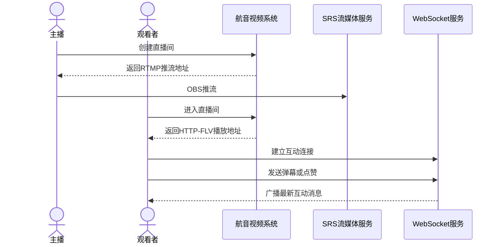
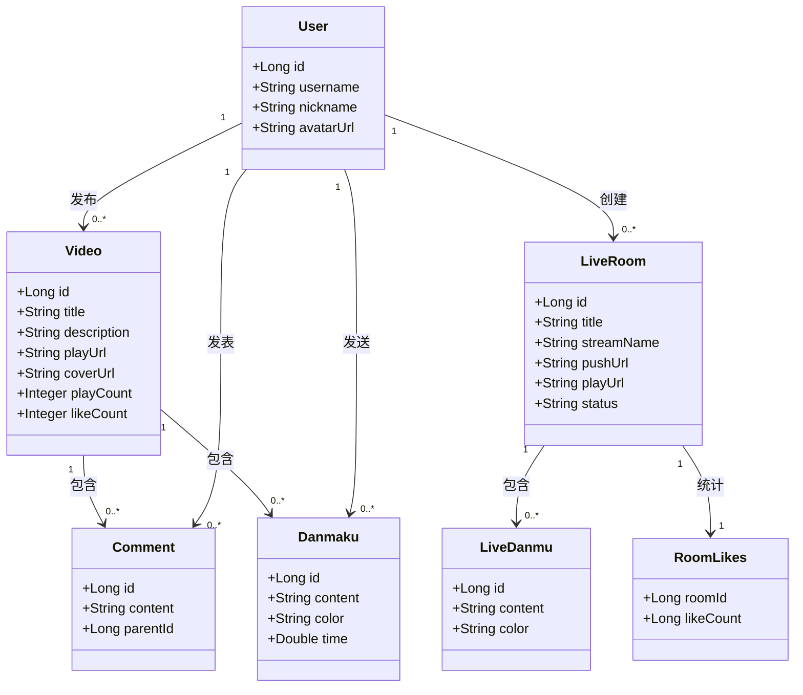

# 《航音视频》软件需求规格说明书

## 1. 引言

### 1.1 编写目标

本文档用于明确“航音视频”系统的软件需求，描述系统目标、用户特征、功能性需求、非功能性需求、界面需求、接口定义、交付要求和验收要求。本文档是后续概要设计、详细设计、开发实现、测试报告和需求追溯表的依据。

### 1.2 读者对象

本文档面向以下读者：

- 软件工程基础课程教师、助教和验收人员。
- 项目组开发人员、测试人员和项目管理人员。
- 需要了解系统需求边界、功能范围和验收标准的相关人员。

### 1.3 文档概述

本文档详细规定了“航音视频”系统的功能需求、非功能需求、接口定义及数据约束，旨在为后续的《软件概要设计说明书》及《软件详细设计说明书》提供准确的依据，并作为最终验收测试的标准 。

### 1.4 术语定义

| 术语 | 定义 |
| --- | --- |
| 航音视频 | 本项目开发的在线视频与直播互动网站。 |
| 普通观看者 | 浏览视频、观看直播、发表评论和弹幕的用户。 |
| 内容创作者 | 上传、发布和管理视频内容的用户。 |
| 主播 | 创建直播间并使用推流工具进行直播的用户。 |
| 弹幕 | 与视频播放时间或直播时间相关联的滚动互动文本。 |
| MinIO | 对象存储服务，用于保存视频文件和封面文件。 |
| SRS | 流媒体服务，用于直播 RTMP 推流和 HTTP-FLV 播放。 |

### 1.5 参考文献

- 《软件工程基础2026春大作业要求》
- 《航音视频》软件开发计划书
- 目标平台对标系统（抖音、哔哩哔哩等）的需求调研资料

## 2. 软件系统概述

### 2.1 软件产品概述

航音视频是一款集短视频、中长视频、直播互动于一体的综合视频平台。系统致力于连接内容创作者与观看者，打造一个多元、开放、有温度的视频社区。核心功能包括用户注册登录、视频上传、视频推荐与播放、评论弹幕、直播间创建、直播观看、直播弹幕和直播点赞。

系统采用 Web 端访问方式，前端基于 Vue3，后端基于 Spring Boot，数据存储使用 MySQL，对象文件存储使用 MinIO，直播推流和播放使用 SRS，视频文件代理使用 Nginx。

### 2.2 用户特征

| 用户类型 | 用户特征 | 主要目标 |
| --- | --- | --- |
| 游客 | 未登录用户，可浏览部分公开内容。 | 浏览推荐视频、查看公开视频、进入公开直播间。 |
| 注册用户 | 已注册并登录系统的普通用户。 | 播放视频、发表评论、发送弹幕、直播点赞。 |
| 内容创作者 | 需要发布和管理内容的用户。 | 上传视频、查看个人视频、删除不需要的视频。 |
| 主播 | 开展直播活动的用户。 | 创建直播间、获取推流地址、与观众互动。 |
| 运维/验收人员 | 负责部署、检查和验收系统的人员。 | 按部署文档启动系统并验证核心流程。 |

### 2.3 设计和实现约束

- 前端使用 Vue3 和 Vite 实现，运行于现代主流浏览器。
- 后端使用 Java、Spring Boot 和 MyBatis Plus 实现。
- 数据库存储使用 MySQL。
- 视频和封面文件保存到 MinIO。
- 直播能力依赖 SRS，支持 RTMP 推流和 HTTP-FLV 播放。
- Nginx 负责代理视频文件访问，并支持 Range 请求。
- 系统以课程大作业演示和验收为目标，需保证核心流程稳定运行。
- 后续需求变更需由小组讨论确认，并同步修改需求追溯表。

### 2.4 假设与依赖

- 用户设备能够访问前端页面和后端接口。
- MySQL、MinIO、SRS、Nginx 等基础服务按部署文档正确启动。
- 测试环境具备基本网络条件，可完成视频上传、视频播放和直播演示。
- 浏览器支持系统所需的视频播放能力和 WebSocket 通信能力。
- 课程验收时以核心功能流程和过程文档完整性为主要评价依据。

## 3. 功能性需求描述

### 3.1 软件功能概述

系统整体划分为五大核心子系统：

1. **用户与账户子系统**：注册、登录、用户信息维护。
2. **内容分发与创作者生态子系统**：内容发布、视频上传、推荐列表、创作者视频管理。
3. **播放与社区互动子系统**：播放器功能、评论留言、视频弹幕交互。
4. **直播互动子系统**：直播间创建、推流/拉流、直播弹幕、直播点赞。
5. **存储与基础设施子系统**：MySQL、MinIO、SRS、Nginx、Docker Compose 部署支撑。

核心功能需求如下：

| 需求编号 | 功能名称 | 说明 |
| --- | --- | --- |
| REQ-01 | 用户注册与登录 | 用户能够注册账号、登录系统并获取用户信息。 |
| REQ-02 | 视频上传与对象存储 | 创作者能够上传视频文件，系统保存到 MinIO 并生成访问地址。 |
| REQ-03 | 视频列表与推荐展示 | 用户能够浏览首页推荐视频和个人视频列表。 |
| REQ-04 | 视频播放与播放控制 | 用户能够播放视频、暂停、快进、切换倍速。 |
| REQ-05 | 评论与视频弹幕 | 用户能够发送评论和与播放时间绑定的视频弹幕。 |
| REQ-06 | 直播间管理 | 主播能够创建直播间并获取推流/播放地址。 |
| REQ-07 | 直播弹幕与点赞 | 观看者能够在直播间发送弹幕、点赞并看到实时更新。 |
| REQ-08 | 部署与运行支撑 | 系统能够启动并连接 MySQL、MinIO、SRS、Nginx 等基础服务。 |

#### 3.1.1 用户注册与登录

- **输入**：用户名、密码等登录注册信息。
- **处理**：系统校验用户名唯一性和账号密码正确性。
- **输出**：注册成功提示、登录成功后的用户信息或失败提示。
- **异常处理**：用户名重复、密码错误或参数为空时提示用户重新输入。

#### 3.1.2 视频上传与管理

- **输入**：视频文件、标题、描述、封面等信息。
- **处理**：系统将视频文件保存至 MinIO，并将视频元数据写入 MySQL。
- **输出**：视频访问地址、视频记录和上传成功提示。
- **异常处理**：格式不支持、文件过大、对象存储不可用或网络异常时提示上传失败。

#### 3.1.3 视频列表与播放

- **输入**：分页参数、视频 ID、用户播放控制指令。
- **处理**：系统查询视频列表和视频详情，前端播放器加载播放地址。
- **输出**：推荐视频列表、视频详情、可播放的视频画面。
- **异常处理**：视频不存在或播放地址失效时提示视频资源不可用。

#### 3.1.4 评论与视频弹幕

- **输入**：评论内容、弹幕内容、弹幕颜色、视频播放时间点。
- **处理**：系统保存评论和弹幕记录，并按视频维度查询展示。
- **输出**：评论列表、弹幕轨迹和发送成功提示。
- **异常处理**：内容为空、过长或保存失败时提示用户修改或重试。

#### 3.1.5 直播间与直播互动

- **输入**：直播间标题、封面、主播信息、观众弹幕和点赞请求。
- **处理**：系统生成推流地址和播放地址，维护直播状态，广播直播弹幕并累计点赞数。
- **输出**：直播间信息、HTTP-FLV 播放地址、直播弹幕和点赞数。
- **异常处理**：直播间离线、推流中断或 WebSocket 断开时提示用户。

### 3.2 软件需求的用例模型

#### 3.2.1 用例清单

| 用例编号 | 用例名称 | 参与者 | 关联需求 |
| --- | --- | --- | --- |
| UC-01 | 上传视频 | 内容创作者 | REQ-02 |
| UC-02 | 管理个人视频 | 内容创作者 | REQ-02, REQ-03 |
| UC-03 | 浏览推荐视频 | 观看者 | REQ-03 |
| UC-04 | 播放视频 | 观看者 | REQ-04 |
| UC-05 | 发送评论 | 注册用户 | REQ-05 |
| UC-06 | 发送视频弹幕 | 注册用户 | REQ-05 |
| UC-07 | 创建直播间 | 主播 | REQ-06 |
| UC-08 | 观看直播 | 观看者 | REQ-06 |
| UC-09 | 直播弹幕互动 | 注册用户 | REQ-07 |
| UC-10 | 直播点赞 | 注册用户 | REQ-07 |

#### 3.2.2 用例图

#### 3.2.3 用例描述

| 用例编号 | 用例名称 | 参与者 | 触发条件 | 前置条件 | 基本流程 | 异常流程 | 可验证结果 |
| --- | --- | --- | --- | --- | --- | --- | --- |
| UC-01 | 上传视频 | 内容创作者 | 创作者点击上传并提交视频文件 | 用户已登录，视频文件与标题符合上传要求 | 选择视频文件；填写标题，封面；上传至 MinIO；保存视频记录；生成播放地址和封面地址。 | 文件过大、格式错误或对象存储失败时提示上传失败。 | MinIO 中存在视频对象；数据库保存视频记录；个人视频列表可查询到该视频。 |
| UC-02 | 管理个人视频 | 内容创作者 | 创作者进入个人视频管理页面或发起删除操作 | 用户已登录且已有本人视频 | 查询本人视频列表；查看视频详情；选择不需要的视频；系统校验归属关系后删除视频。 | 删除不存在或非本人视频时拒绝操作。 | 仅返回本人视频；删除成功后列表和网站不再展示该视频；非本人视频不会被删除。 |
| UC-03 | 浏览推荐视频 | 观看者 | 用户打开首页或刷新推荐列表 | 系统存在公开视频 | 打开首页；系统按热度和时间查询视频列表；前端展示封面、标题、作者和播放量。 | 无公开视频时显示空列表。 | 首页能够展示公开视频列表；列表项包含封面、标题、作者和播放量； |
| UC-04 | 播放视频 | 观看者 | 用户点击公开视频并进入播放页 | 视频存在且可访问 | 获取视频详情；加载播放地址；初始化播放器；进行播放、暂停和进度控制。 | 播放地址失效、视频不存在或资源不可访问时提示资源不可用。 | 视频可以正常播放和控制；播放页展示视频信息；播放量按规则更新。 |
| UC-05 | 发送评论 | 注册用户 | 用户在视频详情页提交评论 | 用户已登录且视频存在 | 输入评论；系统校验内容；保存评论；刷新评论列表并展示评论及回复关系。 | 评论为空、过长或保存失败时提示修改或重试。 | 评论记录写入数据库；评论列表出现新评论； |
| UC-06 | 发送视频弹幕 | 注册用户 | 用户播放视频时发送弹幕 | 用户正在播放视频，视频存在且可访问 | 输入弹幕内容和颜色；系统保存视频时间点；播放器按时间轴展示弹幕。 | 弹幕为空、内容过长或发送失败时提示修改或重试。 | 弹幕记录包含视频、时间点、内容和颜色；重新播放到对应时间点时可显示弹幕。 |
| UC-07 | 创建直播间 | 主播 | 主播提交直播间创建信息 | 主播已登录，直播间标题和封面信息有效 | 填写直播间信息；系统创建直播间记录；生成推流地址和播放地址；更新直播间状态。 | SRS 配置不可用、直播间信息缺失或服务异常时提示创建失败。 | 数据库生成直播间记录；返回推流地址和播放地址；直播间列表可查询到该房间。 |
| UC-08 | 观看直播 | 观看者 | 用户打开直播间或从直播列表进入直播间 | 直播间存在且处于可访问状态 | 打开直播间；获取 HTTP-FLV 播放地址；加载直播画面；展示直播间基础信息。 | 直播间离线、未开播、已结束或播放地址失效时提示当前不可观看。 | 在线直播间能够播放直播画面；离线直播间显示未开播或已结束提示。 |
| UC-09 | 直播弹幕互动 | 注册用户 | 用户进入直播间后发送直播弹幕 | 用户已进入直播间，WebSocket 服务可用 | 建立 WebSocket 连接；输入并发送弹幕；系统保存弹幕并向直播间观众广播消息。 | 连接断开、弹幕为空或发送失败时提示重连或重试。 | 同一直播间观众可实时看到弹幕；数据库保存直播弹幕记录。 |
| UC-10 | 直播点赞 | 注册用户 | 用户在直播间点击点赞按钮 | 用户已进入直播间，直播间存在 | 点击点赞；系统累计直播间点赞数；向前端返回最新数量并更新页面显示。 | 网络失败或直播间不存在时保持原数量并提示。 | 点赞数按请求递增；前端显示最新点赞数量。 |

### 3.3 软件需求的分析模型

#### 3.3.1 视频上传系统顺序图

#### 3.3.2 UC-04 播放视频系统顺序图

#### 3.3.3 UC-05 发送评论系统顺序图

#### 3.3.4 UC-06 发送视频弹幕系统顺序图

#### 3.3.5 直播互动系统顺序图

#### 3.3.6 概念类图

## 4. 非功能性需求

| 编号 | 类型 | 需求描述 | 验收标准 |
| --- | --- | --- | --- |
| NFR-01 | 性能 | 首页视频列表、视频详情、直播间信息应快速返回。 | 常规测试环境下核心接口 3 秒内响应。 |
| NFR-02 | 可用性 | 上传失败、视频资源缺失、直播断开时应给出明确提示。 | 用户能看到错误原因或重试入口。 |
| NFR-03 | 兼容性 | 支持主流现代浏览器访问。 | Chrome/Edge 可正常完成核心流程。 |
| NFR-04 | 可维护性 | 后端采用 Controller-Service-Mapper 分层。 | 主要业务逻辑不直接写在控制器中。 |
| NFR-05 | 可部署性 | 支持本地和测试环境部署。 | 按部署文档可启动前端、后端和基础设施。 |
| NFR-06 | 数据一致性 | 视频、评论、弹幕、直播间数据应与页面展示保持一致。 | 删除视频后列表和首页不再展示该视频。 |

## 5. 界面需求

### 5.1 首页界面

首页应展示推荐视频列表，至少包含视频封面、标题、作者、播放量等信息。用户可点击视频进入播放页。

### 5.2 登录注册界面

登录注册界面应提供用户名和密码输入框，能够清晰提示注册成功、登录成功、用户名重复、密码错误等结果。

### 5.3 视频播放界面

视频播放界面应包含播放器、视频标题、作者信息、评论区和弹幕输入区域。播放器应支持播放、暂停、快进、倍速等基础操作。

### 5.4 视频上传与个人视频界面

内容创作者应能够选择视频文件、填写标题和描述、提交上传，并在个人页面查看或删除本人上传的视频。

### 5.5 直播界面

直播界面应展示直播画面、直播间标题、直播状态、弹幕输入区和点赞按钮。直播未开始或已结束时应展示明确状态提示。

## 6. 接口定义

### 6.1 用户接口

| 接口 | 输入 | 输出 | 说明 |
| --- | --- | --- | --- |
| 用户注册 | username, password | 注册结果 | 创建新用户。 |
| 用户登录 | username, password | 用户信息、登录结果 | 验证用户身份。 |
| 查询用户信息 | userId | 用户资料 | 展示用户基础信息。 |

### 6.2 视频接口

| 接口 | 输入 | 输出 | 说明 |
| --- | --- | --- | --- |
| 上传视频文件 | 视频文件 | 文件访问 URL | 将文件保存到 MinIO。 |
| 创建视频记录 | 标题、描述、播放地址、封面地址 | 视频记录 | 将视频元数据写入数据库。 |
| 查询推荐视频 | page, pageSize, category | 视频列表 | 首页推荐展示。 |
| 查询视频详情 | videoId | 视频详情 | 播放页加载数据。 |
| 删除视频 | videoId, userId | 删除结果 | 删除创作者本人视频。 |

### 6.3 评论与弹幕接口

| 接口 | 输入 | 输出 | 说明 |
| --- | --- | --- | --- |
| 新增评论 | videoId, userId, content | 评论结果 | 保存视频评论。 |
| 查询评论 | videoId | 评论列表 | 展示视频评论区。 |
| 新增视频弹幕 | videoUrl, content, color, time, userId | 弹幕结果 | 保存视频弹幕。 |
| 查询视频弹幕 | videoUrl | 弹幕列表 | 初始化播放器弹幕。 |

### 6.4 直播接口

| 接口 | 输入 | 输出 | 说明 |
| --- | --- | --- | --- |
| 创建直播间 | userId, title, coverUrl | pushUrl, playUrl, roomId | 主播创建直播间。 |
| 查询直播间 | roomId | 直播间详情 | 观众进入直播间。 |
| 直播弹幕 | roomId, userId, content, color | 广播消息 | WebSocket 广播直播弹幕。 |
| 直播点赞 | roomId | 最新点赞数 | 累加并返回点赞数。 |

## 7. 进度要求

| 阶段 | 主要任务 | 输出物 |
| --- | --- | --- |
| 需求阶段 | 明确系统范围、用户角色、核心用例和需求编号。 | 软件需求规格说明书、需求追溯表初稿。 |
| 设计阶段 | 完成概要设计、详细设计和主要 UML 图。 | 概要设计说明书、详细设计说明书。 |
| 实现阶段 | 完成前端、后端、数据库、存储和直播相关功能。 | 可运行系统、源码和数据库脚本。 |
| 测试阶段 | 执行功能测试、异常测试和部署连通测试。 | 测试报告、缺陷记录。 |
| 交付阶段 | 整理全部过程文档和最终演示材料。 | 文档包、代码包、部署说明。 |

## 8. 交付要求

系统交付时应包含以下内容：

1. 完整源代码，包括前端、后端、基础设施配置和数据库脚本。
2. 可运行的部署说明，能够指导验收人员启动系统。
3. 软件开发计划书、需求规格说明书、概要设计说明书、详细设计说明书、测试报告、用户手册、部署文档。
